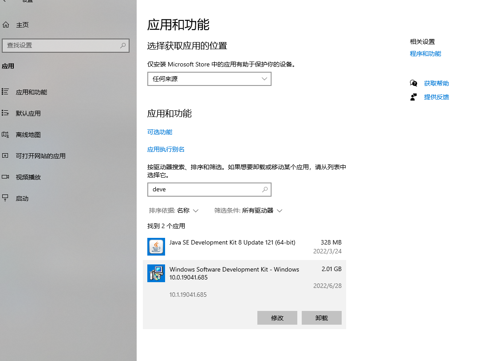
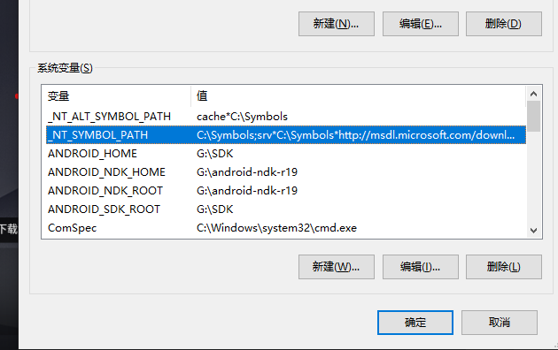
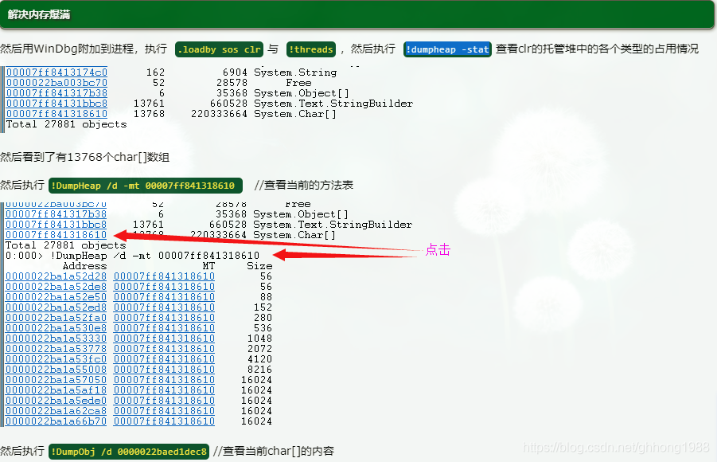
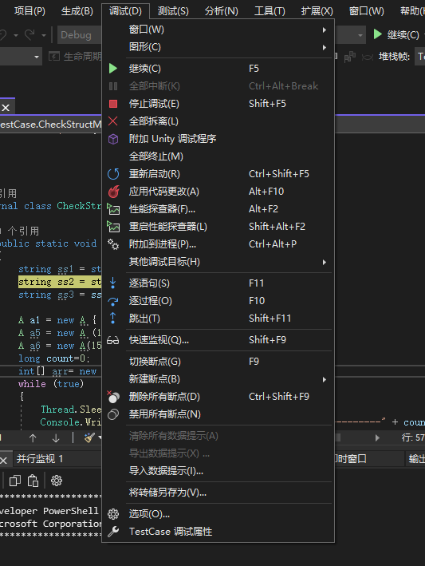
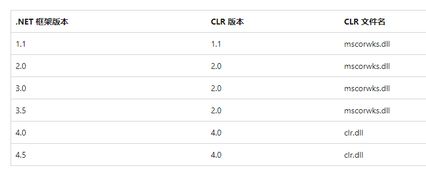

# CSharp笔记

>- [ ] 绍跳点搜索(JPS)算法

> IL学习：  
> [C#基础拾遗系列之一：先看懂IL代码](https://www.cnblogs.com/runningsmallguo/p/8440734.html)  
> [读懂IL代码就这么简单 (一)](https://www.cnblogs.com/zery/p/3366175.html) 
> [c# IL 指令集](https://www.cnblogs.com/justinli/p/4041538.html)  
> [c#的逆向工程-IL指令集](https://www.cnblogs.com/idefav2010/p/ILCode.html)  
> [IL指令详细表](https://cloud.tencent.com/developer/article/1200327)
### vs中设置IL ( ildasm.exe )
我这里的路径：
`C:\Program Files (x86)\Microsoft SDKs\Windows\v10.0A\bin\NETFX 4.8 Tools\x64\ildasm.exe`


### int强转 enum过程

**结论：int强转enum和enum正常赋值是一样的，强转失败不会报异常，且赋值成功**

```csharp
using System;
namespace EnumTest
{
    internal class Program
    {
        enum Hello
        {
            A=0xfff0,
            B= 0xfff1,
        }

        static void Main(string[] args)
        {
            int n = 0xfff0;
            int m = 0xfff2;
            // int强转enum和enum正常赋值是一样的开销 不做越界处理
            Hello h1=(Hello)n;
            int b1 = m;
            

            Console.WriteLine(h1);
            Console.WriteLine(b1);
            Console.ReadKey();
        }
    }
}

```

生成exe（Debug模式下，Release模式下代码被优化）后查看id代码

```c
//Debug模式
.method private hidebysig static void  Main(string[] args) cil managed
{
  .entrypoint
  // 代码大小       43 (0x2b)
  .maxstack  1
  .locals init ([0] int32 n,
           [1] int32 m,
           [2] valuetype EnumTest.Program/Hello h1,
           [3] int32 b1) //局部变量索引
  IL_0000:  nop
  IL_0001:  ldc.i4     0xfff0  //入栈
  IL_0006:  stloc.0 // n赋值 栈顶出栈
  IL_0007:  ldc.i4     0xfff2  //入栈
  IL_000c:  stloc.1 // m赋值  栈顶出栈
  IL_000d:  ldloc.0 //加载 入栈 n
  IL_000e:  stloc.2 // h1=n  栈顶出栈
  IL_000f:  ldloc.1 // 加载 入栈 m
  IL_0010:  stloc.3 // b1=m 栈顶出栈
  IL_0011:  ldloc.2 //加载 入栈 h1
  IL_0012:  box        EnumTest.Program/Hello //栈顶h1出栈 装箱结果入栈
  IL_0017:  call       void [mscorlib]System.Console::WriteLine(object)  //使用一个参数，使用后栈顶出栈
  IL_001c:  nop
  IL_001d:  ldloc.3 //加载 入栈 b1 
  IL_001e:  call       void [mscorlib]System.Console::WriteLine(int32)
  IL_0023:  nop
  IL_0024:  call       valuetype [mscorlib]System.ConsoleKeyInfo [mscorlib]System.Console::ReadKey()
  IL_0029:  pop
  IL_002a:  ret
} // end of method Program::Main

```

```c
//Relase模式
.method private hidebysig static void  Main(string[] args) cil managed
{
  .entrypoint
  // 代码大小       36 (0x24)
  .maxstack  2
  .locals init ([0] int32 m,
           [1] int32 b1)
  IL_0000:  ldc.i4     0xfff0
  IL_0005:  ldc.i4     0xfff2
  IL_000a:  stloc.0 // m=0xfff2 
  IL_000b:  ldloc.0 
  IL_000c:  stloc.1 // b1=0xfff0
  IL_000d:  box        EnumTest.Program/Hello
  IL_0012:  call       void [mscorlib]System.Console::WriteLine(object)
  IL_0017:  ldloc.1 //加载b1
  IL_0018:  call       void [mscorlib]System.Console::WriteLine(int32)
  IL_001d:  call       valuetype [mscorlib]System.ConsoleKeyInfo [mscorlib]System.Console::ReadKey()
  IL_0022:  pop
  IL_0023:  ret
} // end of method Program::Main

```
### int强转成enum且越界
**结论：int强转成enum越界时赋值会成功，但是输出是int的值**
代码
```csharp
using System;
namespace EnumTest
{
    internal class Program
    {
        enum Hello
        {
            A=0xfff0,
            B= 0xfff1,
        }

        static void Main(string[] args)
        {
            int n = 0xfff0;
            int m = 0xfff2;

            Hello h1=(Hello)n;
            int b1 = m;

            Console.WriteLine(h1.ToString());
            h1 = (Hello)100;
            //int强转成enum越界时赋值会成功，但是输出是int的值
            Console.WriteLine(h1.ToString());
            Console.WriteLine(b1);
            Console.ReadKey();
        }
    }
}

```
输出:
```
A
100
65522
```

### 在类和结构之间进行选择（Choosing Between Class and Struct）
> <https://docs.microsoft.com/en-us/dotnet/standard/design-guidelines/choosing-between-class-and-struct>

**结论：**

✔️ 如果类型的实例很小且通常短暂存在或通常嵌入在其他对象中，请考虑定义结构而不是类。

❌ 避免定义结构，除非该类型具有以下所有特征：
- 它在逻辑上表示单个值，类似于原始类型（int、double等）。
- 它的实例大小小于 16 个字节。
- 它是不可变的。
- 它不必经常装箱。

>可以这么理解：值类型的数组是真正的线性结构；而引用类型数组类似树结构。因此相率上存在天然差距！
>
>引用类型的对象数组，物理上一般是分配指针来指向引用的实例，此时数组的内存块不能涵盖所有要访问的数据。而struct数组在这种情况下所有会用到的数据都在数组的物理内存之中包含，可以直接访问到，无需通过GC堆内存的对象引用来反复的间接查找。同时，如果实例数量非常多时，使用struct数组还能避免大量分散在GC堆中的对象实例，从而减轻GC压力。这里理想化的认为struct的定义中所有字段都是值类型的，不包含string等引用类型。

**对比：**
```
+--------------------------------------------------+------+----------------------------------------------+
|                      Struct                      |      |                      Class                    |
+--------------------------------------------------+------+----------------------------------------------+
| - 1 per Thread.                                  |      | - 1 per application.                         |
|                                                  |      |                                              |
| - Holds value types.                             |      | - Holds reference types.                     |
|                                                  |      |                                              |
| - Types in the stack are positioned              |      | - No type ordering (data is fragmented).     |
|   using the LIFO principle.                      |      |                                              |
|                                                  |      |                                              |
| - Can't have a default constructor and/or        |      | - Can have a default constructor             |
|   finalizer(destructor).                         |      |   and/or finalizer.                          |
|                                                  |      |                                              |
| - Can be created with or without a new operator. |      | - Can be created only with a new operator.   |
|                                                  |      |                                              |
| - Can't derive from the class or struct          |  VS  | - Can have only one base class and/or        |
|   but can derive from the multiple interfaces.   |      |   derive from multiple interfaces.           |
|                                                  |      |                                              |
| - The data members can't be protected.           |      | - Data members can be protected.             |
|                                                  |      |                                              |
| - Function members can't be                      |      | - Function members can be                    |
|   virtual or abstract.                           |      |   virtual or abstract.                       |
|                                                  |      |                                              |
| - Can't have a null value.                       |      | - Can have a null value.                     |
|                                                  |      |                                              |
| - During an assignment, the contents are         |      | - Assignment is happening                    |
|   copied from one variable to another.           |      |   by reference.                              |
+--------------------------------------------------+------+----------------------------------------------+
```

### WinDbg

> [Windbg调试命令详解](http://yiiyee.cn/blog/2013/08/23/windbg/)
> <https://docs.microsoft.com/zh-cn/windows-hardware/drivers/debugger/debugger-download-tools> 
> <https://docs.microsoft.com/zh-cn/sysinternals/downloads/procdump> 
> <https://www.cnblogs.com/harrychinese/p/winbug.html> 
> <https://cloud.tencent.com/developer/article/1045085> 
> <http://fresky.github.io/2015/06/21/how-to-attack-the-memory-leak-issue/> 
> [生产环境诊断利器 WinDbg 帮你快速分析异常情况 Dump 文件](https://blog.csdn.net/hezheqiang/article/details/121930036) 
> [windbg调试命令](https://www.cnblogs.com/kekec/archive/2012/12/02/2798020.html) 


## WinDbg安装
### 安装方式（建议使用该方法）1  
 使用windows store 搜索 WinDbg preview 然后下载
 
### 安装方式2：
下载windows SDK，并且勾选WinDbg；


如果已经安装windows SDK 使用修复 ：




### 配置符号表环境变量
添加环境变量
```
_NT_SYMBOL_PATH=C:\Symbols;srv*C:\Symbols*http://msdl.microsoft.com/download/symbols;

_NT_ALT_SYMBOL_PATH=cache*C:\Symbols
```

###  WinDBG中加载SOS和CLR （安装sos工具）
```sh
#step1
dotnet tool install -g dotnet-sos
#step2 
dotnet-sos install

#安装成功后有SOS install succeeded的提示，并且返回有安装路径。
PS E:\Project> dotnet-sos install
Installing SOS to C:\Users\coding\.dotnet\sos
Installing over existing installation...
Creating installation directory...
Copying files from C:\Users\coding\.dotnet\tools\.store\dotnet-sos\6.0.328102\dotnet-sos\6.0.328102\tools\netcoreapp3.1\any\win-x64
Copying files from C:\Users\coding\.dotnet\tools\.store\dotnet-sos\6.0.328102\dotnet-sos\6.0.328102\tools\netcoreapp3.1\any\lib
Execute '.load C:\Users\coding\.dotnet\sos\sos.dll' to load SOS in your Windows debugger.
Cleaning up...
SOS install succeeded
```

命令 `!DumpHeap -stat`不可用

```
.loadby sos clr 
如果失败需要 （sos.dll和clr.dll一般情况下在同一个目录）
.load 绝对路径的sos.dll
.load 绝对路径的clr.dll
```

> <https://www.cnblogs.com/Leo_wl/p/3329437.html> 
> <https://blog.csdn.net/ghhong1988/article/details/104674837> 
>想要一次性成功搭建测试环境，那得靠人品。看来我近来人品积累的不够，不断的有小问题出现。比如加载SOS和CLR，就让我不胜其烦。必须得记下来，分享出来，以节省大家的时间。
>
>　　问题一：WinDBG分X86和X64两个版本
>
>　　如果你用的是32位的WinDBG，那直接打开就行；你如果用的是64位的版本，那么如果调试64位代码也直接打开，如果调试x86的代码，要使用Wow64下的WinDBG.exe。
>
>　　问题二：确定SOS和CLR的位置和版本
>
>　　如果安装了Visual Studio的机器，可以打开VS的命令行，输入where sos.dll命令，可以找到sos.dll的全路径（需要说明的是，找到的不一定是全部的文件）。它的一般位置在C:\Windows\Microsoft.NET\Framework?\version?\SOS.dll。其中Framework?包括Framework和Framework64两个版本；version?包括v2.0.50727，v3.0，v3.5和v4.0.30319等版本。文件确切路径的选择依据要调试程序的版本而定，一般为C:\Windows\Microsoft.NET\Framework\v4.0.30319\SOS.dll，CLR为同一目录下的CLR.dll文件。
>
>　　问题三：加载SOS和CLR
>
>　　运气好的话，使用命令.load C:\Windows\Microsoft.NET\Framework\v4.0.30319\SOS.dll可以加载成功。如果失败，特别是出现The call to LoadLibrary(C:\Windows\Microsoft.NET\Framework\v4.0.30319\sos.dll) failed, Win32 error 0n193这样的错误，请确认加载sos.dll的版本是否正确。

>　　此外，加载不出错，并不见得可以直接使用。可以尝试命令`.loadby sos clr`。如果命令成功，那么测试环境好了。如果出现了“Unable to find module 'clr'”这样的错误。请键入g让调试程序运行一会儿，停下来的时候再尝试命令.loadby sos clr，这时一般都会成功。
> 


> [Windbg+sos调试.net笔记](https://cxymm.net/article/yusakul/109246669)
>
>要加载扩展，有2个命令。一个是.loadby，另一个是.load。对于.loadby，请使用相对路径；对于.load，请使用完整路径。
>
>对于.loadby，有5个选项：
>- loadby sos mscorsvr
>- loadby sos mscorwks
>- loadby sos clr
>- loadby sos coreclr
>- loadby sos 
>
>其中mscorsvr确实很旧（.NET CLR 1，服务器版本），mscorwks确实很旧（.NET CLR 1和2，但仍然存在），clr是在当今很常见（.NET CLR 4），coreclr可能正在增加（UWP和Silverlight）


当尚未加载.NET运行时时，您正在尝试加载SOS。等待直到加载.NET，然后该命令将起作用。在初始断点处肯定是不可能的。 `sxe ld clr` 表示让应用程序运行到.NET可用

```sh
    sxe ld clr
    sxe ld mscorwks
    sxe ld coreclr
    g
```

## 生成转储文件
**方式1**

 任务管理器，进程 -> 创建转储文件 ;得到当前进程的dump文件

**方式2**

使用ProcDump 工具

```sh
# mydotNetApp.exe是进程名字
procdump -ma mydotNetApp.exe d:\myapp.dmp
# TestCase.exe是进程名字
.\procdump.exe -ma TestCase.exe e:\test.dmp
```

**方式3**
使用vs调试，断点后，点击 调试菜单-> 将转储另存为



## 配置windbg为vs外部工具

```
Windbg(x86)

C:\Users\coding\AppData\Local\Microsoft\WindowsApps\WinDbgX.exe
C:\Program Files (x86)\Windows Kits\10\Debuggers\x86\windbg.exe

 -srcpath $(ProjectDir) $(TargetPath)

 $(TargetDir)
```


```
C:\Symbols
srv*C:\Symbols*http://msdl.microsoft.com/download/symbols

cache*C:\Symbols

 !DumpHeap -stat

0:000> !clrstack
No export clrstack found
0:000> !dumpstackobjects
No export dumpstackobjects found
0:000> sxe ld clr
0:000> sxe ld mscorwks
0:000> sxe ld coreclr
```

## windbg 基础
windbg命令分标准命令、元命令和扩展命令。

标准命令提供基本功能，不区分大小写。比如dt、lm、g、bl、bc、p等。

提供标准命令没有提供的功能，也内建在调试引擎中，以.开头。如.sympath  .reload等。

 扩展命令用于扩展某一方面的调试功能，实现在动态加载的扩展模块中，以!开头。如!analyze等。

 使用;作为分隔符，可以在同一行输入多条命令。

一次可以执行多条命令，命令间用分号;分隔 【如：bp main;bp `view.cpp:120`】，一次打2个断点。

## windbg调试C#程序
>[使用WinDBG + SOS调试.Net程序的一般步骤](https://www.cnblogs.com/mashuping/archive/2009/03/28/1424168.html) 
>
> [windbg调试C#代码](https://www.cnblogs.com/AlexanderYao/p/4843711.html)
>
>用windbg调试C#代码是比较麻烦的，因为windbg是针对OS层级的，而C#被CLR隔了一层，很多原生的命令如查看局部变量dv、查看变量类型dt等在CLR的环境中都不能用了。必须使用针对CLR的扩展命令，比如sos、psscor2中的命令。
>
>[sos官网文档](https://docs.microsoft.com/en-us/dotnet/framework/tools/sos-dll-sos-debugging-extension)
> [使用 Windows 调试器调试托管代码](https://docs.microsoft.com/en-us/windows-hardware/drivers/debugger/debugging-managed-code)

>

```sh
    sxe ld clr # 添加中断 （加载指定名称的dll时，调试器中断） 
    # sxe ld mscorwks  # 添加中断 （加载指定名称的dll时，调试器中断） 
    # sxe ld coreclr  # 添加中断 （加载指定名称的dll时，调试器中断） 
    # sxe ld clrjit  # 添加中断 （加载指定名称的dll时，调试器中断） 
    g # 运行，当遇到中断或者断点时 中断
    # 让应用程序运行到.NET可用（clr等核心初始化后，这时候.net环境初始化完成）
    .loadby sos clr  ## 加载sos模块 (宿主程序必须加载clr后执行，否则会找不到clr)
    
    !bpmd DotnetTest DotnetTest.Program.Main  ## Main函數添加断点
    !bpmd -md 005e4d90 #在指定的MethodDesc地址处添加断点
    g # 运行，当遇到中断或者断点时 中断
    !name2ee DotnetTest DotnetTest.Program.Main
```
```sh
.cordll -ve -u -l
lmv mclr #（适用于 CLR 4.0 版）

lmv mscorwks  #（适用于 CLR 的 1.0 或 2.0 版）

!sos.help
!sos.Threads
!sos.DumpDomain

k
kv
kb
x *! 

```

### `.load`和`.loadby` 命令将新的扩展DLL加载到调试器中。

使用形式
```sh
.load DLLName
!DLLName.load
.loadby DLLName ModuleName

参数
DLLName
指定要加载的调试器扩展DLL。如果使用.load命令，DLLName应包含完整路径。如果使用.loadby命令，DLLName应仅包含文件名。

ModuleName
指定与DLLName指定的扩展DLL位于同一目录中的模块的模块名。

```

 `sxe ld ` 
 
 有些场景需要使用windbg调试某个dll模块，而这个模块加载时机不是很确定。

通常需要使用sxe ld <dll名称> 来设置一个模块加载异常。当被调试进程加载指定名称的dll时，调试器就会中断，后续就可以对该模块的设置一些符号断点了。

`lm` 和 `.chain`

查看已经加载模块的列表

`Name2EE <module name> <type or method name>` 

>`Name2EE <module name>!<type or method name>`

显示指定模块中指定类型或方法的MethodTable结构和结构。指定的模块必须在进程中加载​​。要获得正确的类型名称，请使用Ildasm.exe (IL Disassembler)浏览模块。您还可以作为模块名称参数传递以搜索所有加载的托管模块。模块名称参数也可以是模块的调试器名称，例如或。此命令支持 < > < > 的 Windows 调试器语法。类型必须是完全限定的。EEClass

```sh
0:000> !name2ee DotnetTest DotnetTest.Program.Main
Module:      00c44044
Assembly:    DotnetTest.exe
Token:       06000009
MethodDesc:  00c44d90
Name:        DotnetTest.Program.Main(System.String[])
Not JITTED yet. Use !bpmd -md 00c44d90 to break on run.
```


`BPMD [-nofuturemodule] [<module name> <method name>] [-md <MethodDesc>] -list -clear <pending breakpoint number> -clearall`

在指定模块中的指定方法处创建断点。

如果指定的模块和方法尚未加载，则此命令在创建断点之前等待模块已加载和即时 (JIT) 编译的通知。

您可以使用-list、-clear和-clearall选项管理挂起断点的列表：

-list选项生成所有挂起断点的列表。如果挂起的断点具有非零模块 ID，则该断点特定于该特定加载模块中的函数。如果挂起的断点的模块 ID 为零，则该断点适用于尚未加载的模块。

使用-clear或-clearall选项从列表中删除挂起的断点。


```sh
# 添加断点
!bpmd DotnetTest DotnetTest.Program.Main  #[<module name> <method name>]
!bpmd DotnetTest DotnetTest.HeapStack.New

```
