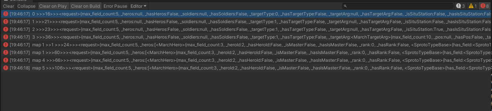
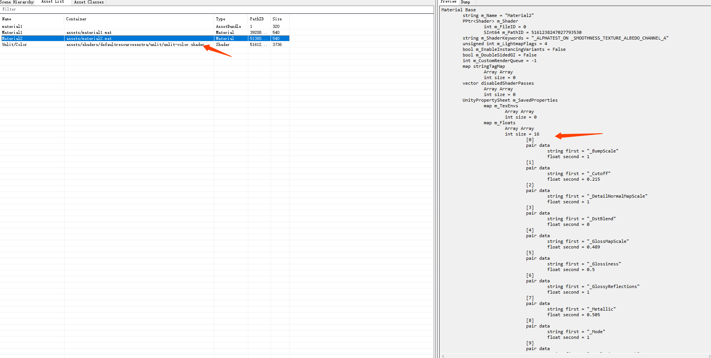
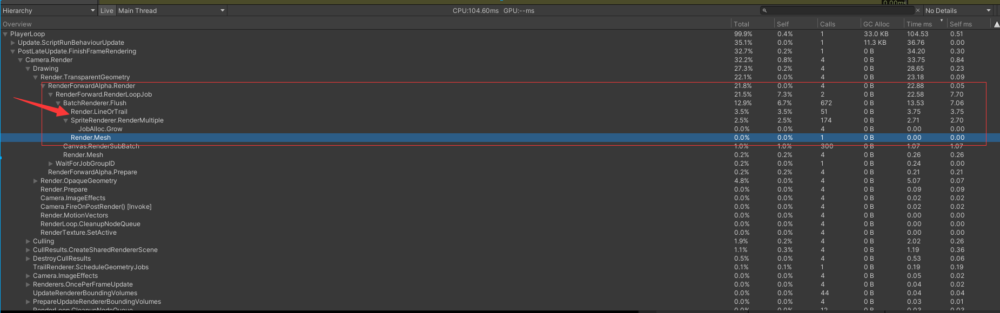

# EOC项目笔记

- [ ] ScrollRect 工具封装


### SProto 分析

```csharp
     int Pack(Sproto.SprotoTypeBase o)
        {
            byte[] encodeWarpPackage;
            int gameSession;
            long sprotoId;
            byte[] token = new byte[0];
            pack.Encode(o, ref token, out encodeWarpPackage, out gameSession, out sprotoId);
            return encodeWarpPackage.Length;
        }

        NetMsgPackage pack = new NetMsgPackage();
        Role_CreateArmy.request req ;
        public override void Update()
        {
            if (Input.GetKeyUp(KeyCode.Y))
            {
                req = new Role_CreateArmy.request();
                Debug.LogError($" 0 >>>{Pack(req)}>>>{Codingriver.Dumper.Dump(req)}");
                req = new Role_CreateArmy.request();
                req.targetType = 1;
                Debug.LogError($" 1 >>>{Pack(req)}>>>{Codingriver.Dumper.Dump(req)}");
                req = new Role_CreateArmy.request();
                req.targetType = 1;
                req.isSituStation = true;
                Debug.LogError($" 2 >>>{Pack(req)}>>>{Codingriver.Dumper.Dump(req)}");
                req = new Role_CreateArmy.request();
                req.targetType = 1;
                req.isSituStation = true;
                req.targetArg = new MarchTargetArg { targetName = "hello" };
                Debug.LogError($" 3 >>>{Pack(req)}>>>{Codingriver.Dumper.Dump(req)}");
            }
            if(Input.GetKeyUp(KeyCode.U))
            {
                req = new Role_CreateArmy.request();
                req.heros = new List<MarchHero>(1);
                req.heros.Add(new MarchHero() { heroId = 2 });
                Debug.LogError($" map 1 >>1 >>>{Pack(req)}>>>{Codingriver.Dumper.Dump(req)}");
                req = new Role_CreateArmy.request();
                req.heros = new List<MarchHero>(1);
                req.heros.Add(new MarchHero(){ heroId = 2   });
                req.heros.Add(new MarchHero(){ heroId = 3   });
                req.heros.Add(new MarchHero(){ heroId = 4   });
                req.heros.Add(new MarchHero(){ heroId = 200 });
                req.heros.Add(new MarchHero(){ heroId = 300 });
                req.heros.Add(new MarchHero(){ heroId = 400 });
                req.heros.Add(new MarchHero(){ heroId = 20  });
                req.heros.Add(new MarchHero(){ heroId = 30  });
                req.heros.Add(new MarchHero(){ heroId = 40  });
                Debug.LogError($" map 1 >>>{Pack(req)}>>>{Codingriver.Dumper.Dump(req)}");
                req = new Role_CreateArmy.request();
                req.heros = new List<MarchHero>(1);
                req.heros.Add(new MarchHero() { heroId = 2 });
                req.heros.Add(new MarchHero() { heroId = 3 });
                req.heros.Add(new MarchHero() { heroId = 4 });
                req.heros.Add(new MarchHero() { heroId = 200 });
                req.heros.Add(new MarchHero() { heroId = 300 });
                req.heros.Add(new MarchHero() { heroId = 400 });
                req.heros.Add(new MarchHero() { heroId = 20 });
                req.heros.Add(new MarchHero() { heroId = 30 });
                req.heros.Add(new MarchHero() { heroId = 40 });
                req.targetType = 1;
                req.isSituStation = true;
                Debug.LogError($" map 4 >>>{Pack(req)}>>>{Codingriver.Dumper.Dump(req)}");
            }
            if (Input.GetKeyUp(KeyCode.I))
            {
                req = new Role_CreateArmy.request();
                req.soldiers = new Dictionary<long, SoldierInfo>();
                req.soldiers[2] = new SoldierInfo { id = 2 };
                req.soldiers[3] = new SoldierInfo { id = 3 };
                req.soldiers[4] = new SoldierInfo { id = 4 };
                req.soldiers[5] = new SoldierInfo { id = 200 };
                req.soldiers[6] = new SoldierInfo { id = 300 };
                req.soldiers[7] = new SoldierInfo { id = 400 };
                req.soldiers[8] = new SoldierInfo { id = 20 };
                req.soldiers[9] = new SoldierInfo { id = 30 };
                req.soldiers[10]= new SoldierInfo { id = 40 };
                req.heros = new List<MarchHero>(1);
                req.heros.Add(new MarchHero() { heroId = 2 });
                req.heros.Add(new MarchHero() { heroId = 3 });
                req.heros.Add(new MarchHero() { heroId = 4 });
                req.heros.Add(new MarchHero() { heroId = 200 });
                req.heros.Add(new MarchHero() { heroId = 300 });
                req.heros.Add(new MarchHero() { heroId = 400 });
                req.heros.Add(new MarchHero() { heroId = 20 });
                req.heros.Add(new MarchHero() { heroId = 30 });
                req.heros.Add(new MarchHero() { heroId = 40 });
                req.targetType = 1;
                req.isSituStation = true;
                Debug.LogError($" map 5 >>>{Pack(req)}>>>{Codingriver.Dumper.Dump(req)}");
            }
        }
```




# AssetBundle 包体大小
> 当前冗余资源 111 ，总资源数 5430
> 
## Shader打包问题
> shader的ab文件 `all_shader.ab` 大小 `1291kb`
> `shader.ab` 大小 `302kb`
> (shader.ab内容)
>


#### 依赖信息异常
(all_shader.ab内容) 应该是把所以shader打包进去，但是Container 异常


**解决办法：**
- 导入Unity内置Shader到项目中  
    `var arr = AssetDatabase.GetDependencies(path, true);` 不能收集到内置Shader依赖。

- Shader 中 `UsePass`和`FallBack`及其他依赖需要单独处理   
    `var arr = AssetDatabase.GetDependencies(path, true);` 无法收集Shader引用依赖，但是如果shader打包bundle会自动手机依赖，造成引用计数错误，可能会造成冗余

- 变体收集（keywords），`ShaderVariantCollection`生成资产`.shadervariants`，然后收集整个项目的变体  
    这里需要注意 `ShaderVariantCollection.WarmUp`,项目使用一个`ShaderVariantCollection`资产，会处理所有的变体，`WarmUp`执行可能需要更长时间


## Material 打包问题

`m_SavedProperties`的数据冗余，无用数据被打包进去


- 使用项目内工具 `Tools/清理材质中的废弃属性` 清理


## 打包冗余优化历程
> `AssetDatabase.GetDependencies`无法获取unity内置shader的依赖关系,也不能获取Shader依赖其他Shader的依赖关系（FallBack ，UsePass等等） 
>
> `EditorUtility.CollectDependencies()` 可以获取内置Shader的依赖信息，而且能否收集shader依赖其他Shader的关系 (`FallBack`可以收集，`UsePass`需要测试)

1. 打包shader使用`ShaderVariantCollection`收集keyword组合，单独使用list引用所有要使用的shader，这时候发现会有unity 内置shader在list中，需要剔除，Standard变体太多，不能加入list中，不能被打包进去，需要将所有引用Standard的资源分析替换其他shader，（）
    - 这里使用打包一个Shader 的AB包时通过`IPreprocessShaders`来收集所以keyword变体，

1. 内置shader冗余（`AssetDatabase.GetDependencies`无法获取unity内置shader的依赖关系）
    - 导入内置Shader到项目中，然后替换所有内置shader引用，使用导入的shader替换原有内置shader，重新打包资源
2. 默认材质球及内置Shader冗余，没有材质球资源的情况，这时候使用内置默认材质球（Default-Material，Sprites-Default，Default-ParticleSystem）
    > `IPreprocessShaders` 可能无法处理默认材质球的shader问题，所以在上一步处理内置冗余时，默认材质球的引用没有收集到。
    - 使用工具找出所有使用Unity内置材质球的资源，根据需求替换其他材质球

3. 材质球引用的纹理Texture 且Texture是Sprite资源，这时候Texture单独一个AB文件，材质球是另一个AB文件，则会出现冗余
 >使用`BuildPipeline.BuildAssetBundles`打包AB文件会有这个问题 （*图中下面绿色框，error文件夹*）
 - 使用`UnityEditor.Build.Pipeline.CompatibilityBuildPipeline.BuildAssetBundles`会解决这个问题（*图中上面蓝色色框，general文件夹*）
 >参考  <https://forum.unity.com/threads/unity-5-6-0b4-problem-with-asset-bundle-the-file-archive-cab-8bc5a956f7efa6356fcd1d00c8005f99.452006/>


4. 材质球`m_SavedProperties`中的无用属性（有可能引用纹理，但是已经删除了）
> 上图中`RenderTexture #4`纹理，实际材质球中已经删除，但是还是会被引用

5. 完全替换内置资源
> <https://blog.csdn.net/e295166319/article/details/60140796>


# 部队性能排查
>物体缓存池 优先
> gc检查
> 特效



- 部队头像update中刷新loadsprite和name (每帧调用)
    - update中的业务分解，像loadsprite和name等不需要每帧执行的按需处理
- 部队英雄释放技能时对应头像播放UI特效，特效有内存泄露，特效创建后大概率不卸载，每次播放时不卸载的特效也跟着播放（缓存池失效）
    - 使用缓存池处理，着重处理回收

>GC问题
- `String.Format`
```
            //TODO:GC严重,调用频繁（一帧内调用多次）
            view.m_lbl_count_troops_LanguageText.text =string.Format("{0}/{1}", count, m_TroopProxy.GetTroopDispatchNum());
```
- List或者Dictionary Clear后重建， 调用频繁


                    case RssType.HolyLand_PVP:
                    case RssType.Sanctuary_PVP:
                    case RssType.Altar_PVP:
                    case RssType.Shrine_PVP:
                    case RssType.LostTemple_PVP:
                    case RssType.CheckPoint_PVP:
                    case RssType.Checkpoint_1_PVP:
                    case RssType.Checkpoint_2_PVP:
                    case RssType.Checkpoint_3_PVP: