# IGG开发笔记

## 待分析
- [ ] C#关于String暂存池（常量池）
    > [C#关于String暂存池（常量池）](https://www.cnblogs.com/qjns/p/13125170.html)  
    > [C#中字符串的内存分配与暂存池【非常详细】](https://blog.csdn.net/xiaouncle/article/details/87832198)  

- [ ] `CircularBuffer` 
- [ ] `LockFreeQueue<T>` 
    >use `LockFreeQueue<MemoryStream>`,`LockFreeQueue<Const<TCPCommon.NETWORK_STATE>>`
- [ ] [GCHandle](https://docs.microsoft.com/zh-cn/dotnet/api/system.runtime.interopservices.gchandle)

- [ ] [Sproto](https://github.com/cloudwu/sproto)
    > [skynet中sproto的简单使用](https://zhuanlan.zhihu.com/p/345878937)  
    > [sproto rpc 的用法](https://blog.codingnow.com/2015/04/sproto_rpc.html)  
- [ ] 配置表数据文件的大小分析，数据反序列化耗时及内存峰值分析，分析后找出一种耗时及内存最优方案
    >  二进制方式，unityasset自带反序列化方式，protobuffer方式，其他通信协议方式，sqlite方式
- [ ] proto序列化和反序列化耗时及内存峰值分析，压缩和解压缩耗时及内存峰值，3des加密和解密耗时及内存峰值

## PureMVC

> 说明:<https://blog.csdn.net/wangjiangrong/article/details/107686954>  
> 官方文档：<http://puremvc.org/docs/PureMVC_IIBP_Chinese.pdf>  
> github c#: <https://github.com/PureMVC/puremvc-csharp-standard-framework>  
> github: <https://github.com/PureMVC>  
> 官网：<http://puremvc.org> （提供pdf中文文档）

>>>
>如果在 Mediator 里有很多对 View Component 的操作（响应 Event 或Notification），那么应该考虑将这些操作封装为 View Component 的一个方法，提高可重用性。
>如果一个 Mediator 有太多的对 Proxy 及其数据的操作，那么，应该把这些代码重构在 Command 内，简化 Mediator，把业务逻辑（Business Logic）移放到Command 上，这样 Command 可以被 View 的其他部分重用，还会实现 View 和Model 之间的松耦合提高扩展性

## 网络通信优化
> 游戏内通信协议使用`Sproto`序列化
### 通信反序列化分析
> 优化前:   
> *当前截图为win10 unity editor测试*  
>*编号为1的测试数据，每帧解析30001协议50次的开销，测试数据为`Map_ObjectInfo.request`,数据包含有60个`MapObjectInfo`对象*   
> 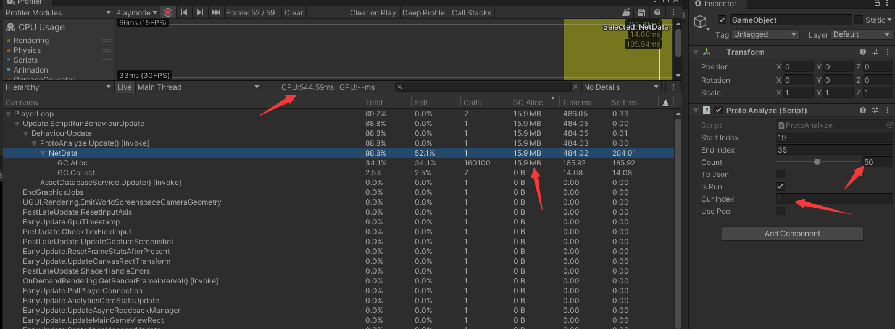  

**协议开销分析**
1. `SocketAsyncEventArgs mReceiveEventArgs` 异步socket 收到网络数据
1. 网络数据 写入`mReceiveBuffer`中
    > 
1. 然后`Copy`到`mReadQueueBuffer`（网络数据拆包）进行传递
    > 
1. 然后使用`packetData`进行派发，`packetData`是新的buffer
    > 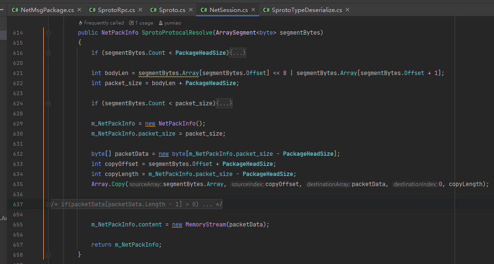  
    >   
    >
1. 通过`Socket`异步回调线程将`packetData` 存储到`private LockFreeQueue<MemoryStream> mReceivePacketQueue`队列中，然后通过`unity`主线程进行派发,在主线程中进行`Decode`
    > 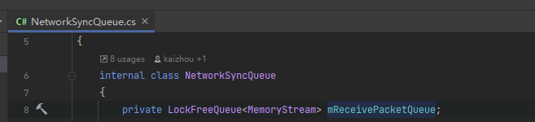
1. `Decode`时，`MemoryStream.ToArray()`进行拷贝，生成新的buffer
    >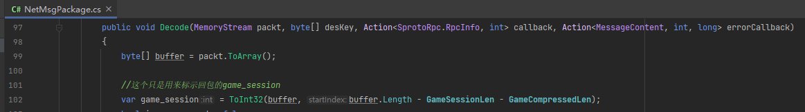  
    > 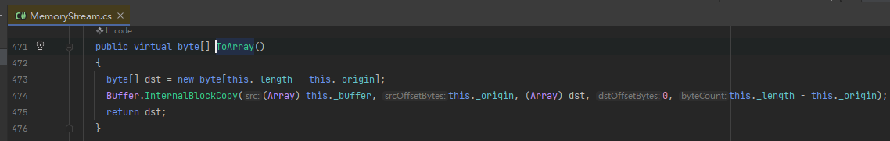  
    > 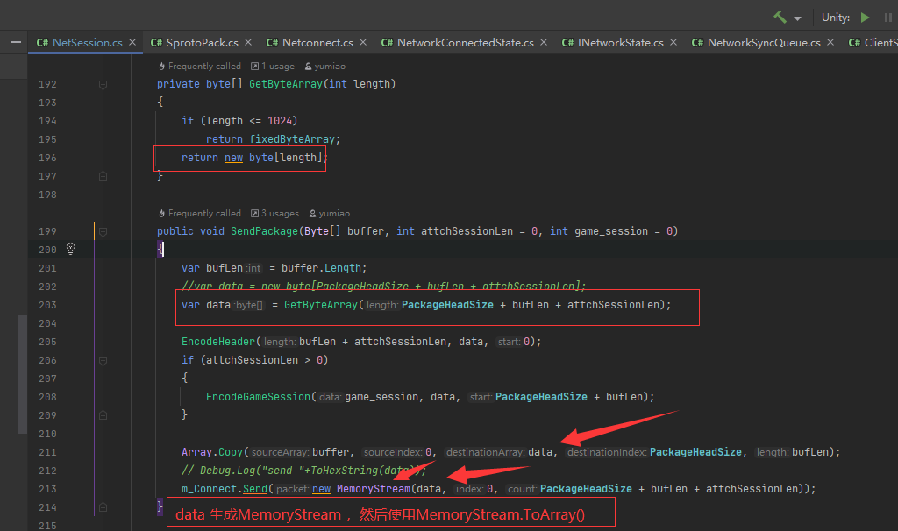  
    >  
    >  
1. `Decode`首先进行解压缩，解压缩时先把原始buffer`Copy`到`newBuffer`，`newBuffer`是新的buffer
    > 
1. 然后进行解压缩`decomBuffer`，解压缩`decomBuffer`是新的buffer
    > 
    > 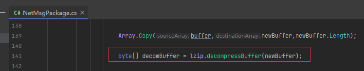
1. 解压后进行解密`outBuffer`，解密是新的buffer
    > 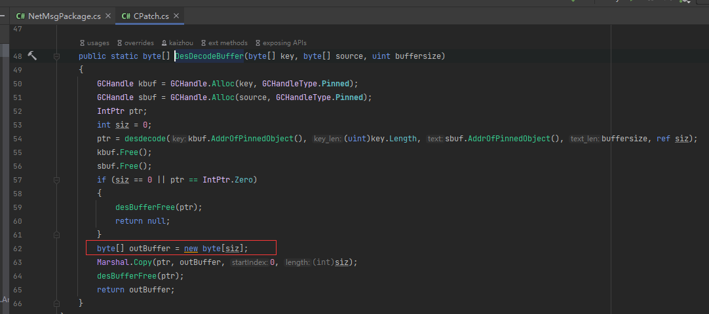
1. 解密后进行解包`unpack_data`,解包是新的buffer
    > 
1. 解包后解析对象`Package`
1. 解析对象后进行解析对象`GateMessage`,`GateMessage`对象有新的`byte[]`字段,该字段有新的buffer
    > 收到的每个协议先反序列化成`GateMessage`对象，该对象的字段`private List<MessageContent> _content;` 带有`private byte[] _networkMessage;`字段，这个字段是真实协议对象的原始数据，gc严重
    > 
    > 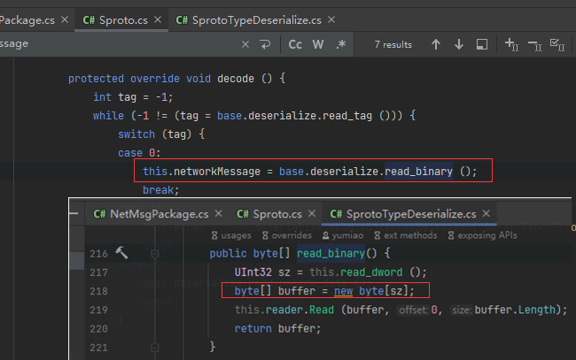
1. 将解析对象封装到`RpcInfo`对象中
1. 使用`GateMessage`进行解包`unpack_data`,解包是新的buffer
1. 开始解析具体业务对象,同时会封装到`RpcInfo`中
1. `RpcInfo`进行解封，使用具体业务对象进行业务派发
### 通信反序列化优化
1. 调整`Sproto`反序列化流程，使其支持缓存重复利用，将`MessageContent`的`byte[]`调整为`BufferStream`，支持重复利用`buffer`，减少`GC`
1. `packetData`的`MemoryStream` 替换成`RecyclableMemoryStream`，进行缓存利用，且支持跨线程处理
1. 调整业务，替换掉`MemoryStream.ToArray()`，解析过程使用`RecyclableMemoryStream`

1. 解压缩前使用的`decomBuffer`，替换为常驻的大`buffer`，只创建一次，就不销毁了，重复利用
1.  解压缩后使用的`decomBuffer`，替换为常驻的大`buffer`，只创建一次，就不销毁了，重复利用
1. 解密后使用的`outBuffer`，替换为常驻的大`buffer`，只创建一次，就不销毁了，重复利用
1. 解包使用的`unpack_data`，这里使用两个大`buffer`进行处理，只创建一次，就不销毁了，重复利用，
    > 解析协议`GateMessage`前执行`unpack`,解析协议`GateMessage`后，解析具体业务协议前也会执行`unpack`,这里剥离具体业务的影响，进行分步处理，使用两个大`buffer`分别对应两次解析协议
1. `RpcInfo`、`GateMessage.request`、`GateMessage.response`、`MessageContent`等等对象需要进缓存池,这些对象是为反序列化服务的
1. 调用频繁的业务协议使用缓存池进行处理
    >`MessageContent`是工具生成的，为了防止冲突，改为`MessageContentEx`  
    > 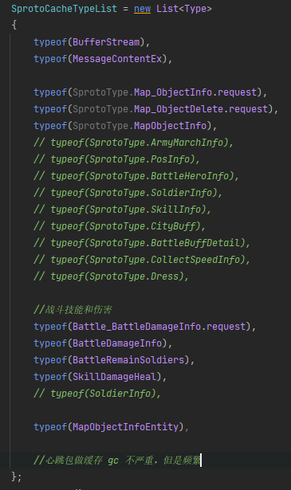

>优化中期参照：  
> *编号为1的测试数据，每帧解析30001协议50次的开销，测试数据为`Map_ObjectInfo.request`,数据包含有60个`MapObjectInfo`对象*   
>   
> *上面结果是将所有协议都做缓存，包括`MapObjectInfo`内部字段引用的协议*
> 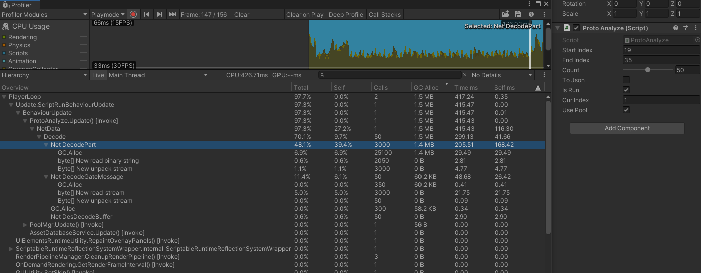  
> *上面是将`MapObjectInfoEntity`的`Dictionary`使用`MapObjectInfo`，不创建新的,具体业务会有bug*
> `et.heros = new System.Collections.Generic.Dictionary<System.Int64,SprotoType.BattleHeroInfo>();`
>

> 优化最终结果:
>*编号为1的测试数据，每帧解析30001协议50次的开销，测试数据为`Map_ObjectInfo.request`,数据包含有60个`MapObjectInfo`对象*   
> 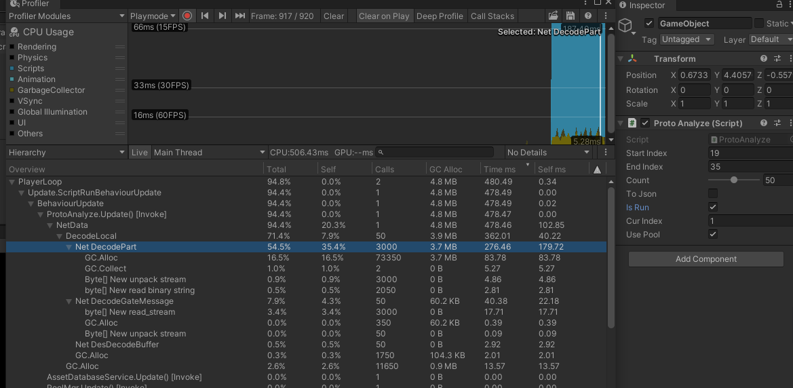   
> `MapObjectInfo`的内部字段引用的协议类型没有做缓存（多个协议会引用相同的协议，复杂度太高）;  
> `MapObjectInfoEntity`的`Dictionary`还是创建新的，否则业务有bug;  
> 
> 测试数据优化前后`GC`对比
> *编号为1的测试数据，每帧解析30001协议50次的开销，测试数据为`Map_ObjectInfo.request`,数据包含有60个`MapObjectInfo`对象*   
> 优化前 15.9MB
> 优化后 4.8MB

>    
>游戏中优化前后对比:  
> 优化前每一次调用 `GC` 是 `255kb`
> 优化后第一次调用 `GC` 是 `114.1kb`
> 优化后第二次调用 `GC` 是 `86.6kb`

>对进入地图场景初始化的`Map_ObjectInfo.request`协议数据50倍测试
>优化前 15.9MB
>优化后 4.8MB
>

> PoolMgr的缓存池测试
>
>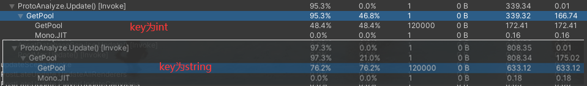