# IGG性能分析笔记

> 世界地图优化前的数据  
>   
>
> 优化后的数据：  
>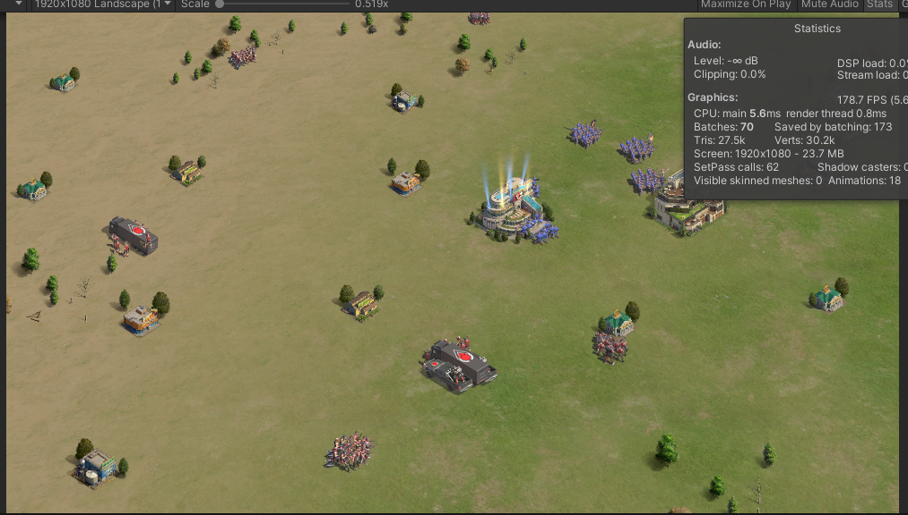


## 动态批处理说明
> 参考 ： 
>[Unity批处理手游——动态VS静态批处理](https://www.unity3dtips.com/unity-batching-dynamic-vs-static/)  
>[Unity3d Tips](https://www.unity3dtips.com/) 
>[Batch Breaking Cause](https://github.com/Unity-Technologies/BatchBreakingCause)  
>[Unity-25种合批失败的原因](https://www.cnblogs.com/Jaysonhome/p/13529789.html) 


 
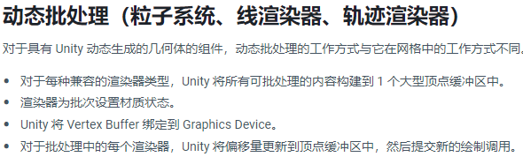

*unity版本不同，动态合批限制也不同，需根据对应版本的官方文档去处理。*

*（注意：如果您正在开发 Unity PC 游戏，请记住动态批处理会产生 CPU 开销，因此除非您受到繁重的 GPU 渲染时间的瓶颈，否则您可能希望在项目中禁用动态批处理！）*

*注意：动态批处理并不总是适用于场景中的所有对象！即使您设法将所有对象减少到 300 个顶点以下，大量动态批处理计算的成本最终也会成为非常昂贵的 CPU 操作。（虽然 GPU 会很高兴！）*

与静态批处理不同，动态批处理的对象可以四处移动，并且具有刚体物理特性。他们也有自己的局限性：

- 必须与批处理的比例完全相同（也不支持镜像比例，例如，如果您有一个比例为 -1 的对象与一个比例为 1 的对象）*(`Sprite Renderer`和`Particle System`不受缩放影响)*
- 需要共享完全相同的材料参考以一起批处理
- 必须按顺序一起渲染！如果渲染顺序在一个批次之间有其他渲染，那么它将被分成多个批次
- 每个对象都必须低于上述顶点限制，具体取决于它使用的着色器

常见合批失败原因：

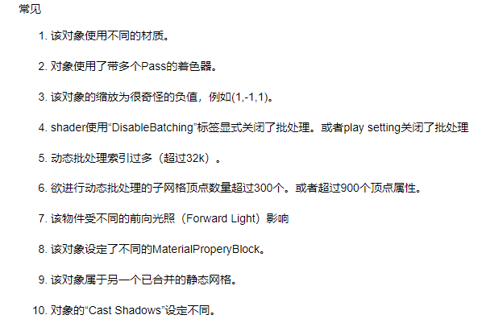

Unity中`Player Settings > Other Settings > Dynamic Batching` 

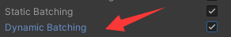

**注意: `Sprite Renderer`和`Particle System` 默认启用`Dynamic Batching`，不会受到 `Player Setting`的动态合批开关的影响。**
## 地图GPU优化规划
 1. 场景内地表，灯光，河流等
 1. 场景内圣地，关卡及周边环境等静态业务对象
 1. 场景内的静态特效及圣地关卡的静态特效
 1. 运行时玩家城堡，联盟建筑，资源点等 动态创建后位置不动的纹理使用图集进行合批，待定
 1. 怪物,召唤怪（艾萨克）,圣地召唤怪等，（核心处理普通怪物,量级太大）
 1. 玩家部队
 1. 部队上挂载的特效，战斗的弹道，弹道特效等
 1. 战斗的部队释放技能特效（暂不处理，周期太长，效率提升有限）
  
##  优化方案简述
1. 世界地图上，所有单位及装饰物进行渲染顺序规划，提高动态合批的成功率
1. 简化模式
    >- 部队简化显示  
    >- 部队上的默认特效进行移除  
    >- 性能瓶颈时，考虑部分动画进行屏蔽出现动画，消失动画，休闲动画）  
    >- 不同的图集使用不同的sortingorder进行渲染顺序控制，保证动态合批成功率（放弃前后遮挡关系，效率优先）  
    >- 部队阵型及移动插值计算进行简化，特别是移动方向变化后阵型调整的计算（转向）
    
1. 怪物合批    
    >- 不同的图集使用不同的sortingorder进行渲染顺序控制，保证动态合批成功率（放弃前后遮挡关系，效率优先）  
    >- 性能瓶颈时，考虑部分动画进行屏蔽出现动画，消失动画，休闲动画）  
    >- 怪物上的默认特效进行移除
    >- 部队阵型及移动插值计算进行简化，特别是移动方向变化后阵型调整的计算（转向）

**优化结果：**

1. 在展示层（不计算UI） 优化前drawcall为452,优化后为71 
1. 在lod第一层时 优化前drawcall为107，优化后为87
1. 在lod最高层时 所有建筑单位（重点是关卡圣地）的drwacall为54，优化后为17
1. 战斗部队200支头像 优化前drawcall为1400，优化后为22
1. 驻扎部队23支的名字 优化前drawcall为46，优化后为13

## 渲染顺序规划
地图渲染顺序说明（New）   MapSortingOrder

默认层-Default(地面，山，河流，水，树草等)  
```
        Land = -100,                       //地表
        MountainGrove = -90,      // 山 树  
        RiverLake = -80,                //河水 湖泊
        HolyLandRoad = -70,       //圣地表 公路
        Circle = -1,        // 圆形的环 当移动到obj，长按空地/主城时出现
		行军线
		联盟线
		资源富集区
```        
怪物层-Monster		
角色层-Army			默认是和建筑一个层级，在性能瓶颈时，单独一个配置，方便部队合批
建筑层-Building	(城堡，资源点，联盟建筑，圣地，关卡，帮会据点等)
特效层-Effect(战斗特效,静态特效)
BillText
3DUI特效层-UIEffect
天空层-Sky(迷雾等)

## 待处理问题
1. lod中间层，会显示缩略图，还有展示图(自由行军会用)


## 怪物合批和部队合批

地图 建筑单位可以合并图集处理


分析场景 `map-analyse.unity `

分析前的`drawcall`是 `478`


只显示怪的数据`drawcall`是 `274`


怪是3转3的图片，带阴影，有8个方向，每个动作都有8个方向，所有动作：攻击，待机，行走，跑步，攻击，休闲 

1. 调整图集方案
现在图集的方案是每只怪的所有动作作为一个图集  
调整图集：  
**所有怪的相同动作作为一个图集，因为图集太大，这里将所有士兵怪按照相同动作生成为一个图集的方案去处理**

2. 使用精灵切块工具[SpriteDicing
](https://github.com/Elringus/SpriteDicing)尝试将序列帧中每帧相同部分进行公用。 

3. 一个动作需要为8方向生成序列帧，这里考虑下是否能接受 左右镜像来减少序列帧素材，
    > 提供左上，左，左下的序列帧，通过镜像方式作为右上，右，右下的序列帧使用，这样就能减少3方向的素材，减小包体
    >需要考虑阴影单独拆分
    
4. 动态合并图集
5. shader实现一个材质球代表一个怪物的展示(shader实现几*几的方格子，同时渲染多个图集的数据)
    >
    >弊端：怪物和别的怪或者部队有交叉重叠时，不能交叉渲染，前后遮挡关系会有细节问题

6. 怪物里面的每个士兵和英雄 根据图集设置固定的order，分离渲染顺序
    >会丢失阵型前后遮挡关系，也会丢失重叠怪的遮挡关系
    
    >测试调整后的怪，drawcall只有`7`
    >
    
7. 角色和角色阴影分离
    > 减小角色图集 ,阴影可以使用更低的分辨率，使角色图集能容纳更多角色的图
    > 降低overdraw，角色和阴影在一个图中，形成大面积的透明区域，overdraw严重
    > 可以根据角色生成对应的mesh，降低overdraw，带阴影的情况下mesh不能复用
    > 阴影可以再中低平台设备上关闭，或者中端使用一个阴影图片来代替，降低阴影的性能开销，更可控
8. 使用 [SortingGroup](https://docs.unity3d.com/cn/2021.2/Manual/class-SortingGroup.html) 进行分组 
    >Unity 按 Sorting Layer 和 Order in Layer 渲染器属性对同一排序组中的所有渲染器进行排序。在此排序过程中，Unity 不会考虑每个渲染器的 **Distance to Camera** 属性。实际上，Unity 会根据包含 Sorting Group 组件的根游戏对象的位置，为整个排序组（包括其所有子渲染器）设置 Distance to Camera 值。  
    >配置在怪物上，表现一般，大量重叠的对象上效果应该更好一些  
    >

#### 结论
**使用第6条方案，每个士兵和英雄 根据图集设置固定的order，分离渲染顺序**
    
>数据比对 测试场景 `mapbatches.unity`
>优化前的怪和部队drawcall `426`  
> 
>
>优化后的怪和部队drawcall `36`  
>


## 场景内lod高层静态特效及物体
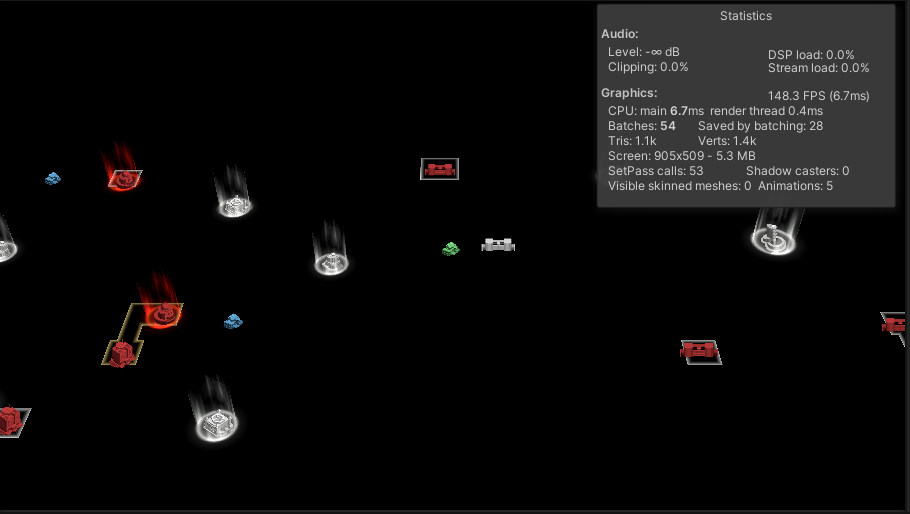

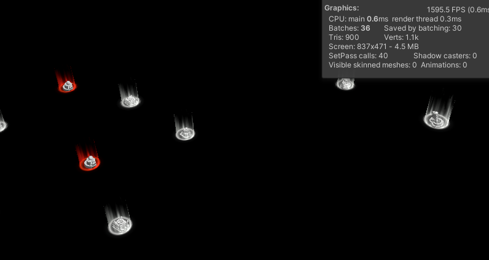

>优化后的数据 （lod 对象这里没有进行图集整合，需要时可以支持）
>优化前drawcall是 54，优化后是17，效果非常可观，但需要注意动态合批的CPU及内存开销
>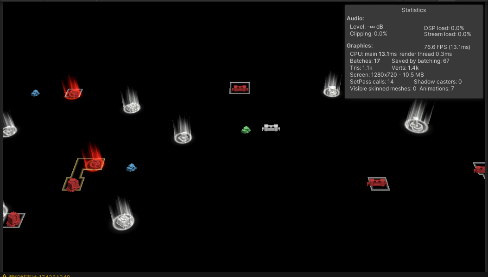

### 静态特效

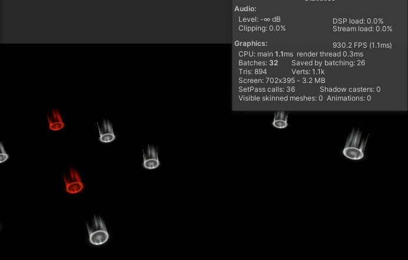

优化后特效后的结果: 

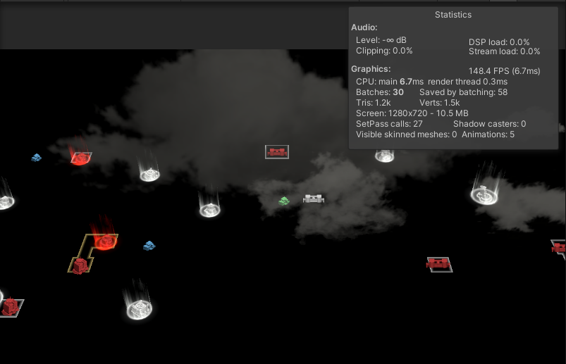

**结论**
1. 给特效物体不同的材质球指定不同的`sortingorder`
>如果不同材质球的物体使用相同的`sortingorder`，unity内部
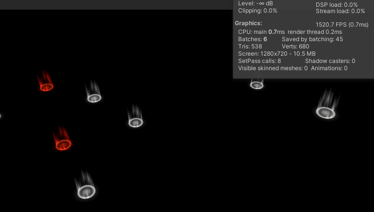

### 静态物体

drawcall 序号1和3是相同图集相同材质球,序号2和4也是相同图集相同材质球，1,2,3,4使用的相同shader，且，1,2,3,4动态合批的物体互相没有遮挡，


**结论**

1. 动态合批时，渲染顺序穿插会造成消耗更多的drawcall，最好指定固定的`sortingorder`,手动控制顺序，这样能提高动态合批的成功率.
>调整后的drawcall从4个变成2个

2. 所有圣地的图片需要调整到一个图集里面
>调整后的drawcall从4个变成1个

3. 占领后需要调整颜色，则使用`MaterialPropertyBlock`进行处理，不会打断合批(前提是支持`GPU Instancing`)

4. 这里使用顶点颜色进行颜色调整

5. `SpriteRenderer`针对不同sprite生成不同的mesh，mesh不同，所以不支持`GPU Instancing`合批，

### 在lod层时 会有展示层内容占用drawcall
 相机从展示层到lod1层时，策划的需求是可点击业务单位及可以自由行军到业务单位，所以展示层的节点保留了，会把展示层的sprite节点`localScale`设置为`0`，但scale为0还是会占用drawcall。

 **处理方案：** 将scale为0时的sprite位置设置到相机外的位置

 

处理后的`drawcall`

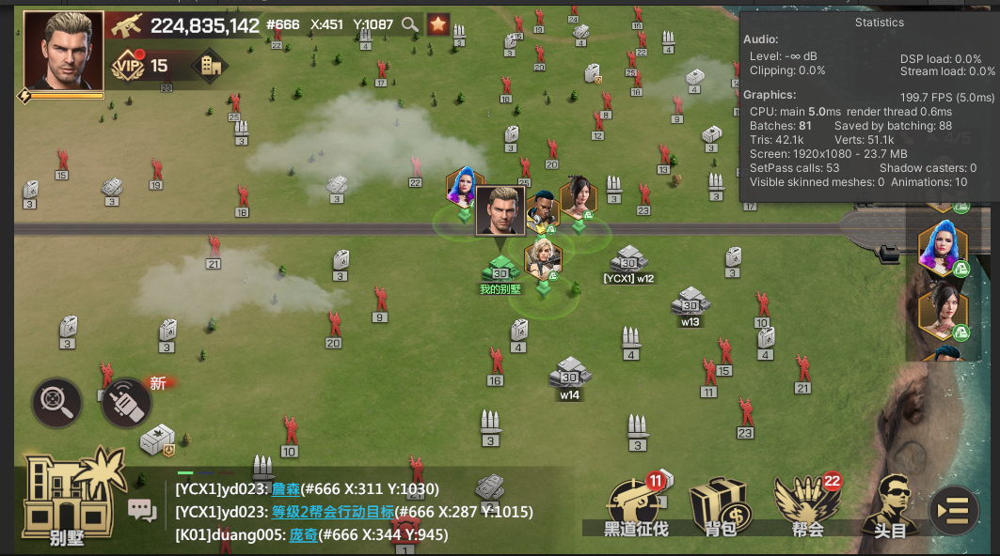

## 静态特效
>联盟标记，城堡护盾，冒烟特效，着火特效， 部队移动烟尘，lod高层圣地常驻特效，普攻子弹特效，

1. 城堡护盾、冒烟，着火特效
护盾特效（`effect_map_huzhao`）本身占用10个drawcall，有两个模型组成，每个模型5个材质球，且模型不能动态合批合批（因为不同材质球的渲染顺序相同）


*7个护盾特效，占用60个drawcall，视野内随着护盾数量的增长，drawcall也急速增长*

**结论**
- 建议优化护盾特效，降低材质球数量
    > 这里半球护盾特效是有两个mesh组成（1/2的半球mesh）,这两个mesh是相同的，（思考下是否可以使用1/4的半球mesh？） 
    > `eff_banyuan_007_1`和`eff_banyuan_007_2` mesh是一样的，资源冗余问题
    >
- 将材质球的`RenderQueue`进行调整，不同的材质球使用不同的值，可以进行动态合批
    >测试后的drawcall `11` 
    >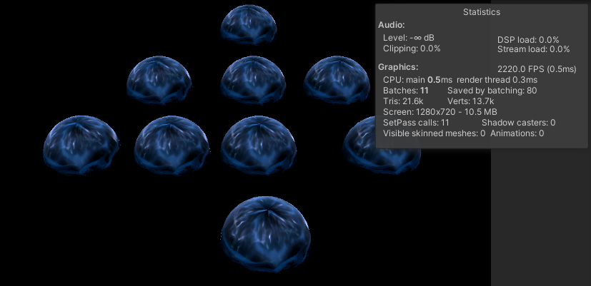
    >将 `Sorting Group`组件移除后drawcall 是`6` （`Sorting Group`这里打断动态合批了） 
    >

2. 普通子弹特效

**爆炸特效**
`effect_map_tongyong_touzhiwu_baozha` 炮弹爆炸特效 有7个材质球，每个爆炸特效 占用7个drawcall。
24个爆炸特效，同时播放会有 71 drawcall，特效有动态合批，但drawcall还是随着特效数量增长而增长

**处理方案：**将爆炸特效的sortingorder分别设置不同的值，24个爆炸特效，同时播放会有9个drawcall（一个clear的drawcall，一个天空盒的drawcall），特效完美动态合批，且drawcall不会随着特效数量增加而增加

> 着火和冒烟特效 也是这样的处理方案

**炮弹特效**


`effect_map_tongyong_touzhiwu` 炮弹的顶点数量过多不能动态合批，
**处理方案：**调整模型的顶点数，不高于300个顶点


## UI及UI特效

1. `UI_Pop_TroopNameState` 部队名字及状态图标


23支部队，只显示`UI_Pop_TroopNameState` 占用drawcall就达到46 
`UI_Pop_TroopNameState`节点上添加有`Canvas`组件,所以打断合批了


**处理方案：**
    - 将`Canvas`组件移除，给状态图标添加`SortingGroup`组件，将名字和图标层级分离，这样保证`Text`组件和`Image`组件分别独立合批，不会被打断
    - 图标显示分底图和图标，将底图和图标放到同一个图集中。 

>优化后：
>


2. `UI_Pop_TroopSelectHUD` 部队选中后的信息显示

5支部队，占用20个drawcall 
`UI_Pop_TroopSelectHUD`节点上添加有`Canvas`组件,所以打断合批了
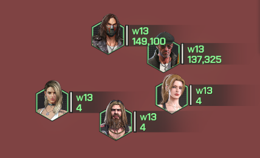


>关于合批 UGUI的一个缺陷  
>  
> *头像框合批失败，所以是3个drawcall*  
>  
> *白色图片不能合批，一共占用3个drawcall*
>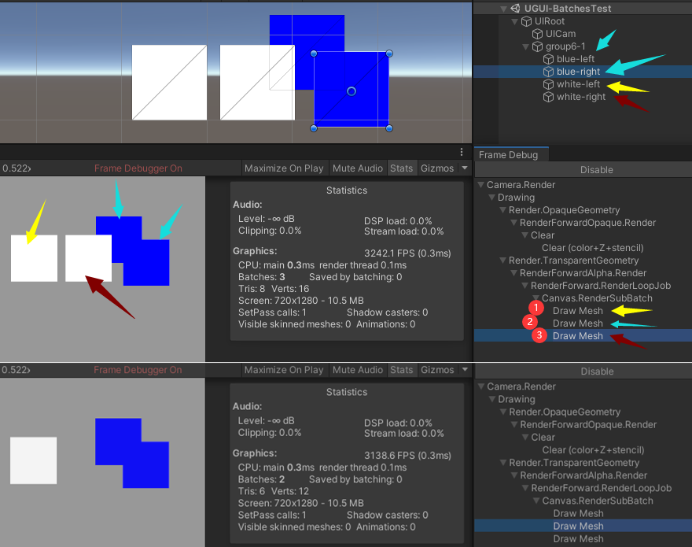 
>根据上图占用3个drawcall，推断出，Hierachy内的上下关系不能保证临近位置合批，受到前后遮挡关系影响。 
>这里有个问题是 第1个drawcall先绘制的左侧的白图，根据Hierachy的顺序，应该先绘制蓝色图片才对?
>UGUI是根据Depth进行相邻的Depth合批，不相邻的不能合批，这里可以调整节点关系

3. `UI_Pop_TroopFightInfoHUD` 战斗头像

10支部队，占用50个drawcall，200支部队占用drawcall为1000  ,200支部队副将头像也显示 drawcall为 1400
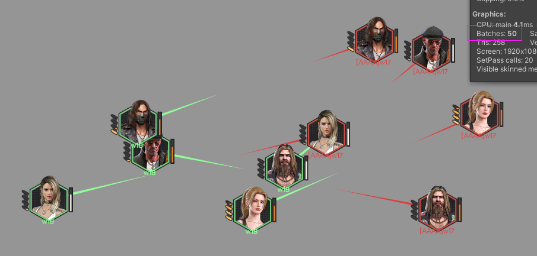  
200支部队  
  
问题：  
- 每个头像上添加有Canvas组件  
> 去除Canvas组件后 drawcall 是19,200支部队占用drawcall为375  
- 每个头像上的指向线添加有Canvas组件  
>这个Canvas组件是保证指向线的层级在头像后面，不能去除。  
>这里去除Canvas后使用固定的材质球调整Render Queue来替代处理层级关系，替换材质球后drawcall为16，200支部队占用drawcall为412   
>  
- 如果不显示指向线，且把Canvas组件去除，头像的drawcall为9，  200支部队占用drawcall为175   
>  
- 指向线通过`MultiImage`组件合并成一个mesh进行处理   
> 这时候指向线和头像同时显示的drawcall为10，  200支部队占用drawcall为176   
>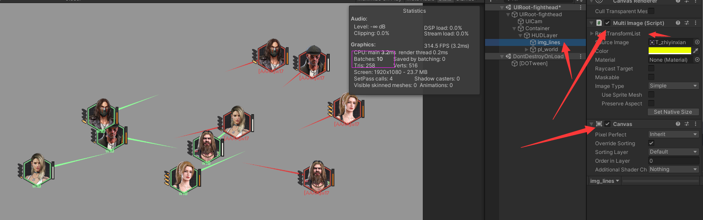


**处理方案**
- 指向线通过`MultiImage`组件合并成一个mesh进行处理   

- 战斗头像超过一定数量限制后,处理办法:   
    1. 进行位置更新频率调整，
    1. 缩放效果停止播放，
        > 别人不会播放，只有自己的部队及和自己对战的会播放
    1. 战斗头像的技能特效停止播放，战斗抖动效果停止播放
        > 别人不会播放，只有自己的部队及和自己对战的会播放
    1. 分离成名字组和头像组，遮挡关系舍弃
    1. 数量级很大时，再次分组，canvas Rebuild更新Mesh会非常耗时

- 图集调整，将英雄战斗头像这一个尺寸类型单独打包一个图集为`duilietouxiang`图集
    1. 将战斗头像框，血条，技能充能条放到该图集中
    1. 部队的状态图标，状态图标底图，别动队图标放到该图集中（战斗头像和行军列表使用相同的头像） 
        >
    >英雄头像的图集放有多种尺寸类型的，这个图集不合理  
    >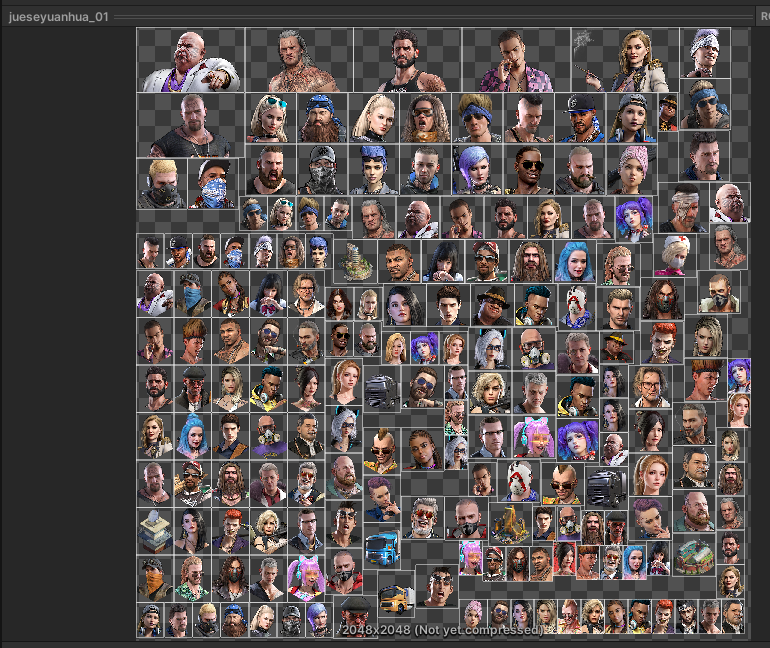  


 优化前 200支部队，不显示指向线时 drawcall为1200  
 优化后 200支部队，不显示指向线时 drawcall为  21 (去掉canvs，所有头像相关图片调整到一个图集中)    
 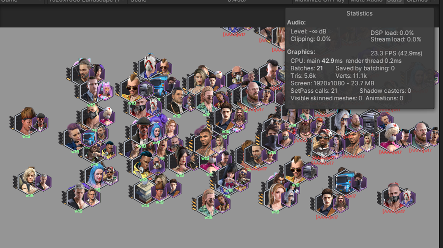  


## 内城优化
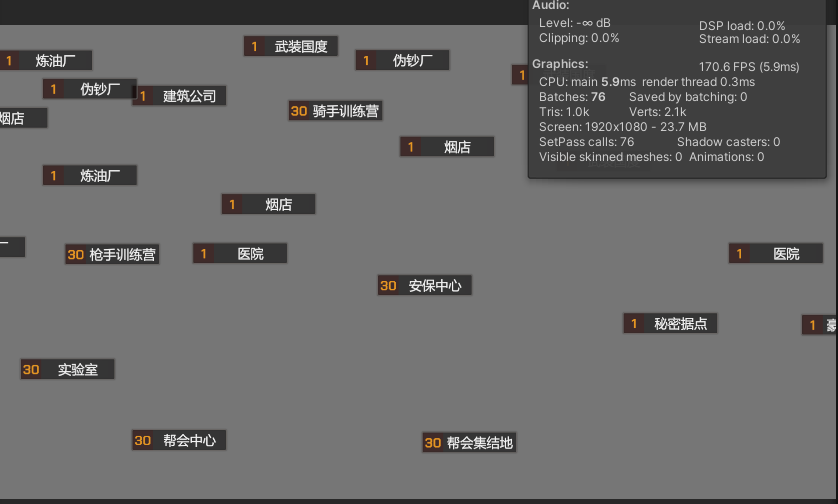
*每个hud上添加有Canvas组件*  
**移除后的效果：**
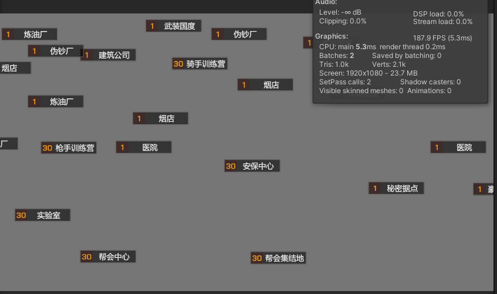