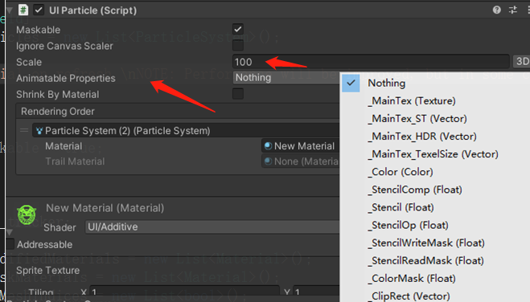

# ParticleEffectForUGUI使用教程

# `UIParticle`使用教程

> Unity中 `UGUI` 使用 `Particle System`每次需要设置rendererorder和layer等信息来控制排序，非常繁琐，这里使用`ParticleEffectForUGUI`插件来解决该问题。   
> [ParticleEffectForUGUI](https://github.com/mob-sakai/ParticleEffectForUGUI)  

## 使用
设置Game窗口的分辨率 `1920*1080`  

将带`Particle System`组件的物体放到`UGUI`根节点里面  

将带`Particle System`组件的物体添加 `UIParticle` 组件,该组件会自动添加到子节点的所有带`Particle System`组件的物体上

`Scale`:调整该`Particle System`的缩放,不影响子物体  
`Animatable Properties`:如果使用Animation或者其他动画更新（Update）材质球上的属性，则勾选上对应的Shader属性即可  

删除则需要每个物体去删除 `UIParticle` 组件  

## 说明
每个带`Particle System`组件的物体都要增加 `UIParticle` 组件  （可以挂到prefab根节点物体上，可以是空物体）

`ParticleEffectForUGUI`会自动合批处理，不被打算的情况下  

`ParticleEffectForUGUI`插件支持 `Mask` `Rect Mask2D`等遮罩，需要在使用的Shader上添加模板测试(`Stencil`)和`ClipRect`代码进行支持