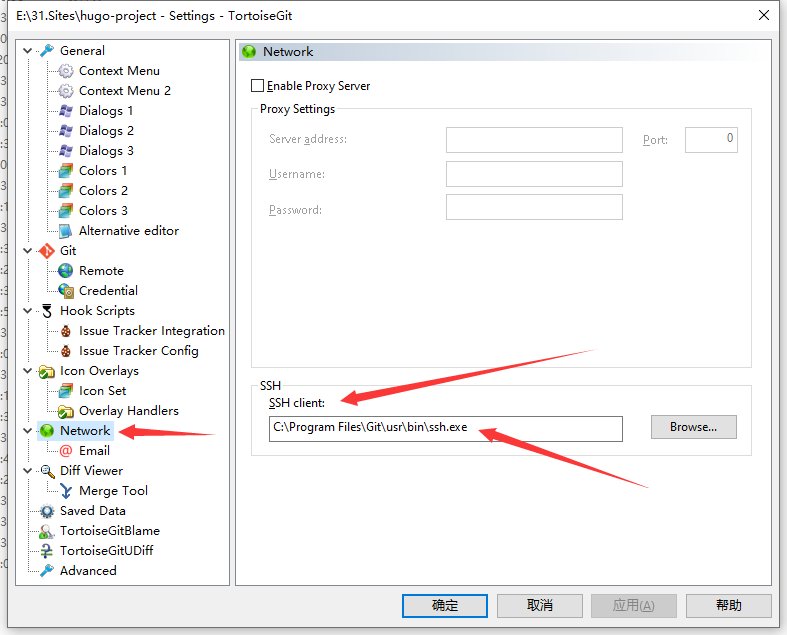

# SSH笔记

## ssh-keygen 基本用法

ssh-keygen命令用于为“ssh”生成、管理和转换认证密钥，它支持RSA和DSA两种认证密钥.

ssh-keygen(选项)

```c
-b：指定密钥长度； 
-e：读取openssh的私钥或者公钥文件； 
-C：添加注释； 
-f：指定用来保存密钥的文件名； 
-i：读取未加密的ssh-v2兼容的私钥/公钥文件，然后在标准输出设备上显示openssh兼容的私钥/公钥； 
-l：显示公钥文件的指纹数据； 
-N：提供一个新密语； 
-P：提供（旧）密语；
-q：静默模式； 
-t：指定要创建的密钥类型。
```

> 特别注意 `-C` 参数：
> `-C`：添加注释   
> **如果在github中配置ssh 则这个参数的值必须是github的邮件名称**，不能是其他的

案例：
```sh
ssh-keygen -t rsa -f id_rsa_github -C "codingriver@163.com"
# -t 指定要创建的密钥类型
# -f 指定创建的密钥文件名字
# -C 注释 注意如果是github配置ssh，这里必须是github的邮箱名称

ssh-keygen -t ed25519 -C "codingriver@163.com"
```


## 验证ssh
```sh
# 验证github ssh配置是否成功
ssh -vT git@github.com
# or
# 验证github ssh配置是否成功
ssh -vT git@github.com
```
## 配置ssh密钥登录

- 在本地电脑上生成密钥
   ```
   ssh-keygen -t rsa
   ```
   生成密钥和公钥，将公钥复制到远程服务器的.ssh目录下
- 远程ssh配置
   ```c
   cd ~/.ssh
   ls                 //ls你可以看到这个文件
   touch authorized_keys  //生成认证文件，其实已经有了
   cat id_rsa.pub >> authorized_keys // 将上面生成公钥复制到.ssh后然后复制到authorized_keys文件
   chmod 600 authorized_keys    //设置文件权限
   chmod 700 -R .ssh              //是指文件夹权限
   ```
- 远程sshd_config文件配置
   文件位置： `/etc/ssh/sshd_config`,需要使用管理员权限打开
   几步处理：
   ```c
   //使用密钥登录
   RSAAuthentication yes
   PubkeyAuthentication yes
   //禁止空密码和Root密码登录：
   PermitEmptyPasswords no
   PasswordAuthentication no
   ```
- ssh登录测试
```sh
ssh -i .ssh/remote_rsa root@101.43.160.247
// - i 指定密钥的文件路径
// root 登录的用户名
// 最后是ip
```
>参考 <https://blog.csdn.net/ouzuosong/article/details/52225087>  
> 安装ssh <https://www.cnblogs.com/wangboyu/articles/11611925.html>

## ssh登录

- 第一种 在命令行中指定私钥文件
```sh
# -i 指定私钥地址（私钥和公钥的文件名是一样的，只不过公钥文件有一个 .pub 后缀名。换句话说，如果把本地公钥给删了，只剩下私钥是无法登录的，因为在登录时要将公钥id发送给服务端，这样服务端才知道要选择哪个公钥加密）
$ ssh -p 22 root@192.168.56.102 -i ~/.ssh/id_rsa_server
```
- 第二种 使用 ssh-agent 代理
```sh
# 先添加私钥
$ ssh-add ~/.ssh/id_rsa_server
# 查看添加的私钥
$ ssh-add -l
# 使用 ssh-agent 代理，ssh-agent 会在 ssh-add 列表中寻找到合适的私钥
$ ssh root@192.168.56.102
```

- 第三种 在 SSH 配置中指定私钥文件
```sh
$ vim ~/.ssh/config

Host gateway # 主机别名，使用 ssh gateway 命令可以直接登录该主机
Protocol 2  # SSH 协议版本
HostName example.com # 主机地址，支持IP或域名
Port 22  # SSH 服务端口号
User ubuntu # 登录用户名，会被 ssh root@gateway 覆盖，除非使用 ssh gateway
IdentityFile ~/.ssh/id_rsa # 使用的私钥文件
```
例子：`~/.ssh/config`
权限： 
```sh
# 为.ssh目录设置权限
chmod 600 ~/.ssh/config
```
```
Host server
  HostName 101.43.160.247
  IdentityFile ~/.ssh/remote_rsa
  User root
  Port 22
  ServerAliveInterval 60
  ServerAliveCountMax 14400

Host remote
  HostName wgqing.com
  IdentityFile ~/.ssh/remote_rsa
  User root
  Port 22
  ServerAliveInterval 60
  ServerAliveCountMax 14400  

```

> 参考：   
><https://zhuanlan.zhihu.com/p/257430478>    
><https://blog.csdn.net/baalhuo/article/details/78067621>
## 问题

#### 关于ECDSA key fingerprint is 
```
mrwang@CodingdeMBP .ssh % ssh -T git@github.com
The authenticity of host 'github.com (20.205.243.166)' can't be established.
ECDSA key fingerprint is SHA256:p2QAMXNIC1TJYWeIOttrVc98/R1BUFWu3/LiyKgUfQM.
Are you sure you want to continue connecting (yes/no/[fingerprint])? yes
Warning: Permanently added 'github.com,20.205.243.166' (ECDSA) to the list of known hosts.
git@github.com: Permission denied (publickey).
mrwang@CodingdeMBP .ssh % ssh-add ~/.ssh/github
Identity added: /Users/mrwang/.ssh/github (my mac for github codingriver@163.com)
mrwang@CodingdeMBP .ssh % ssh -T git@github.com
Hi codingriver! You've successfully authenticated, but GitHub does not provide shell access.
```
新建ssh，将公钥添加至github后，使用`ssh -T git@github.com`验证报ECDSA key fingerprint is xxx 错误。
是因为**新建SSH后没有开启代理**

**为SSH key 启用SSH代理**
```
$ ssh-add ~/.ssh/id_rsa
```

#### ssh 出现Permission denied (publickey)问题
```
% git push
git@github.com: Permission denied (publickey).
fatal: Could not read from remote repository.

Please make sure you have the correct access rights
and the repository exists.
```
修改配置文件 `/etc/ssh/ssh_config` (windows系统 `C:\Program Files\Git\etc\ssh\ssh_config`)，添加如下一行
```
   IdentityFile ~/.ssh/github_rsa  # github_rsa是密钥文件的名字
```
就可以了
> 这里可能是因为我修改密钥文件名字造成的，通配符匹配不到


#### SSH用私钥登录远程服务器时提示私钥不安全

>使用 `chmod 600 id_ed25519`就好了，私钥文件权限问题

```sh
@@@@@@@@@@@@@@@@@@@@@@@@@@@@@@@@@@@@@@@@@@@@@@@@@@@@@@@@@@@
@         WARNING: UNPROTECTED PRIVATE KEY FILE!          @
@@@@@@@@@@@@@@@@@@@@@@@@@@@@@@@@@@@@@@@@@@@@@@@@@@@@@@@@@@@
Permissions 0644 for '/Users/mrwang/.ssh/***' are too open.
It is required that your private key files are NOT accessible by others.
This private key will be ignored.
Load key "/Users/mrwang/.ssh/***": bad permissions
git@codeup.aliyun.com: Permission denied (publickey).
fatal: Could not read from remote repository.

Please make sure you have the correct access rights
and the repository exists.

```

#### ssh认证代理连接失败
> 需要执行下`ssh-agent bash`启动代理

```
$ ssh -vT git@github.com
OpenSSH_9.1p1, OpenSSL 1.1.1s  1 Nov 2022
debug1: Reading configuration data /etc/ssh/ssh_config
debug1: Connecting to github.com [::1] port 22.
debug1: Connection established.
debug1: identity file /c/Users/coding/.ssh/id_rsa type -1
debug1: identity file /c/Users/coding/.ssh/id_rsa-cert type -1
debug1: identity file /c/Users/coding/.ssh/id_ecdsa type -1
debug1: identity file /c/Users/coding/.ssh/id_ecdsa-cert type -1
debug1: identity file /c/Users/coding/.ssh/id_ecdsa_sk type -1
debug1: identity file /c/Users/coding/.ssh/id_ecdsa_sk-cert type -1
debug1: identity file /c/Users/coding/.ssh/id_ed25519 type -1
debug1: identity file /c/Users/coding/.ssh/id_ed25519-cert type -1
debug1: identity file /c/Users/coding/.ssh/id_ed25519_sk type -1
debug1: identity file /c/Users/coding/.ssh/id_ed25519_sk-cert type -1
debug1: identity file /c/Users/coding/.ssh/id_xmss type -1
debug1: identity file /c/Users/coding/.ssh/id_xmss-cert type -1
debug1: identity file /c/Users/coding/.ssh/id_dsa type -1
debug1: identity file /c/Users/coding/.ssh/id_dsa-cert type -1
debug1: Local version string SSH-2.0-OpenSSH_9.1
kex_exchange_identification: Connection closed by remote host
Connection closed by ::1 port 22


$ ssh-add id_rsa_github
Could not open a connection to your authentication agent.


$ ssh-add -l
Could not open a connection to your authentication agent.

```

私钥的权限

```sh
-rw-r--r--@  1 mrwang  staff   432  3 11 13:18 id_ed25519
-rw-r--r--@  1 mrwang  staff   113  3 11 13:18 id_ed25519.pub
-rw-------   1 mrwang  staff  2602 12 19 22:37 id_rsa
-rw-r--r--@  1 mrwang  staff   573 12 19 22:37 id_rsa.pub
```
使用 `chmod 600 id_ed25519`就好了，私钥文件权限问题
```sh
-rw-r--r--@ 1 mrwang  staff   627  2 12 18:52 config
-rw-------@ 1 mrwang  staff   432  3 11 13:18 id_ed25519
-rw-r--r--@ 1 mrwang  staff   113  3 11 13:18 id_ed25519.pub
-rw-------  1 mrwang  staff  2602 12 19 22:37 id_rsa
-rw-r--r--@ 1 mrwang  staff   573 12 19 22:37 id_rsa.pub
```

> 参考：<https://my.oschina.net/philosopher/blog/314134>


#### github使用ssh及小乌龟tortoisegit配置ssh的正确姿势

如果你也在使用小乌龟客户端，你可能会遇到使用SSH协议的仓库不能成功push的问题，这时你需要确保tortoisegit设置的SSH客户端是Git提供的才对。

