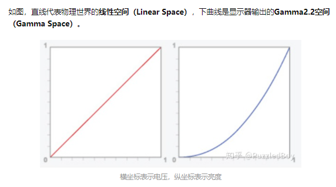
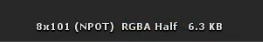

# Shader笔记

> **Shader Language目前主要有3种语言**
>- 基于OpenGL的OpenGL Shading Language，简称 `GLSL`;
>- 基于DirectX的High Level Shading Language,简称 `HLSL`;
>- 还有NVIDIA公司的C for Graphic，简称 `Cg` 语言
>
> **渲染相关博客及网站**
> [catlikecoding](https://catlikecoding.com/) :render相关博客  

### 渲染管线流程

    CPU应用阶段： 视锥体剔除，渲染顺序，提交Drawcall
    顶点处理   ： 顶点MVP空间变换，自定义参数
    光栅化操作 ： 裁剪，NDC归一化，背面剔除，屏幕坐标，图元装配，光栅化
    片元处理   ： 光照着色，纹理着色
    输出合并   ： Alpha测试，模版测试，深度测试，颜色混合
    最后输出到帧缓冲区

 #### CPU应用程序渲染逻辑
a. 剔除：
- 视锥体剔除（Frustum Culling）
- 层级剔除（Layer Culling Mask），遮挡剔除（Occlusion Culling）等规则

b. 渲染排序：
- 渲染队列 RenderQueue
- 不透明队列（RenderQueue < 2500）
   按摄像机 **从前往后** 排序
- 半透明队列（RenderQueue >2500）
   按摄像机 **从后往前** 排序（为了保证效果的正确性）

c. 打包数据（Batch）：大量数据，参数发送到gpu

**模型信息**
  - 顶点坐标
  - 法线
  - UV
  - 切线
  - 顶点颜色
  - 索引列表

**矩阵**
  - 世界变换矩阵
  - VP矩阵：根据射线机位置和fov等参数构建VP矩阵
  - 当矩阵的w分量为0的时候Unity会将其视为向量，而当w分量为1的时候Unity将其视为位置

**灯光，材质参数**
  - Shader
  - 材质参数
  - 灯光信息

d. 调用Shader
  - SetPassCall（Shader，背面剔除等参数，设置渲染数据），DrawCall
  
  
  
  
  
  


#### GPU渲染管线
>CPU端调用DrawCall后 在GPU端启动顶点shader执行顶点处理
>顶点Shader：最主要的处理是将模型空间的顶点变换到裁剪空间
- 顶点处理   ： 顶点MVP空间变换，自定义参数
- 光栅化操作 ： 裁剪，NDC归一化，背面剔除，屏幕坐标，图元装配，光栅化
- 片元处理   ： 光照着色，纹理着色
- 输出合并   ： Alpha测试，模版测试，深度测试，颜色混合  
  
  
  
  
  

裁剪操作是在长方体或者正方体范围内进行的，不是视锥体，这里图中只是表达要进行三角形剔除  
  
##### 颜色混合
常用颜色混合类型
- 正常（Alpha Blend），即透明度混合  
    `Blend SrcAlpha OneMinusSrcAlpha`
- Particle Additive  
     `Blend  SrcAlpha One`
- 柔和叠加(Soft Additive)   
    `Blend OneMinusDstColor One`
- 线性减淡（Additive,Linear Dodge）  
  `Blend One One`    ("LightMode" = "ForwardAdd" 光源叠加Pass使用的混合模式)
- 正片叠底（Multiply），即相乘  
    `Blend DstColor Zero`
- 两倍相乘（2x Multiply）  
    `Blend DstColor SrcColor`
- 变暗（Darken）   
    `BlendOp Min  `  
    `Blend One One  `  
- 变亮（Lighten）  
    `BlendOp Max`  
    `Blend One One`  
- 滤色（Screen）  
    `Blend OneMinusDstColor One`  
    `Blend One OneMinusSrcColor`  


### 空间变换
1. 模型空间（M）（左手坐标系）
1. 世界空间（W）（左手坐标系）
1. 观察空间（V）（右手坐标系）
1. 裁剪空间（P）（左手坐标系）
1. 屏幕空间（左手坐标系）

>裁剪空间是正方形或者长方形，下一步ndc归一化是除以w就到正负1范围内，（z轴在opengl 范围是正负1，在dx中范围是从0到1）
>NDC归一化后进行背面剔剔除（Back Face Culling）根据三角形的索引顺序进行判定背面（三角形索引顺序是顺时针）或者正面（三角形索引顺序是逆时针），然后剔除对应三角形  
  
  

### 类型长度
- float：32位
- half ：16位 精度范围-60000～+60000
- fixed：11位 精度范围-2.0～+2.0;也可能是8位

**一般使用fixed存储颜色和单位矢量**
### Gamma校正（Gamma Correct）
> 参考：[https://zhuanlan.zhihu.com/p/66558476](https://zhuanlan.zhihu.com/p/66558476)

  
  
  
  
  
  

点线代表线性颜色/亮度值（译注：这表示的是理想状态，Gamma为1），实线代表监视器显示的颜色。

`Gamma校正`(Gamma Correction)的思路是**在最终的颜色输出上应用监视器Gamma的倒数**。回头看前面的Gamma曲线图，你会有一个短划线，它是监视器Gamma曲线的翻转曲线。我们在颜色显示到监视器的时候把每个颜色输出都加上这个翻转的Gamma曲线，这样应用了监视器Gamma以后最终的颜色将会变为线性的。我们所得到的中间色调就会更亮，所以虽然监视器使它们变暗，但是我们又将其平衡回来了。

- 显示器的输出在Gamma2.2空间。(显示器自动计算)
- 伽马校正会将颜色转换到Gamma0.45空间。
- 伽马校正和显示器输出平衡之后，结果就是Gamma1.0的线性空间。

```c
//为了有效解决color的值域问题，我们可以使用色调映射（Tone Map）和曝光控制（Exposure Map），用它们将color的高动态范围（HDR）映射到LDR之后再做伽马校正：
color = color / (color + vec3(1.0)); // 色调映射（Tone Map）
color = pow(color, vec3(1.0/2.2)); 	 // 伽马校正
```
### sRGB纹理
基于gamma0.45的颜色空间叫做sRGB颜色空间（Gamma 空间）。

把sRGB纹理变回线性空间：
```c
float gamma = 2.2;
vec3 linear_diffuseColor = pow(texture(sRGB_diffuse, texCoords).rgb, vec3(gamma));
```
变回线性空间后可以进行光照计算等等一系列计算
线性空间转到Gamma空间：
```c
float gamma = 2.2;
vec3 gamma_diffuseColor = pow(linear_color, vec3(1.0/gamma));
```

> Unity中sRGB(Color Texture)选项说明：  
>sRGB (Color Texture)        启用此属性可指定将纹理存储在伽马空间中。对于非 HDR 颜色纹理（例如反照率和镜面反射颜色），应始终选中此复选框。如果纹理存储了有特定含义的信息，并且您需要着色器中的确切值（例如，平滑度或金属度），请禁用此属性。默认情况下会启用此属性。
### linear和srgb,HDR区别
>#### linear模式
>在PBR流程中，环境光线效果需要使用linear模式，原来的gamma模式不再适用。因为gamma模式本身是为了使其他技术渲染出来的模型具有更真实而效果，对环境光进行了修正。但是在pbr中，贴图在设计的时候，完全是按照真实的环境中的光照去计算的，所以此处不再需要修正。
>#### HDR(High Dynamic Range)
> 也叫 **高动态范围**  。
>显示器被限制为只能显示值为0.0到1.0间的颜色（LDR），但是在光照方程中却没有这个限制。通过使片段的颜色超过1.0，我们有了一个更大的颜色范围，这也被称作HDR(High Dynamic Range, 高动态范围)。有了HDR，亮的东西可以变得非常亮，暗的东西可以变得非常暗，而且充满细节。

人眼有光线自适应的特性，这样也是能让人在暗的场景里看到更多东西，在亮的场景里能分辨更多东西，这种效果一般从电影院这样昏暗的场所里走出来更能体会，眼睛会有一个慢慢适应的过程。现在摄像头一般也会自适应曝光度，但是工业需求的有些还是需要不自动的，三维渲染之中，如果把这种真实完全模拟的图像给人眼看到，会感觉比我们人眼看到灰暗的多，所以一般会在硬件方面做一个反曲线最后变成srgb的色彩空间让人看到。

游戏引擎里面最终效果给人看到，当然是这种强化过的适应人眼的色彩空间，但是我做光照计算和贴图就不行，因为会由于多次的色彩强化导致最终画面强烈失真，这时候就是需要linear的色彩空间，计算时候用真实色彩，直到输出这一步把色彩强化一遍以适合人眼。unity很早就是linear的色彩空间，但是由于后期最后一部的矫正方面很多从业人士的素养不足，或者完全没有这个意识，做出来的效果完全是不正确，或者缺乏调整弹性的。而unreal则在工作流上面几乎是整合和后期的色表，去解决这个问题。

而HDR是模拟人眼的过程,能看到更广范围的光（就是亮的时候能更亮瞎），HDR图像的一般色域也超过普通的RGB色域（但也可以不超过）。HDR在unity中需要勾选摄像机上的HDR选项和使用延迟渲染deferred才能（否则会有滤镜提示The camera is not HDR enabled 这是没使用延迟渲染），要看出效果还要加个bloom之类的


### 法线 
>法线一般用切线空间存储，优点：自由度高，uv动画扰动，可以重用，可以压缩（只存储两个方向的数据）  
>切线空间（右手坐标系）： 切线方向（X轴）（和uv的u方向相同,有的是和v方向相同），次法线方向（Y轴）,法线方向（Z轴）

```
    half3 normal_data=UnpackNormal(normalmap);
    float3x3 TBN=float3x3(tangent_dir,binormal_dir,normal_dir);
    normal_dir=normalize(mul(normal_data.xyz,TBN));
    // 和上面矩阵相乘结果一样
    //normal_dir=normalize(tangent_dir*normal_data.x+binormal_dir*normal_data.y+normal_dir*normal_data.z);
```


### 纹理
1. 漫反射纹理
2. 法线纹理
3. 渐变纹理（卡通风格，从冷色调到暖色调）
   1. u方向渐变纹理
   2. LUT（查找表，lookup table）纹理
4. 遮罩纹理
   - 高光强度遮罩
   - 高光指数遮罩
   - 边缘光强度遮罩
   - 自发光遮罩
5. 立方体纹理(天空盒)
6. 渲染纹理（渲染目标纹理，RT）
7. 程序纹理
8. AO贴图
        AO贴图会根据模型某一部分相对于其他组成部分或者其他模型之间的几何距离，模拟模型的光影效果，比如一些夹角会更暗或者更亮，某一些面因为其他模型部分的影响，可能光照更少。
9.  Height贴图，高度图，视差贴图（视差偏移，视差映射）
        height贴图会给模型本身根据实际需要增加凸起或者凹陷的几何效果。比如木质模型，某处被敲打而导致的凹陷效果。
10. 粗糙度贴图
11. 动画纹理（VAT）
12. FlowMap
    


### 光照
- 漫反射：
    - lambert:`max(0,dot(n,l))`
    - halflambert:`dot(n,l)*0.5+0.5`
    `diffuse=basecolor*lightcolor*lambert ( or halflambert )`
- 镜面反射（高光，各向异性高光，kk高光）：
    - phong:`pow(max(dot(v,r),0),_Gloss)`
    - blinn-phong:`pow(max(dot(n,h),0),_Gloss) //性能比phong要好`
    - speccolor=lightcolor*_SpecIntensity*lambert*blinn-phong  ( or phong )
- 间接光漫反射：可以用 **光照探针（light Probe）** ，使用 SH 球谐光照模拟
- 间接光镜面反射:可以用 **反射探针（reflection Probe）**，使用 IBL （基于图像的照明）模拟
- 菲涅尔：
    `float fresnel=_FresnelScale+(1-_FresnelScale)*pow(1-saturate(ndotv),_FresnelPower);`  
    `float reflectionFactor = _FresnelBias + _FresnelScale * pow(1 + dot(i, n), _FresnelPower);`
- 环境光(ambient): 环境光可以理解为间接光的一部分(可以用 **间接光漫反射**和 **间接光镜面反射**代替)
  - `half3 ambient_color = UNITY_LIGHTMODEL_AMBIENT.rgb * base_color.xyz;`
- 自发光
- Matcap: `float2 uv_mapcap=(vNormal*0.5+0.5).xy;`使用观察空间下的法线代表uv坐标  
  

> **Phong 光照模型：** `max(dot(n,l),0)+pow(max(dot(v,r),0),smoothness)+ambient=Phong`  
> **基础光照模型=直接光漫反射(Direct Diffuse)+直接光镜面反射(Direct Specular)+间接光漫反射(Indirect Diffuse)+间接光镜面反射(Indirect Specular)**  
> 直接光镜面反射: PBR中的GGX光照模型  

#### 环境贴图
 环境贴图 （存储环境光或者间接光的漫反射和镜面反射的图像载体），*环境光可以理解为间接光的一部分*。

环境贴图一般转成立方体贴图（Cubemap）使用，原因：**直接采样环境贴图会造成贴图空间的浪费及采样会出现失真情况，所以先转成立方体贴图**

Cubemap立方体贴图的局限性： **只根据方向来采样 Cubemap 会造成采样点错误，这也是为什么Cubemap技术不适合用于平面模型作反射的原因**

立方体贴图（Cubemap）采样：`texCUBE(_CubeMap, reflect_dir)`
  
  
  
  


- CubeMap
```
			samplerCUBE _CubeMap;
			float4 _CubeMap_HDR;  
			    half3 view_dir = normalize(_WorldSpaceCameraPos.xyz - i.pos_world);
				half3 reflect_dir = reflect(-view_dir, normal_dir);
				half4 color_cubemap = texCUBE(_CubeMap, reflect_dir);
				half3 env_color = DecodeHDR(color_cubemap, _CubeMap_HDR);//确保在移动端能拿到HDR信息
```

- IBL_Specular
```c
samplerCUBE _CubeMap;
float4 _CubeMap_HDR;

				half3 reflect_view_dir = reflect(-view_dir, normal_dir);

				float roughness = tex2D(_RoughnessMap, i.uv);
				roughness = saturate(pow(roughness, _RoughnessContrast) * _RoughnessBrightness);
				roughness = lerp(_RoughnessMin, _RoughnessMax, roughness);
				roughness = roughness * (1.7 - 0.7 * roughness);
				float mip_level = roughness * 6.0;

				half4 color_cubemap = texCUBElod(_CubeMap, float4(reflect_view_dir, mip_level));
				half3 env_color = DecodeHDR(color_cubemap, _CubeMap_HDR);//确保在移动端能拿到HDR信息
```
- IBL_Diffuse
```c
			samplerCUBE _CubeMap;
			float4 _CubeMap_HDR;

    			float roughness = tex2D(_RoughnessMap, i.uv);
				roughness = saturate(pow(roughness, _RoughnessContrast) * _RoughnessBrightness);
				roughness = lerp(_RoughnessMin, _RoughnessMax, roughness);
				roughness = roughness * (1.7 - 0.7 * roughness);
				float mip_level = roughness * 6.0;
				float4 uv_ibl = float4(normal_dir, mip_level);
				half4 color_cubemap = texCUBElod(_CubeMap, uv_ibl);
				half3 env_color = DecodeHDR(color_cubemap, _CubeMap_HDR);//确保在移动端能拿到HDR信息
				half3 final_color = env_color * ao * _Tint.rgb * _Tint.rgb * _Expose;
```

- IBL_Reflection-Probe(环境光镜面反射)（unity捕捉生成的,unity最多支持两个反射探针）
```hlsl
    			half3 view_dir = normalize(_WorldSpaceCameraPos.xyz - i.pos_world);
				half3 reflect_view_dir = reflect(-view_dir, normal_dir);

				reflect_view_dir = RotateAround(_Rotate, reflect_view_dir);
				
				float roughness = tex2D(_RoughnessMap, i.uv);
				roughness = saturate(pow(roughness, _RoughnessContrast) * _RoughnessBrightness);
				roughness = lerp(_RoughnessMin, _RoughnessMax, roughness);
				roughness = roughness * (1.7 - 0.7 * roughness);
				float mip_level = roughness * 6.0;

				
				half4 color_cubemap = UNITY_SAMPLE_TEXCUBE_LOD(unity_SpecCube0, reflect_view_dir, mip_level);
				half3 env_color = DecodeHDR(color_cubemap, unity_SpecCube0_HDR);//确保在移动端能拿到HDR信息
```
- IBL_Light-Probe（环境光漫反射，内部使用SH读取）
```
    half3 env_color = ShadeSH9(float4(normal_dir,1.0)); //unity 内置函数
```

- SH球谐光照（环境光漫反射可以使用SH）（可以替代IBL_Diffuse，节省性能，不用读取cube贴图）
```
    			float4 normalForSH = float4(normal_dir, 1.0);
				//SHEvalLinearL0L1
				half3 x;
				x.r = dot(custom_SHAr, normalForSH);
				x.g = dot(custom_SHAg, normalForSH);
				x.b = dot(custom_SHAb, normalForSH);

				//SHEvalLinearL2
				half3 x1, x2;
				// 4 of the quadratic (L2) polynomials
				half4 vB = normalForSH.xyzz * normalForSH.yzzx;
				x1.r = dot(custom_SHBr, vB);
				x1.g = dot(custom_SHBg, vB);
				x1.b = dot(custom_SHBb, vB);

				// Final (5th) quadratic (L2) polynomial
				half vC = normalForSH.x*normalForSH.x - normalForSH.y*normalForSH.y;
				x2 = custom_SHC.rgb * vC;

				float3 sh = max(float3(0.0, 0.0, 0.0), (x + x1 + x2));
```  
  
#### 光照衰减
> 光照衰减计算量太大，unity使用查找表（LUT，lookup table）纹理存储衰减数据（_LightTexture0），如果光源使用了cookie，则使用衰减查找纹理_LightTextureB0。

```
    # ifdef USING_DIRECTIONAL_LIGHT
        fixed atten=1.0;
    #else
        float3 lightcoord = mul(unity_WorldToLight,float4(i.worldPosition,1)).xyz;
        fixed atten=tex2D(_LightTexture0,dot(lightcoord,lightcoord).rr).r; //r equal UNITY_ATTEN_CHANNEL not cookie
    #endif

```
**一种简单的做法 点光源**
```
    # ifdef USING_DIRECTIONAL_LIGHT
        //half3 light_dir=normalize(_WorldSpaceLightPos0.xyz);
        fixed atten=1.0;
    #else
        //half3 light_dir=normalize(_WorldSpaceLightPos0.xyz-i.pos_world);
        half distance=length(_WorldSpaceLightPos0.xyz-i.pos_world);
        half range=1.0/untiy_WorldToLight[0][0]; //光源范围
        fixed atten=saturate((range-distance)/range);
    #endif
    half3 light_dir=normalize( lerp(_WorldSpaceLightPos0.xyz,_WorldSpaceLightPos0.xyz-i.pos_world,_WorldSpaceLightPos0.w));
```
#### 阴影（Shadow）
> 阴影映射纹理（深度纹理）存储距离光源的深度信息  
> 老版本是在光源空间中计算深度数据  
> 新版本部分平台是在屏幕空间中计算深度数据，显卡必须支持MRT才行  
  
  
  
  


### 角色渲染  
  

### 动画
#### uv动画
#### 顶点动画
    1. 顶点动画贴图（VAT）  （风力动画可以用这种）`比较细腻`(旗帜燃烧CS06)
>
>
>
    2.
#### 关键帧动画
#### 骨骼动画

### 屏幕后处理  
  

- 亮度  
`fixed3 finalColor=baseCol.rgb*_Brightness`

- 饱和度 
```
    fixed luminance=0.2125*baseCol.r+0.7154*baseCol.g+0.0721*baseCol.b;
    fixed3 luminanceCol=fixed(luminance,luminance,luminance);
    finalCol = lerp(luminanceCol,finalCol,_Saturation); 
```

- 对比度

```
    fixed3 avgColor=fixed3(0.5,0.5,0.5);
    finalCol=lerp(avgColor,finalCol,_Constrast);
```

- 晕影/暗角（Vignette）

```
    //暗角/晕影
    float2 d=abs(i.uv-half2(0.5,0.5))*_VignetteIntensity;
    d=pow(saturate(d),_VignetteRoundness);
    float dist=length(d);
    float vfactor=pow(saturate(1.0-dist*dist),_VignetteSmoothness);
```  


#### 边缘检测

#### 模糊（Blur）
> 参考：[高品质后处理：十种图像模糊算法的总结与实现](https://blog.csdn.net/poem_qianmo/article/details/105350519)
  
  
##### 方框模糊（Box Blur）

##### 高斯模糊（Gaussian Blur）

##### 双重模糊（Dual Blur）

##### Kawase模糊（DualKawaseBlur）

##### 运动模糊

#### 泛光 （Bloom）

#### 光晕


### 深度纹理和法线纹理

> 设置 `camera.depthTextureMode=DepthTextureMode.DepthNormals;`  
> `_CameraDepthTexture`  


### 全局雾效

### 卡通风格渲染

### 素描风格渲染
### 色调映射(Tone-Mapping)

**用Tone-Mapping压缩高光范围**
*HDR颜色通过色调映射转到（0-1）范围内*
**一般用于屏幕后处理**
```
    // Tone-Mapping 需要将x从Gamma空间转到Lear线性空间使用，结果再转到Gamma空间下
    inline float3 ACESFilm(float3 x)
    {
        float a=2.51f;
        float b= 0.03f;
        float c=2.43f;
        float d=0.59f;
        float e=0.14f;
        return saturate((x*(a*x+b))/(x*(c*x+d)+e))
    }

    // Gamma空间 转Lear空间 color_lear=pow(color_gamma,2.2);
    // Lear空间转Gamma空间 color_gamma=pow(color_lear,1.0/2.2);
```  
  


### 渲染优化
#### 开销成因
1. CPU
   1. 过多的drawcall
   2. 复杂的脚本或者物理模拟
2. GPU
   1. 顶点处理
      1. 过多的顶点
      2. 过多的逐顶点计算
   2. 片元处理
      1. 过多的片元（可能分辨率高或者overdraw）
      2. 过多的逐片元计算
3. 带宽
   1. 使用尺寸很大且未压缩的纹理
   2. 分辨率过高的帧缓存
#### 优化方案
> [【Unity技巧】Unity中的优化技术](https://blog.csdn.net/candycat1992/article/details/42127811)
1. CPU 
   1. 静态批处理（static batching）降低drawcall
   2. 动态批处理（顶点属性小于900（如果使用顶点坐标，法线和纹理坐标则顶点数量小于300），lightmap必须参数相同指向同一位置，多pass打断合并）降低drawcall
   3. 使用图集
   4. 共享材质
2. GPU
   1. 减少顶点数量
      1. 优化几何体
      2. 使用模型lod（Level of Detail）技术（unity中使用LOD Group组件）
      3. 使用遮挡剔除（Occlusion Culling）技术
      4. 使用mesh压缩
   2. 减少片元数量（核心降低overdraw）
      1. 控制绘制顺序
      2. 警惕透明物体
      3. 减少实时光照和阴影
   3. 减少计算复杂度
      1. 使用Shader的LOD技术
         1. 设置Shader.maximumLDO或者Shader.globalMaximumLOD来允许最大的LOD
      2. Shader代码优化
         1. 把高斯模糊和边缘计算计算放到顶点shader中
         2. float存储顶点坐标等变量，half存储一些标量和纹理坐标等信息，fixed适用于大多数颜色变量和归一化的方向矢量
3. 节省内存带宽
   1. 减少纹理大小
   2. mipmap
   3. 关闭readwrite
   4. 纹理压缩（ETC2 8bit，ASTC 4x4 block，PVRTC）
   5. 降低屏幕分辨率

>待处理
> 7.4.2 遮罩纹理的使用 data2
> 着色器替换技术（Shader Replacement）
> 

>常用素材资料：  
><https://sketchfab.com/>  
