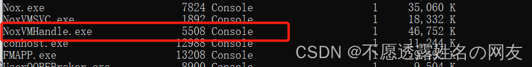
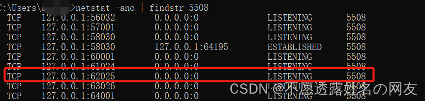

# Shell笔记

## 常用快捷键


## 查看环境变量
`env | less -N`

`printenv | less -N`


打印变量

```sh
echo $?

# mac or linux
echo $PATH

# windows
echo %PATH%
```
## 显示shell变量
`set | less -N`

打印变量

```sh
echo $?

echo $TERM
```

> unset 复位变量
## whereis 和 whatis
```sh
[root@VM-24-15-centos ~]# whatis cp
cp (1)               - copy files and directories
[root@VM-24-15-centos ~]# whereis cp
cp: /usr/bin/cp /usr/share/man/man1/cp.1.gz
[root@VM-24-15-centos ~]# 

```
## who am i
```sh
mrwang@CodingdeMBP hugo-project % who am i 
mrwang   ttys000  Feb  3 12:43 
mrwang@CodingdeMBP hugo-project % who are you
mrwang   ttys000  Feb  3 12:44 
mrwang@CodingdeMBP hugo-project % who goes there
mrwang   ttys000  Feb  3 12:44 
mrwang@CodingdeMBP hugo-project % who is god
mrwang   ttys000  Feb  3 12:44 
```

## lsof
>lsof(list open files)是一个列出当前系统打开文件的工具。

**lsof 查看端口占用语法格式：**
```
lsof -i:端口号
# lsof -i 需要 root 用户的权限来执行

# lsof -i:8000
COMMAND   PID USER   FD   TYPE   DEVICE SIZE/OFF NODE NAME
nodejs  26993 root   10u  IPv4 37999514      0t0  TCP *:8000 (LISTEN)
# 可以看到 8000 端口已经被轻 nodejs 服务占用。
```

更多 lsof 的命令如下：
```
lsof -i:8080：查看8080端口占用
lsof abc.txt：显示开启文件abc.txt的进程
lsof -c abc：显示abc进程现在打开的文件
lsof -c -p 1234：列出进程号为1234的进程所打开的文件
lsof -g gid：显示归属gid的进程情况
lsof +d /usr/local/：显示目录下被进程开启的文件
lsof +D /usr/local/：同上，但是会搜索目录下的目录，时间较长
lsof -d 4：显示使用fd为4的进程
lsof -i -U：显示所有打开的端口和UNIX domain文件
```

## netstat
> `netstat -tunlp` 用于显示 tcp，udp 的端口和进程等相关情况。网络查询

```
# netstat 查看端口占用语法格式：
netstat -tunlp | grep 端口号

netstat -ntlp   //查看当前所有tcp端口
netstat -ntulp | grep 80   //查看所有80端口使用情况
netstat -ntulp | grep 3306   //查看所有3306端口使用情况

-t (tcp) 仅显示tcp相关选项
-u (udp)仅显示udp相关选项
-n 拒绝显示别名，能显示数字的全部转化为数字
-l 仅列出在Listen(监听)的服务状态
-p 显示建立相关链接的程序名


# netstat -tunlp | grep 8000
tcp        0      0 0.0.0.0:8000            0.0.0.0:*               LISTEN      26993/nodejs  
```

## kill 
> 在查到端口占用的进程后，如果你要杀掉对应的进程可以使用 kill 命令：
```
kill -9 PID

# 如上实例，我们看到 8000 端口对应的 PID 为 26993，使用以下命令杀死进程：
kill -9 26993
```
## tar

解压缩

```
tar -zxvf a.tar.gz
```
## 键入信号：erase, werase, kill

|信号|键|作用|
|-|-|-|
|erase|< Backspace > / < Delete >|删除最后一个键入的字符|
|werase|^W|删除最后一个键入的单词|
|kill|^X / ^U|删除整行|

^X 将光标移动到行的开头位置  

## stty命令

```sh
## 显示所有键盘映射当前设置
stty -a

## 屏蔽显示
stty -echo #禁止回显
stty echo #打开回显

## 忽略回车符
stty igncr  # 开启
stty -igncr # 恢复

## 改变ctrl+D的方法:
stty eof "string" # 系统默认是ctrl+D来表示文件的结束,而通过这种方法,可以改变! 
```
|信号|键|作用|
|-|-|-|
|erase|< Backspace > / < Delete >|删除最后一个键入的字符|
|werase|^W|删除最后一个键入的单词|
|kill|^X / ^U|删除整行|
|stop|^S|暂停屏幕显示|
|start|^Q|重新启动屏幕显示|
|eof|^D|指示已经没有数据|


## less 命令
less 与 more 类似，但使用 less 可以随意浏览文件，而 more 仅能向前移动，却不能向后移动，而且 less 在查看之前不会加载整个文件。
```

b  向上翻一页
空格键 向下翻一页
y  向上滚动一行
回车键 向下滚动一行
u  向上翻半页
d  向下翻半页


-i  忽略搜索时的大小写
-N  显示每行的行号
-o  <文件名> 将less 输出的内容在指定文件中保存起来
-s  显示连续空行为一行
/字符串：向下搜索“字符串”的功能
?字符串：向上搜索“字符串”的功能
n：重复前一个搜索（与 / 或 ? 有关）
N：反向重复前一个搜索（与 / 或 ? 有关）
-x <数字> 将“tab”键显示为规定的数字空格
h  显示帮助界面
Q  退出less 命令
[pagedown]： 向下翻动一页
[pageup]：   向上翻动一页
```
- 案例一 分页查看ps进程信息
```sh
## -N 显示行号
ps -aux | less -N
```
- 案例二 查看多个文件
```sh
## 可以使用 n 查看下一个，使用 p 查看前一个。
less 1.log 2.log
```

## scp 命令
>scp是secure copy的简写，用于在Linux下进行远程拷贝文件的命令，和它类似的命令有cp，不过cp只是在本机进行拷贝不能跨服务器，而且scp传输是加密的。可能会稍微影响一下速度。当你服务器硬盘变为只读 read only system时，用scp可以帮你把文件移出来。另外，scp还非常不占资源，不会提高多少系统负荷，在这一点上，rsync就远远不及它了。虽然 rsync比scp会快一点，但当小文件众多的情况下，rsync会导致硬盘I/O非常高，而scp基本不影响系统正常使用。

**使用scp需要远程用户密码；如果配置远程ssh的私钥则不用密码，自动使用私钥登陆**

命令格式
```
scp [参数] [原路径] [目标路径]
[目标路径]: user@server-ip:server-path
```
常用命令参数
```
-C - 这会在复制过程中压缩文件或目录。
-P - 如果默认 SSH 端口不是 22，则使用此选项指定 SSH 端口。
-r - 此选项递归复制目录及其内容。
-p - 保留文件的访问和修改时间。
```
- 复制文件到远程服务器
```
scp logs.tar.gz root@192.168.43.137:/root
```
- 复制远程服务器文件到本地
```
scp  root@192.168.43.137:/root/logs.tar.gz ./
```
- 复制文件夹到远程服务器
```
scp -rC syslog root@192.168.43.137:/root
```
- 复制远程服务器文件夹到本地
```
scp -rC  root@192.168.43.137:/root syslog
```


>参考:  
><https://www.cnblogs.com/peida/archive/2013/03/15/2960802.html>  
><https://www.linuxprobe.com/scp-cmd-usage.html>  
## rsync 命令
>Rsync（remote sync ; remote synchronous）是UNIX 及类UNIX 平台下一款神奇的数据镜像备份软件，它不像FTP 或其他文件传输服务那样需要进行全备份，**Rsync 可以根据数据的变化进行差异备份，从而减少数据流量**，提高工作效率。你可以使用它进行本地数据或远程数据的复制，Rsync 可以使用SSH 安全隧道进行加密数据传输。Rsync 服务器端定义源数据，Rsync 客户端仅在源数据发生改变后才会从服务器上实际复制数据至本地，如果源数据在服务器端被删除，则客户端数据也会被删除，以确保主机之间的数据是同步的。**Rsync 使用TCP `873` 端口**。
**使用rsync需要远程用户密码；如果配置远程ssh的私钥则不用密码，自动使用私钥登陆**
配置文件：`/etc/rsyncd.conf`。

>windows安装 rsync 
> <https://www.itefix.net/cwrsync>   
> <https://www.cnblogs.com/zhangweiyi/p/10571273.html>  
> <https://blog.csdn.net/zetion_3/article/details/103575905> 


常用参数：
```
-a 包含-rtplgoD
-r 同步目录时要加上，类似cp时的-r选项
-v 同步时显示一些信息，让我们知道同步的过程
-l 保留软连接
-L 加上该选项后，同步软链接时会把源文件给同步
-p 保持文件的权限属性
-o 保持文件的属主
-g 保持文件的属组
-D 保持设备文件信息
-t 保持文件的时间属性
--delete 删除DEST中SRC没有的文件
--exclude 过滤指定文件，如--exclude “logs”会把文件名包含logs的文件或者目录过滤掉，不同步
-P 显示同步过程，比如速率，比-v更加详细
-u 加上该选项后，如果DEST中的文件比SRC新，则不同步
-z 传输时压缩
```

## sz,rz 命令
>
>使用xshell来操作服务非常方便，传文件也比较方便。
>就是使用rz，sz

首先，服务器要安装了rz，sz
`yum install lrzsz`

当然你的本地windows主机也通过ssh连接了linux服务器
运行rz，会将windows的文件传到linux服务器
运行sz filename，会将文件下载到windows本地

#### 同步文件夹
- 上传文件夹及同步
```sh
## -r 递归处理文件夹
## 文件夹最后必须带斜杠(/)，不带则远程会创建文件夹
## 第一次同步后，第二次及后面的同步都是增量同步，存在的文件且相同的不会传输
rsync -r ~/pub/ 101.43.160.247:~/public/

## --delete 本地如果删除文件或文件夹，同步后会删除远程的文件或文件夹（exclude 忽略的文件或文件夹除外）
## --exclude 本地忽略同步的文件或文件夹，例如项目中.git文件夹不需要同步到远程
rsync -rtvpz --delete --exclude .git ~/pub/ root@101.43.160.247:~/public/

rsync -rt --delete --exclude .git ~/pub/ 101.43.160.247:~/public/

```
- 下载文件夹及同步
```sh
## -r 递归处理文件夹
## 文件夹最后必须带斜杠(/)，不带则远程会创建文件夹
## 第一次同步后，第二次及后面的同步都是增量同步，存在的文件且相同的不会传输
rsync -r 101.43.160.247:~/public/ ~/pub/ 

## --delete 本地如果删除文件或文件夹，同步后会删除远程的文件或文件夹（exclude 忽略的文件或文件夹除外）
## --exclude 本地忽略同步的文件或文件夹，例如项目中.git文件夹不需要同步到远程
rsync -rtvpz --delete --exclude .git 101.43.160.247:~/public/ ~/pub/ 

```

#### 同步文件
- 上传文件及同步
```sh
rsync  ~/pub/a.txt 101.43.160.247:~/public/f.txt 

```
- 下载文件及同步
```sh
rsync  101.43.160.247:~/public/f.txt ~/pub/a.txt

```

> 参考：  
> <https://www.jianshu.com/p/5a799b36c7e1>  
> <https://blog.csdn.net/allway2/article/details/103073243>  
> [Rsync同步时删除多余文件](https://www.cnblogs.com/kevingrace/p/5766139.html)  
>[rsync --exclude 参数](https://www.cnblogs.com/bass6/p/5542079.html)  
> [windows 上rsync客户端使用方法](https://blog.csdn.net/admin_root1/article/details/78911674)


## md5sum 使用
> centos 默认安装了`md5sum`命令

- 计算二进制文件的md5:
```sh
# -b, --binary         Read files in binary mode
# -t, --text           Read files in ASCII mode
md5sum  filename
```

- 计算字符串md5值：
```sh
[root@xyz.com ~]$ echo -n 'hello world!' | md5sum
fc3ff98e8c6a0d3087d515c0473f8677  -
```
注：一定要加上'-n'参数，代表去掉控制字符。

错误命令示例1：
```sh
[root@xyz.com ~]$ echo 'hello world!' | md5sum
c897d1410af8f2c74fba11b1db511e9e  -
```
错误操作2：将文本`hello world！`写在文本文件中进行保存`test`文件，然后对文件进行`md5sum`。
```sh
mrwang@CodingdeMBP Sites % echo 'hello world!' | md5sum 
c897d1410af8f2c74fba11b1db511e9e  -
mrwang@CodingdeMBP Sites % cat test | md5sum
c897d1410af8f2c74fba11b1db511e9e  -
mrwang@CodingdeMBP Sites % md5sum test
c897d1410af8f2c74fba11b1db511e9e  test
mrwang@CodingdeMBP Sites % 
```
此错误操作与错误1得到的结果一样，都是因为文本中会自动带上一些控制字符，从而导致最终计算出来的md5值不是纯粹字符串的md5值。

用vi打开test文件 使用vi 命令"：set list"，显示如下：
```
hello world!$
```
多了控制字符。

- 批量文件计算md5:
```sh
#!/bin/sh

#获取文件夹下所有文件
folder="./"

softfiles=$(ls $folder)
cd ${folder}
for sfile in ${softfiles}
do
    md5sum $sfile >> ../md5sum.txt
    # md5sum $sfile
done
```


>Mac 使用 md5sum:    
>Mac没有自带`md5sum`， 需要安装`md5sum`。   
>使用brew安装  `brew install md5sha1sum`

> 参考：  
> <https://www.cnblogs.com/xd502djj/p/7055228.html>
> <http://www.blogjava.net/anchor110/articles/433319.html>


## find 命令
查找文件或者文件夹`test`  
```sh
# 在当前目录查找文件或文件夹 test
find test
# 在根目录查找文件或文件夹 test
find / -name test
# 在根目录查找文件或文件夹 以test开头的
find / -name test*
find / -name ‘test*’
# 在 home 目录查找文件或文件夹 包含 test 的
find /home -name *test*
find /home -name ‘*test*’

```

查找文件`test`  
```sh
# 在当前目录查找文件 test
find test -type f
# 在根目录查找文件 test
find / -name test -type -f
```
查找文件夹`test`  
```sh
# 在当前目录查找文件夹 test
find test -type f
# 在根目录查找文件夹 test
find / -name test -type -f
```

> 参考：  
> <https://www.runoob.com/linux/linux-comm-find.html>  
> <https://blog.csdn.net/l_liangkk/article/details/81294260>

## tail 命令
Linux中用于查看文件尾部的内容，与`head`相对应。  
常用来查看日志文件，通过 `tail -f` 实时查看文件最新内容。  

尤其是对于日志文件较大的时候，通过tail指定输出的行数来查看日志。
``` sh
// 输出最后10行的内容
tail test.log

// 输出最后10行的内容，同时监视文件的变化，一旦变化就显示出来
tail -f test.log

// 输出最后n行的内容，同时监视文件的变化，一旦变化就显示出来
tail -nf test.log

// 输出文件最后10行的内容
tail -n 10 filename
// 除第9行不显示外，显示第10行到末尾行
tail -n -10 filename

// 从第20行至末尾
tail +20 test.log

// 显示最后10个字符
tail -c 10 test.log

// 实时日志查看与grep过滤关键字
// -A 除显示符合t匹配内容的那一行之外，并显示该行之后的内容
// -B 除显示符合匹配内容的那一行之外，并显示该行之前的内容
// -C 除显示符合匹配内容的那一列之外，并显示该列前后的内容
tail -f test.log | grep 'test' -C 5
tail -f test.log | grep 'test' -5
```

> 参考：<https://blog.csdn.net/mo_247/article/details/103567545>

## curl 命令
> <https://www.cnblogs.com/duhuo/p/5695256.html>  
> <https://www.ruanyifeng.com/blog/2019/09/curl-reference.html>  

常用命令 

## 读取文件每一行
1. 使用for循环
```sh
# 换行符必须是unix的\n,不能是windows的\r\n,mac是\r结尾
# `cat img.txt | tr "\r\n" "\n" | tr "\r" "\n"`
for line in `cat img.txt | tr '\r\n' '\n'`
do
  echo $line
  cp -f "/d/Sites/hugo-project/content/imgs/${line}" "./imgs/${line}"
done
```
2. 使用for循环
```sh
# 换行符必须是unix的\n,不能是windows的\r\n,mac是\r结尾
# $(cat img.txt | tr "\r\n" "\n" | tr "\r" "\n")
for line in $(cat img.txt| tr '\r\n' '\n')
do
  echo $line
  cp -f "/d/Sites/hugo-project/content/imgs/${line}" "./imgs/${line}"
done
```
3. 使用while循环
```sh
# 换行符必须是unix的\n,不能是windows的\r\n,mac是\r结尾
while read -r line
do
  echo $line
  cp -f "/d/Sites/hugo-project/content/imgs/${line}" "./imgs/${line}"
done < filename
```
> 参考：<https://www.cnblogs.com/oskb/p/9669186.html>

## ln 软连接

第一，ln命令会保持每一处链接文件的同步性，也就是说，不论你改动了哪一处，其它的文件都会发生相同的变化；

第二，ln的链接分软链接和硬链接两种，软链接就是ln–s **，它只会在你选定的位置上生成一个文件的镜像，不会占用磁盘空间，硬链接ln**，没有参数-s， 它会在你选定的位置上生成一个和源文件大小相同的文件，无论是软链接还是硬链接，文件都保持同步变化。

```
# 源文件 和 链接名称 尽量使用绝对路径
ln -s <源文件> <链接名称>


ln-s abc cde    #建立abc 的软连接 
ln abc cde       #建立abc的硬连接

         -f:  链结时先将与dist同档名的档案删除

        -d:允许系统管理者硬链结自己的目录

        -i:  在删除与dist同档名的档案时先进行询问

        -n:在进行软连结时，将dist视为一般的档案

        -s:进行软链结(symboliclink)

        -v:在连结之前显示其档名

        -b:将在链结时会被覆写或删除的档案进行备份

       -SSUFFIX :将备份的档案都加上 SUFFIX的字尾

       -VMETHOD :指定备份的方式

       --help:显示辅助说明

       --version:显示版本

```
## android adb命令
>这里总结了一些常用的PC版模拟器连接方法！其他的自行搜索！  
>MuMu模拟器：adb connect 127.0.0.1:7555  
>夜神模拟器：adb connect 127.0.0.1:62001  
>雷电模拟器：adb connect 127.0.0.1:5555  
>逍遥安卓模拟器：adb connect 127.0.0.1:21503  
>天天模拟器：adb connect 127.0.0.1:6555  
>海马玩模拟器：adb connect 127.0.0.1:53001  

> https://www.52pojie.cn/thread-1872463-1-1.html

1. 查看设备列表
 `adb devices`
  ```
  PS E:\Soft> adb devices
  List of devices attached
  f8d600b1        device
  emulator-5554   device
  ```
1. 安装apk

```
指定一个设备安装,apk要用绝对路径（可以直接拽到命令行中）
PS E:\Soft> adb -s f8d600b1 install E:\Soft\debug.apk
Performing Streamed Install
Success

如果devices只有一个设备,apk要用绝对路径（可以直接拽到命令行中）
PS E:\Soft> adb install E:\Soft\debug.apk
Performing Streamed Install
Success

强制安装（覆盖安装时使用）
adb install -r E:\Soft\debug.apk
```

### 常见问题

情况一：adb devices命令启动了adb服务器，但是设备列表未显示。

解决方法：

第一步：先使用adb kill-server命令停止 adb 服务器，再切换目录到android_sdk/tools 目录下，因为emulator 命令位于 android_sdk/tools 目录下。

第二步：停止 adb 服务器后，输入命令emulator -list-avds获取 AVD 名称列表，再执行命令emulator -avd AVD名称 -port 奇数端口号，最后执行adb devices -l查询设备即可。

情况二：在下面的命令序列中，adb devices 显示了设备列表，因为先启动了 adb 服务器。

解决方法：

第一步：先停止adb服务器，再切换目录到android_sdk/tools 目录下使用命令emulator -avd AVD名称 -port 奇数端口号。

第二步：在使用adb devices -l命令查询设备之前，使用adb start-server命令重新启动adb服务器。

#### adb连接夜神多开器的多个模拟器
但是当我们打开多个夜神的其他多开设备时候， 直接使用以下命令链接，会失败！

`adb connect 127.0.0.1:62001`
那么这个时候我们需要先关闭其他模拟器，只打开要链接的那个多开器，然后去cmd窗口输入

`tasklist`


找到对应的夜神pid,然后输入

`netstat -ano | findstr 5508`

找到端口为 62***的，然后去adb链接

连接成功！
可以使用以下命令，查看一下！

```
adb devices
```
