# UI笔记

## Problem

- [ ] RootScale来源，怎么计算的

# UI适配
## UGUI适配
## UI特效适配及层级关系控制


## UGUI合批
>合批过程是指Canvas合并UI元素的网格，并且生成发送给Unity渲染管线的命令。Canvas使用的网格都是从绑定在Canvas上的CanvasRenderer获得，但是不包含子Canvas的网格。UGUI的层叠顺序是按照Hierarchy中的顺序从上往下进行的，也就是越靠上的组件，就会被绘制在越底部。所有相邻层的可合批的UI元素（具有相同材质和纹理），就会在一个DrawCall中完成。


### 测试
> Win10,`Unity 2019.4.17f1c1`


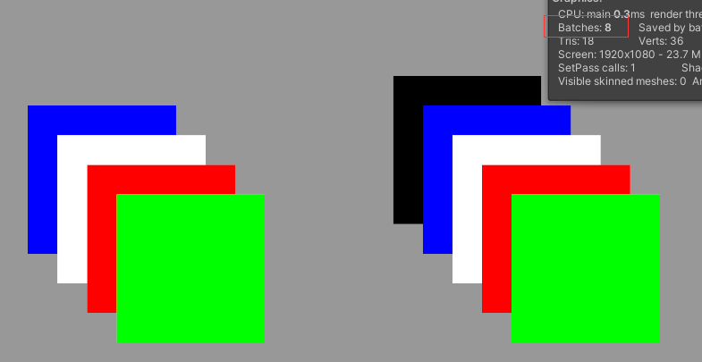  
*8个drawcall，左右的白色图片合批了，其他都没有合批;再次打开场景显示7个drawcall，左右白色图片、绿色图片合批了，其他都没有合批。*

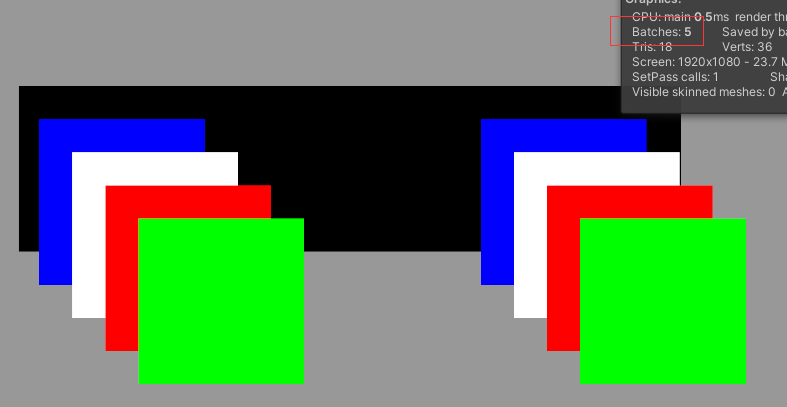 

 


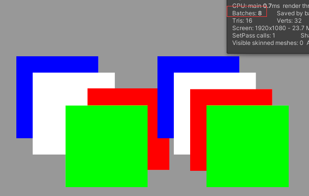 
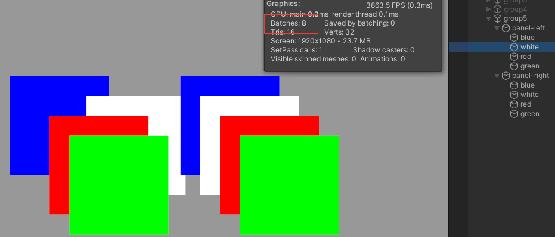 

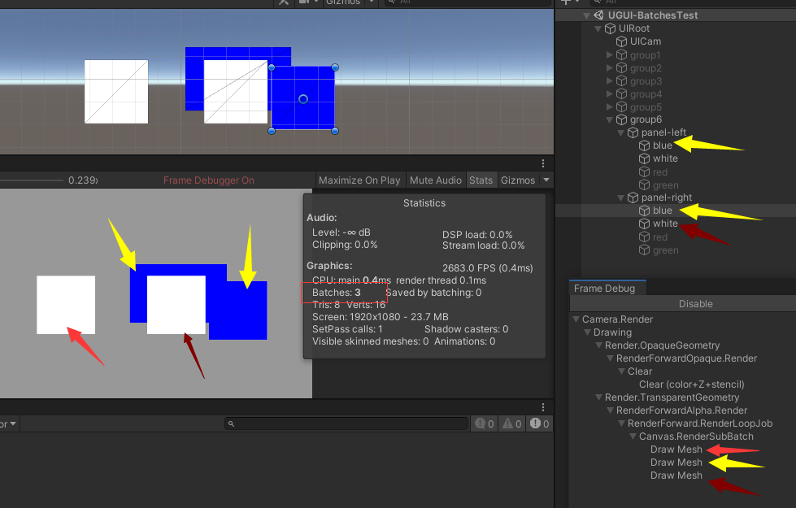 
 
*白色图片不能合批，一共占用3个drawcall。* 
>根据上图占用3个drawcall，推断出，Hierachy内的上下关系不能保证临近位置合批，受到前后遮挡关系影响。 
>这里有个问题是 第1个drawcall先绘制的左侧的白图，根据Hierachy的顺序，应该先绘制蓝色图片才对?

- 设置Image的alpha=0，坐标移到画布视野外，还是会继续占用drawcall，**设置localScale=0则不会占用drawcall**。

### Depth计算算法：

- 遍历所有UI元素（已深度优先排序），对当前每一个UI元素CurrentUI，如果不渲染，CurrentUI.depth = -1，如果渲染该UI且底下没有其他UI元素与其相交（rect Intersects），其CurrentUI.depth = 0;
- 如果CurrentUI下面只有一个的需要渲染的UI元素LowerUI与其相交，且可以Batch（material instance id 和 texture instance id 相同，即与CurrentUI具有相同的Material和Texture），CurrentUI.depth = LowerUI.depth；否则，CurrentUI.depth= LowerUI.depth + 1;
- 如果CurrentUI下面叠了多个元素，这些元素的最大层是MaxLowerDepth，如果有多个元素的层都是MaxLowerDepth，那么CurrentUI和下面的元素是无法合批的；如果只有一个元素的层是MaxLowerDepth，并且这个元素和CurrentUI的材质、纹理相同，那么它们就能合批。


### DrawCall合批(Batch)：

- Depth计算完后，依次根据Depth、material ID、texture ID、RendererOrder（即UI层级队列顺序，HierarchyOrder）排序（条件的优先级依次递减），剔除depth == -1的UI元素，得到Batch前的UI元素队列VisiableList。
- 对VisiableList中相邻且可以Batch（相同material和texture）的UI元素合并批次，然后再生成相应mesh数据进行绘制。

### UGUI合批策略

- 设置窗口父节点Z 值为 0，否则下面的元素都无法合批了。子UI元素Z值不为0时，会被视为3D UI，不参与合批。如果有Z改变了，尽量通过Group来规整在一起
- 设置Canvas.overrideSorting为true
- 设置Canvas.sortingOrder为窗口在Hierarchy下的排列顺序，即每当打开一个新的窗口，都会+1，根据数值由小到大依次渲染。
- 设置Canvas.sortingLayerID为0，表示默认为Default
- 设置Canvas.sortingLayerName为SortingLayer.IDToName(0)
- 根据功能适用性，合理使用Atlas图集。
- Mask和RectMask2D组件,
    >1. 不同mask之间是可以合批的
    >1. 被mask的物体只是不被绘制，依旧会影响合批计算
    >1. RectMask2D之间无法进行合批
    >1. 被RectMask2D隐藏的物体不会参与合批计算
    >1. RectMask2D组件上挂载的Image可以参与外部的合批
- 不要使用Unity内置的素材，不能合批
- GameObject.activeSelf  获取本地激活状态，需要注意的是当父对象是没有激活的时候，也会返回True
- GameObject.activeInHierarchy  获取游戏对象在场景中的激活状态，当父对象是没有激活的时候，就会返回False

> 参考：
> <https://zhuanlan.zhihu.com/p/339387759>  
> <https://www.cnblogs.com/moran-amos/p/13878493.html> 
> <https://www.cnblogs.com/moran-amos/p/13883818.html> 

### UGUI优化指南
1. 优化填充率，裁减掉无用的区域，镂空等，镂空可以勾掉`FillCenter`。

1. Mask和RectMask2D的优劣，根据具体需求取舍。
1. 少用unity自带的outline和shadow。
    >会大量增加顶点和面数，比如outline，他实现原理是复制了四份文本然后做不同角度的便宜，模拟描边，要不就用自己实现的（挖坑待填）；
1.  全屏UI界面打开时建议将场景3D相机移走或者关闭。
1.  如果非特殊需求没必要使用CanvasPixedPerfect，因为比如在scrollView时，滑动视图时一直会导致不断重绘产生性能损耗；
1. 不需要接受点击时间的物件将RayCastTarget关掉减少事件响应，从底层看是因为UGUI的RayCastTarget的响应是从数组中遍历检测是否和用户的点击区域响应，所以能够缩减数组大小自然能够缩减遍历次数；
1. UI动静分离
1. 对于UI上常用的改变颜色的操作，不要使用Image组件上的Color属性改变颜色，这样会导致整个Canvas的重建，可以新建个材质，设置材质给Image的Material通过修改材质的颜色来达到同样效果
1. 对于界面上常用的组件隐藏，别使用SetActive来控制显隐，有两种方式，一种是通过设置物体上`CanvasRenderer`的`CullTransparentMesh`并且控制物体透明度进行剔除，这个一般用于单个ui，如果是多个UI要不显示的话通过设置`CanvasGroups`的`Alpha`控制显隐。
1. Text的组件的BestFit非必要别开，因为这样开启这个会不断生成各种尺寸的字号字体图集，增加不必要开销。
1. 生成图集
1. Image组件不要选择None，也会使用一个默认图片且无法与图集合批，选用一张图片来统一使用并打入到图集中。
1. 不要使用透明为0的图片当作按钮，改用NoOverdrawImage来代替
```
//不渲染但可以相应点击
public class NoOverdrawImage : Graphic{    public override void Rebuild(CanvasUpdate update){}   }   

public class Empty4Raycast : MaskableGraphic    {
        protected Empty4Raycast(){useLegacyMeshGeneration = false;}
        protected override void OnPopulateMesh(VertexHelper toFill){ toFill.Clear();        }    }
```
1. UI相机看不到的物体也会被渲染，占用DC，可以先禁用它们

>参考: 
> <https://www.jianshu.com/p/4aa2b8641875> 

## UI问题分析

>ui常见的问题:
>1. GPU 片段着色器使用过多（即填充率过度使用）
>1. 重建 Canvas 批处理所花费的 CPU 时间过多
>1. Canvas 批次的重建数量过多（过度污染）
>1. 用于生成顶点的 CPU 时间过多（通常来自文本）
>
>
sprite 被意外引用，造成多加载一个图集
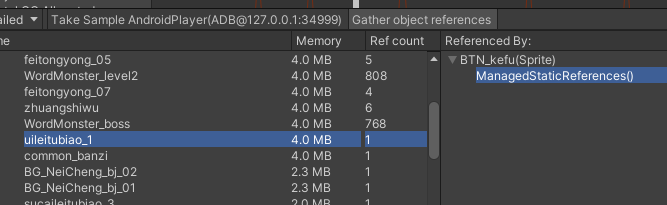


### UGUI 优化记录
#### 主界面优化


优化前批次 84

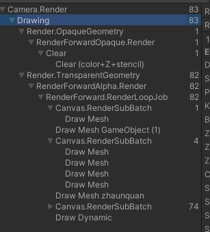
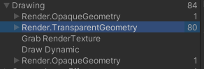
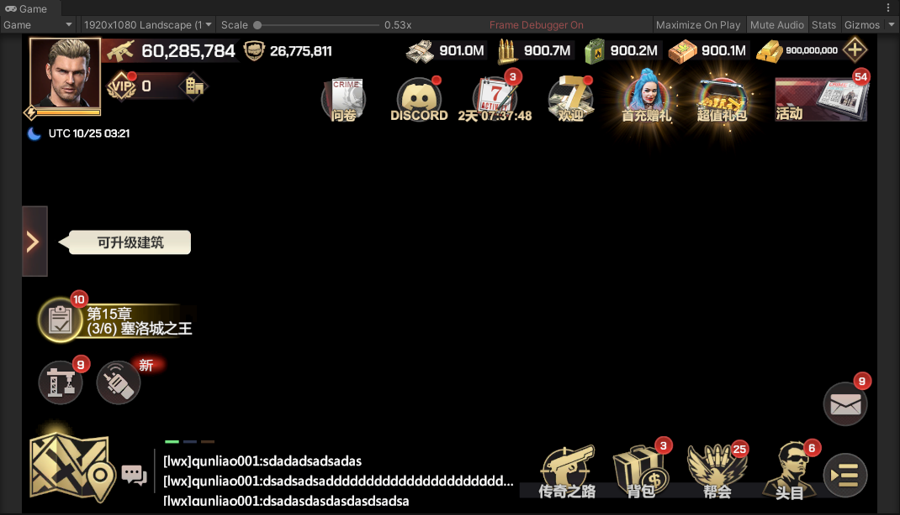
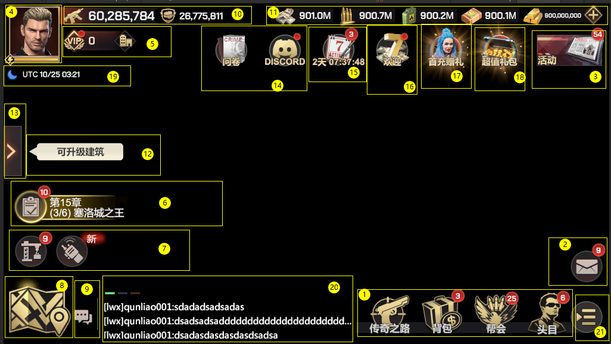
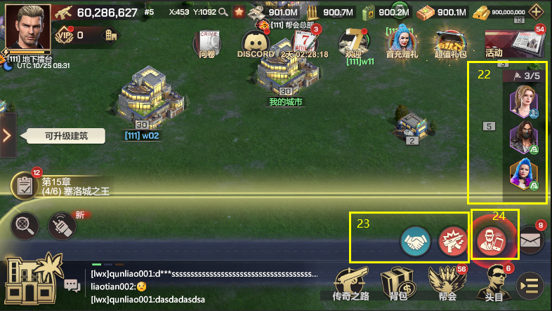

> 红点图标的图集和主面板的icon图集不是一个，所以所有红点图标不能合批

- 位置1
>所有按钮使用的图集 `uileitubiao_1`

mask使用 用来处理动画


mask（没用的），没用用的节点动画


底图
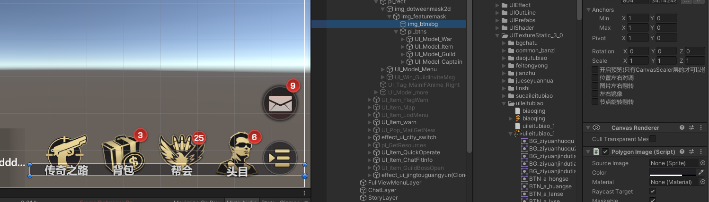
这个底图独自占一个批次，没有使用sprite，不能合批

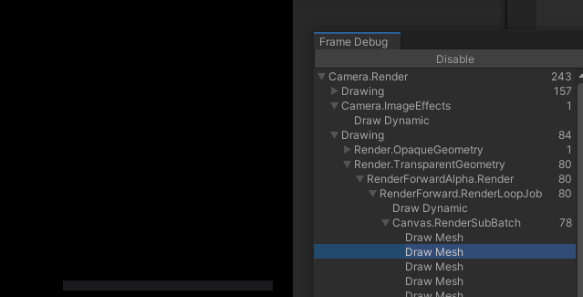

**指定一个上层sprite所在图集的一个背景纹理即可减少一个批次，背景图会和上层的icon按钮合批。**  
*内层mask没有影响合批，后面再测试*

- 位置2 
邮件图标和位置1的图标时同一个图集

**位置1 的内层mask和外层mask都移除后，会和邮件按钮进行合批**

- 位置3 
活动图标的图集和位置1位置2的图集不同

**活动图标的图集改为位置1用的图集**

- 位置4，5，10

位置4 的icon使用的图集 `common_banzi`,`feitongyong_01`,`uileitubiao_1`
位置5 的icon使用的图集 `common_banzi` 和 `uileitubiao_1`
位置10 的icon使用的图集 `common_banzi`,`uileitubiao_3`,`feitongyong_03`


- 位置6
> 单独测试占用12批次

icon使用的图集 `common_banzi` 和 `uileitubiao_4` 
特效节点 `effect_task_huang`  
特效没有合批
有粒子特效（`Particle System`），需要使用替代方案

红点有canvas，造成红点底图还有红点文字合批失败，这个canvas要控制红点在特效前面
红点文字的字体和其他文字字体不一致，打断合批

无用的空Image节点占用一个批次，且打断合批 (这里Image透明度为0)
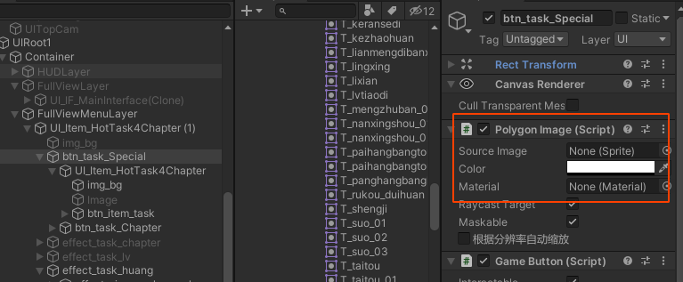

>优化后独立测试占用5批次，特效应该还有优化空间

- 位置7
> 批次 6  

icon使用的图集 `uileitubiao_1`

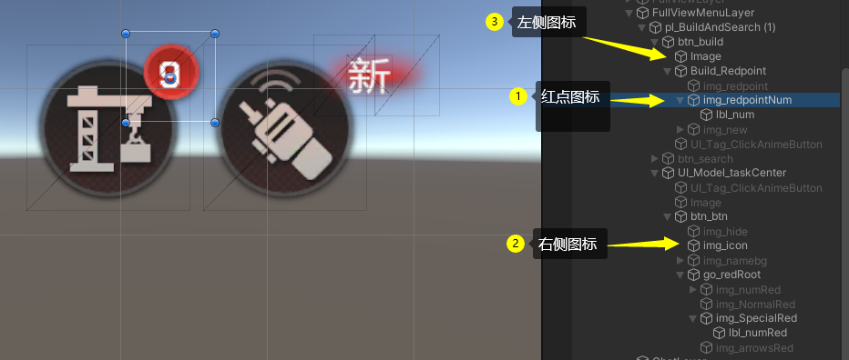
不能合批是因为左侧红点的mesh比较大（红点图标透明区域很大），被右侧图标遮挡了，就会插入到左侧图标和右侧图标中间
>优化后3


- 位置8
icon使用的图集 `uileitubiao_1`

- 位置9
icon使用的图集 `uileitubiao_1`

- 位置20 
icon使用的图集 `common_banzi` 和 `uileitubiao_4` 
还有空Image 但是alpha不是0，不能合批


- 位置11
>批次 6

icon使用的图集 `common_banzi` 和 `daojutubiao_1` 


- 位置19
icon使用的图集 `common_banzi` 

- 位置 14，15，16，17，18 （活动集合）
icon使用的图集 `uileitubiao_1` ,`uileitubiao_4`,`feitongyong_11`,   
有粒子特效（`Particle System`），需要使用替代方案
还有其他特效

这里特效有两部分，一部分在ui底下，一部分在ui上面，美术同学做特效时给所在的prefab所有ui节点挂载`Canvas`组件,直接导致合批失败 且形成大量的drawcall

- 位置12

icon使用的图集 `common_banzi`   
有循环动画  

- 位置13
icon使用的图集 `feitongyong_12`


- 位置23,24

icon使用的图集 `uileitubiao_3`,`uileitubiao_4`,`uileitubiao_6`
有循环动画

- 位置21
icon使用的图集 `uileitubiao_1`

- 位置22
icon使用的图集 `feitongyong_04`,`feitongyong_03`

- 位置 搜索坐标， 收藏按钮
icon使用的图集 `feitongyong_05`,`feitongyong_01`，`feitongyong_03`

#####  优化后的结果：

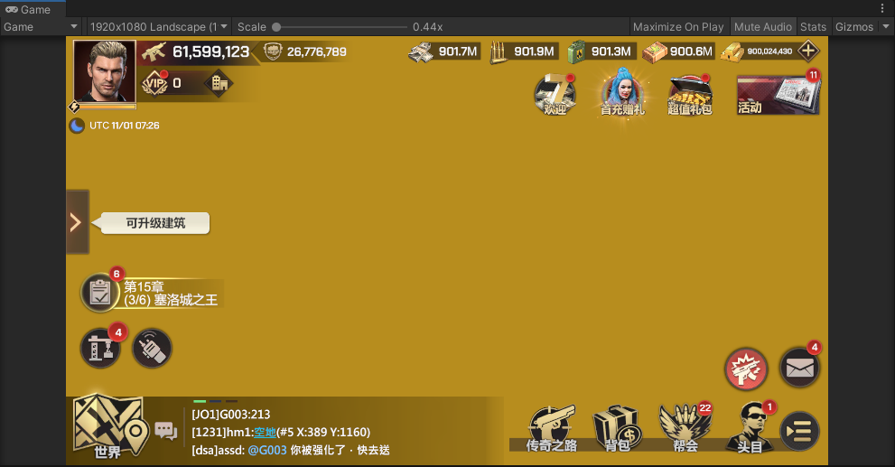
**不显示特效的情况下是11个drawcall。**
4号位置占用3个drawcall，头像和框分别是独立的图集，体力条需要压在框的上面，有的框是特效做的，头像是允许玩家上传自定义头像的，所以不能合批也不能做到一个图集里，动态图集可以考虑但是不能处理特效框的情况。
6号位置的红点有canvas，需要控制红点在特效前面
12号位置占用2个drawcall，这里是animation做的动画，这里的底图和文字是不能合批的，否则每帧都构建合批的大mesh  
22号位置的头像和状态图标是在一个图集里，这里需要一个drawcall。  
剩下的主界面图片合批成1个drawcall，剩下的文字占用2个drawcall，因为是两种字体。  


**显示特效的情况下是31个drawcall**
除去9个drawcall，都是特效占用的
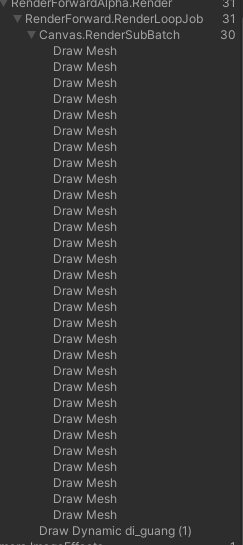


#### 全屏透明图片优化
原始的Overdraw


优化后的Overdraw


#### UIParticle性能对比

- 优化前总耗时40毫秒：


- 将`UIParticle`去掉后的耗时35毫秒（将particle继续显示通过3d的方式）：

*节省耗时5毫秒，一共移除`UIParticle`组件66个，共33个prefab。*


- 游戏中实际情况优化前：


- 游戏中实际情况禁用`UIParticle`后：


**这里不能参考总耗时，因为游戏业务逻辑在运行，场景有业务在运行，只能参考单项，相对来说也不算准确**

#### ui冗余相机
增加额外的2个drawcall
