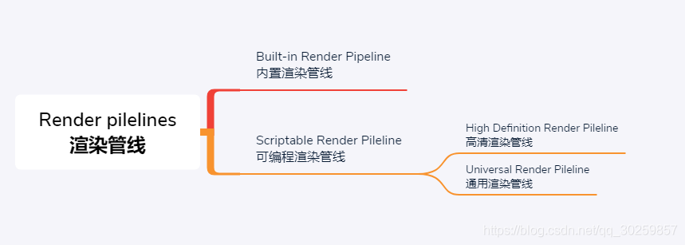
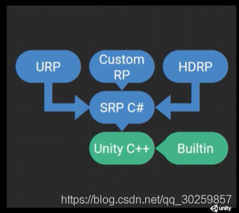
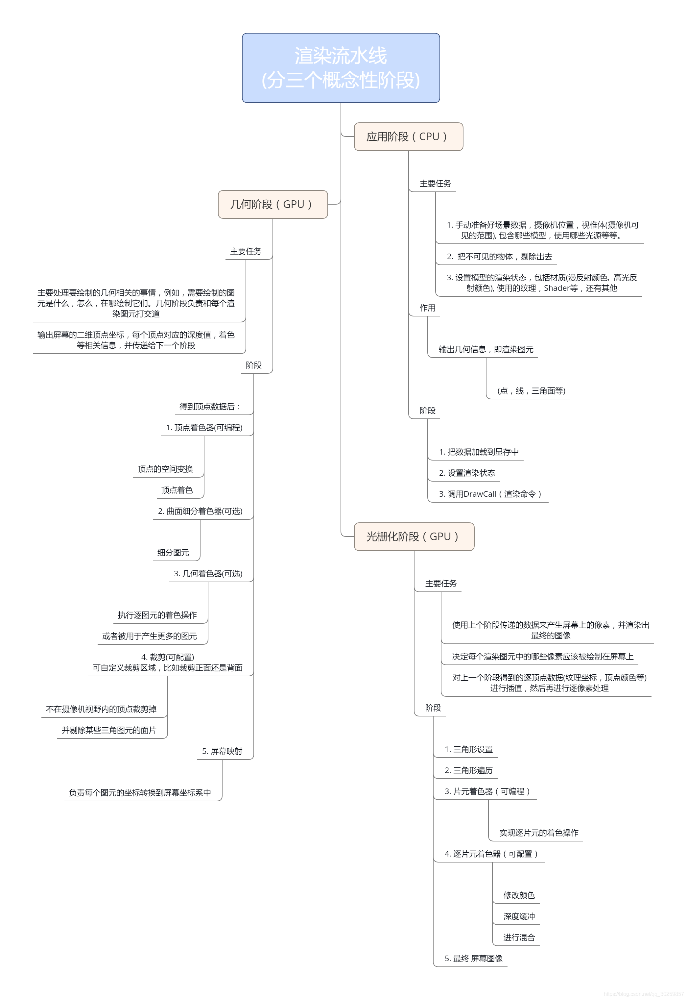

# Unity-URP笔记

## SRP/URP/HDRP之间的关系
  
  

## SRP是什么？
SRP全称为Scriptable Render Pipeline（可编程渲染管线/脚本化渲染管线），是Unity提供的新渲染系统，可以在Unity通过C#脚本调用一系列API配置和执行渲染命令的方式来实现渲染流程，SRP将这些命令传递给Unity底层图形体系结构，然后再将指令发送给图形API。

说白了就是我们可以用SRP的API来创建自定义的渲染管线，可用来调整渲染流程或修改或增加功能。

它主要把渲染管线拆分成二层：

- 一层是比较底层的渲染API层，像OpenGL，D3D等相关的都封装起来。

- 另一层是渲染管线上层，上层代码使用C#来编写。在C#这层不需要关注底层在不同平台上渲染API的差别，也不需要关注具体如何做一个Draw Call

## URP是什么？
它的全称为Universal Render Pipeline(通用渲染管线)，简称 `Universal RP`, 它是Unity官方基于SRP提供的模板，它的前身是 `LWRP`(`Lightweight RP` 即轻量级渲染管线), 在2019.3开始改名为URP，它涵盖了范围广泛的不同平台，是针对跨平台开发而构建的，性能比内置管线要好，另外可以进行自定义，实现不同风格的渲染，通用渲染管线未来将成为在Unity中进行渲染的基础 。

**平台范围：**可以在Unity当前支持的任何平台上使用
  
  


## HDRP是什么？
它的全称为High Definition Render Pipeline（高清晰度渲染管线），它也是Unity官方基于SRP提供的模板，它更多是针对高端设备，如游戏主机和高端台式机，它更关注于真实感图形和渲染，该管线仅于以下平台兼容：

- Windows和Windows Store，带有DirectX 11或DirectX 12和Shader Model 5.0
- 现代游戏机（Sony PS4和Microsoft Xbox One）
- 使用金属图形的MacOS（最低版本10.13）
- 具有Vulkan的Linux和Windows平台
*在此文章对HDRP不过多描述。*
  
  

## 为什么诞生SRP？
- **内置渲染管线的缺陷**

    - **定制性差**：过去，Unity有一套内置渲染管线，渲染管线全部写在引擎的源码里。大家基本上不能改动，除非是买了Unity源码客户，当然大部分开发者是不会去改源码，所以过去的管线对开发者来说，很难进行定制。
    - **代码脓肿，效果效率无法做到最佳**：内置渲染管线在一个渲染管线里面支持所有的二十多个平台，包括非常高端的PC平台，也包括非常低端的平台，很老的手机也要支持，所以代码越来越浓肿，很难做到使效率和效果做到最佳。
- **目的**

    - 为了解决仅有一个默认渲染管线，造成的可配置型、可发现性、灵活性等问题。决定在C++端保留一个非常小的渲染内核，让C#端可以通过API暴露出更多的选择性，也就是说，Unity会提供一系列的C# API以及内置渲染管线的C#实现；这样一来，一方面可以保证C++端的代码都能严格通过各种白盒测试，另一方面C#端代码就可以在实际项目中调整。
  
  
  
  

>渲染流水线图：
>


>ref: [https://blog.csdn.net/qq_30259857/article/details/108318528](https://blog.csdn.net/qq_30259857/article/details/108318528)  
>ref: [https://blog.csdn.net/qq_33700123/article/details/114092028](https://blog.csdn.net/qq_33700123/article/details/114092028)

## SRPBatcher
> 详解参考官方文档: [可编程渲染管线 SRP Batcher](https://docs.unity3d.com/cn/2019.4/Manual/SRPBatcher.html)

## URP 面板详解
> 面板详解: [通用渲染管线(URP)_学习笔记](https://blog.csdn.net/LKR0325/article/details/108402518)  
>  
>

## UniversalRenderPipeline 源码分析
> `UnityEngine.Rendering.Universal.UniversalRenderPipeline`
> `public sealed partial class UniversalRenderPipeline : RenderPipeline`
> 不包括XR，SceneView,Camera Preview，只是前向渲染的分析；不包括`RenderingMode.Deferred`的分析

### `Render`分析
> `protected override void Render(ScriptableRenderContext renderContext, Camera[] cameras)`的执行流程

- `BeginFrameRendering(renderContext, cameras);`
- 配置`GraphicsSettings`
- 设置Shader全局变量 `SetupPerFrameShaderConstants();`
- `SortCameras(cameras); // 根据camera.depth排序`
- `RenderCameraStack(renderContext, camera);`
    - `UpdateVolumeFramework(baseCamera, baseCameraAdditionalData);`
    - `BeginCameraRendering(renderContext, camera);`
    - `UpdateVolumeFramework(camera, null);`
    - `RenderSingleCamera(renderContext, camera);`
    - `EndCameraRendering(renderContext, camera);`
    - `EndFrameRendering(renderContext, cameras);`
```csharp
        protected override void Render(ScriptableRenderContext renderContext, Camera[] cameras)
        {
            BeginFrameRendering(renderContext, cameras);
            GraphicsSettings.lightsUseLinearIntensity = (QualitySettings.activeColorSpace == ColorSpace.Linear);
            GraphicsSettings.useScriptableRenderPipelineBatching = asset.useSRPBatcher;
            SetupPerFrameShaderConstants();
            SortCameras(cameras);
            for (int i = 0; i < cameras.Length; ++i){
                var camera = cameras[i];
                if (IsGameCamera(camera))
                {
                    RenderCameraStack(renderContext, camera);
                }
                else
                {
                    BeginCameraRendering(renderContext, camera);
                    UpdateVolumeFramework(camera, null);
                    RenderSingleCamera(renderContext, camera);
					EndCameraRendering(renderContext, camera);
                }
            }
            EndFrameRendering(renderContext, cameras);
        }
        public static void RenderSingleCamera(ScriptableRenderContext context, Camera camera)
        {
            UniversalAdditionalCameraData additionalCameraData = null;
            if (IsGameCamera(camera))
                camera.gameObject.TryGetComponent(out additionalCameraData);
            InitializeCameraData(camera, additionalCameraData, true, out var cameraData);
            RenderSingleCamera(context, cameraData, cameraData.postProcessEnabled);
        }	 
        /// <summary>
        /// Renders a single camera. This method will do culling, setup and execution of the renderer.
        /// </summary>
        /// <param name="context">Render context used to record commands during execution.</param>
        /// <param name="cameraData">Camera rendering data. This might contain data inherited from a base camera.</param>
        /// <param name="anyPostProcessingEnabled">True if at least one camera has post-processing enabled in the stack, false otherwise.</param>
        static void RenderSingleCamera(ScriptableRenderContext context, CameraData cameraData, bool anyPostProcessingEnabled)
		{
            Camera camera = cameraData.camera;
            var renderer = cameraData.renderer;
            if (!TryGetCullingParameters(cameraData, out var cullingParameters))
                return;
            ScriptableRenderer.current = renderer;
            bool isSceneViewCamera = cameraData.isSceneViewCamera;
            CommandBuffer cmd = CommandBufferPool.Get();
                renderer.Clear(cameraData.renderType);
                renderer.SetupCullingParameters(ref cullingParameters, ref cameraData);
                context.ExecuteCommandBuffer(cmd); // Send all the commands enqueued so far in the CommandBuffer cmd, to the ScriptableRenderContext context
                cmd.Clear();
                var cullResults = context.Cull(ref cullingParameters);
                InitializeRenderingData(asset, ref cameraData, ref cullResults, anyPostProcessingEnabled, out var renderingData);
                renderer.Setup(context, ref renderingData);
                renderer.Execute(context, ref renderingData);
            context.ExecuteCommandBuffer(cmd); // Sends to ScriptableRenderContext all the commands enqueued since cmd.Clear, i.e the "EndSample" command
            CommandBufferPool.Release(cmd);
                context.Submit(); // Actually execute the commands that we previously sent to the ScriptableRenderContext context
        }     

        /// <summary>
        // Renders a camera stack. This method calls RenderSingleCamera for each valid camera in the stack.
        // The last camera resolves the final target to screen.
        /// </summary>
        /// <param name="context">Render context used to record commands during execution.</param>
        /// <param name="camera">Camera to render.</param>
        static void RenderCameraStack(ScriptableRenderContext context, Camera baseCamera)
        {
            baseCamera.TryGetComponent<UniversalAdditionalCameraData>(out var baseCameraAdditionalData);
            // Overlay cameras will be rendered stacked while rendering base cameras
            if (baseCameraAdditionalData != null && baseCameraAdditionalData.renderType == CameraRenderType.Overlay)
                return;
            // renderer contains a stack if it has additional data and the renderer supports stacking
            var renderer = baseCameraAdditionalData?.scriptableRenderer;
            bool supportsCameraStacking = renderer != null && renderer.supportedRenderingFeatures.cameraStacking;
            List<Camera> cameraStack = (supportsCameraStacking) ? baseCameraAdditionalData?.cameraStack : null;
            bool anyPostProcessingEnabled = baseCameraAdditionalData != null && baseCameraAdditionalData.renderPostProcessing;
            // We need to know the last active camera in the stack to be able to resolve
            // rendering to screen when rendering it. The last camera in the stack is not
            // necessarily the last active one as it users might disable it.
            int lastActiveOverlayCameraIndex = -1;
            if (cameraStack != null)
            {
                var baseCameraRendererType = baseCameraAdditionalData?.scriptableRenderer.GetType();
				baseCameraAdditionalData.UpdateCameraStack();
            }
            // Post-processing not supported in GLES2.
            anyPostProcessingEnabled &= SystemInfo.graphicsDeviceType != GraphicsDeviceType.OpenGLES2;
            bool isStackedRendering = lastActiveOverlayCameraIndex != -1;
			// Update volumeframework before initializing additional camera data
			UpdateVolumeFramework(baseCamera, baseCameraAdditionalData);
			InitializeCameraData(baseCamera, baseCameraAdditionalData, !isStackedRendering, out var baseCameraData);
			BeginCameraRendering(context, baseCamera);
			RenderSingleCamera(context, baseCameraData, anyPostProcessingEnabled);
			EndCameraRendering(context, baseCamera);
			if (isStackedRendering)
			{
				for (int i = 0; i < cameraStack.Count; ++i)
				{
					var currCamera = cameraStack[i];
					if (!currCamera.isActiveAndEnabled)
						continue;
					currCamera.TryGetComponent<UniversalAdditionalCameraData>(out var currCameraData);
					// Camera is overlay and enabled
					// Copy base settings from base camera data and initialize initialize remaining specific settings for this camera type.
					CameraData overlayCameraData = baseCameraData;
					bool lastCamera = i == lastActiveOverlayCameraIndex;
					BeginCameraRendering(context, currCamera);
					UpdateVolumeFramework(currCamera, currCameraData);
					InitializeAdditionalCameraData(currCamera, currCameraData, lastCamera, ref overlayCameraData);
					RenderSingleCamera(context, overlayCameraData, anyPostProcessingEnabled);
					EndCameraRendering(context, currCamera);
				}
			}
        }                  
```
> 如果Unity版本高`UNITY_2021_1_OR_NEWER`宏生效则`BeginContextRendering(renderContext, cameras);`替换`BeginFrameRendering(renderContext, cameras);`，` EndContextRendering(renderContext, cameras);`替换`EndFrameRendering(renderContext, cameras);`

### `RenderSingleCamera` 分析

> `static void RenderSingleCamera(ScriptableRenderContext context, CameraData cameraData, bool anyPostProcessingEnabled)`的执行流程    
> `ScriptableRender renderer= cameraData.renderer;`

- 剔除操作，返回一个剔除参数（被摄象机渲染的游戏物体和光照的列表 ）`TryGetCullingParameters(cameraData, out var cullingParameters)`
    > `static bool TryGetCullingParameters(CameraData cameraData, out ScriptableCullingParameters cullingParams)`   
    
    - cameraData.camera.TryGetCullingParameters(false, out cullingParams)
- 修改剔除参数（是否投射阴影，最大灯光数量，阴影距离shadowDistance，）`renderer.SetupCullingParameters(ref cullingParameters, ref cameraData);`
    > `  public virtual void SetupCullingParameters(ref ScriptableCullingParameters cullingParameters,
            ref CameraData cameraData)`
- `context.ExecuteCommandBuffer(cmd);`
    >`public void ExecuteCommandBuffer(CommandBuffer commandBuffer);`
- 根据剔除参数执行剔除，获得剔除结果 `var cullResults = context.Cull(ref cullingParameters);`
    > `public CullingResults Cull(ref ScriptableCullingParameters parameters)`
- 初始化渲染数据`RenderingData`（灯光数据，阴影数据，后处理数据,是否动态批处理，是否启用后处理，相机数据，剔除结果数据）`InitializeRenderingData(asset, ref cameraData, ref cullResults, anyPostProcessingEnabled, out var renderingData);`
    > `        static void InitializeRenderingData(UniversalRenderPipelineAsset settings, ref CameraData cameraData, ref CullingResults cullResults,
            bool anyPostProcessingEnabled, out RenderingData renderingData)`

- `renderer.Setup(context, ref renderingData)`
    > `public abstract void Setup(ScriptableRenderContext context, ref RenderingData renderingData);`  
    - 如果获取深度
        ```csharp
        ConfigureCameraTarget(BuiltinRenderTextureType.CameraTarget, BuiltinRenderTextureType.CameraTarget);
        AddRenderPasses(ref renderingData);
        EnqueuePass(m_RenderOpaqueForwardPass);

        // TODO: Do we need to inject transparents and skybox when rendering depth only camera? They don't  write to depth.
        EnqueuePass(m_DrawSkyboxPass);    
        EnqueuePass(m_RenderTransparentForwardPass);
        ```
    - `ConfigureCameraColorTarget(activeColorRenderTargetId);`
    - `AddRenderPasses(ref renderingData); // rendererFeatures AddRenderPasses`
    - `CreateCameraRenderTarget(context, ref cameraTargetDescriptor, createColorTexture, createDepthTexture);  // CameraRenderType.Base`
    - `EnqueuePass(m_MainLightShadowCasterPass);`
    - `EnqueuePass(m_AdditionalLightsShadowCasterPass);`
    - `EnqueuePass(m_DepthNormalPrepass);`或者 `EnqueuePass(m_DepthPrepass);`
    - `EnqueuePass(m_ColorGradingLutPass);`
    - `EnqueuePass(m_RenderOpaqueForwardPass);`
    - `EnqueuePass(m_DrawSkyboxPass);`
    - `EnqueuePass(m_CopyDepthPass);`
    - `EnqueuePass(m_CopyColorPass);`
    - `EnqueuePass(m_TransparentSettingsPass);`
    - `EnqueuePass(m_RenderTransparentForwardPass);`
    - `EnqueuePass(m_OnRenderObjectCallbackPass);`
    - `EnqueuePass(m_PostProcessPass);`
    - `EnqueuePass(m_FinalPostProcessPass);`
    - `EnqueuePass(m_CapturePass);`
    - `EnqueuePass(m_FinalBlitPass);`
    - `EnqueuePass(m_PostProcessPass);`
     
- `renderer.Execute(context, ref renderingData);`
    > `public void Execute(ScriptableRenderContext context, ref RenderingData renderingData)`
    > `ref CameraData cameraData = ref renderingData.cameraData;`
    - `InternalStartRendering(context, ref renderingData);`
    - `SetPerCameraShaderVariables(cmd, ref cameraData);`
    - `SetShaderTimeValues(cmd, time, deltaTime, smoothDeltaTime);`
    - `context.ExecuteCommandBuffer(cmd);`
    - ` SortStable(m_ActiveRenderPassQueue);                   // Sort the render pass queue`
    - `SetupLights(context, ref renderingData);`
    - 执行所有Pass的Execute方法 `ExecuteBlock(RenderPassBlock.BeforeRendering, in renderBlocks, context, ref renderingData);`
        >// Before Render Block. This render blocks always execute in mono rendering.  
        >// Camera is not setup. Lights are not setup.  
        >// Used to render input textures like shadowmaps. 
        ```csharp
            void ExecuteBlock(int blockIndex, in RenderBlocks renderBlocks,ScriptableRenderContext context, ref RenderingData renderingData, bool submit = false)
            {   foreach (int currIndex in renderBlocks.GetRange(blockIndex)) //循环所有Pass
                {var renderPass = m_ActiveRenderPassQueue[currIndex];
                    ExecuteRenderPass(context, renderPass, ref renderingData);}
                if (submit) context.Submit();}      
            void ExecuteRenderPass(ScriptableRenderContext context, ScriptableRenderPass renderPass, ref    RenderingData renderingData){
                using var profScope = new ProfilingScope(null, renderPass.profilingSampler);
                ref CameraData cameraData = ref renderingData.cameraData;
                CommandBuffer cmd = CommandBufferPool.Get();
                // Track CPU only as GPU markers for this scope were "too noisy".
                using (new ProfilingScope(cmd, Profiling.RenderPass.configure))
                {   renderPass.Configure(cmd, cameraData.cameraTargetDescriptor); //配置Pass数据
                    SetRenderPassAttachments(cmd, renderPass, ref cameraData);}
                // Also, we execute the commands recorded at this point to ensure SetRenderTarget is called     before RenderPass.Execute
                context.ExecuteCommandBuffer(cmd);
                CommandBufferPool.Release(cmd);
                renderPass.Execute(context, ref renderingData); //执行对应Pass的Execute
            }                  
        ``` 
        
    - `context.SetupCameraProperties(camera); `
        >// This is still required because of the following reasons:
        >// - Camera billboard properties.
        >// - Camera frustum planes: unity_CameraWorldClipPlanes[6]
        >// - _ProjectionParams.x logic is deep inside GfxDevice
        >// NOTE: The only reason we have to call this here and not at the beginning (before shadows)
        >// is because this need to be called for each eye in multi pass VR.
        >// The side effect is that this will override some shader properties we already setup and we will have to
        >// reset them.

    - `SetCameraMatrices(cmd, ref cameraData, true);`
    - `context.ExecuteCommandBuffer(cmd);`
    - `context.DrawWireOverlay(camera);`
    - `InternalFinishRendering(context, cameraData.resolveFinalTarget);`
        > `context.ExecuteCommandBuffer(cmd);`
    - `context.ExecuteCommandBuffer(cmd);`
    - ` context.ExecuteCommandBuffer(cmd);`
    - `context.Submit();`

## URP笔记

### URP `LightMode`Tags 说明

>Tags{“LightMode” = “XXX”}

- `UniversalForward`：前向渲染物件之用，`SRPDefaultUnlit`也用该pass渲染
- `ShadowCaster`： 投射阴影之用
- `DepthOnly`：只用来产生深度图
- `Mata`：来用烘焙光照图之用
- `Universal2D` ：做2D游戏用的，用来替代前向渲染
- `UniversalGBuffer` ： 貌似与延迟渲染相关（开发中）, Does GI + emission. All additional lights are done deferred as well as fog
- `UniversalForwardOnly`:
- `NormalsRendering`:
- `SceneSelectionPass`:Scene view outline pass.
- `Picking`:Scene picking buffer pass
- `DepthNormals`: 只是用俩产生法线贴图`_CameraNormalsTexture` 
