# 包体大小优化笔记

<!--
### 问题
- [ ] ab文件只有同步加载没有异步加载
- [ ] 场景是使用实时光
- [ ] Terrain分块加载问题
    - LOD处理 （GPU Instance 数量过多），DrawCall占用严重
    - 视野范围需要调整，加载量太大
    - 分块的粒度是否合理，有没有优化空间
- [ ] 设置游戏后台运行？ 战斗在后台是否运行？
- [ ] 首包是整包？ 还是需要下载部分资源？
    - 这里现用策略是整包出，不带多语言
- [ ] Resource目录下的文件是否有用？
- [ ] Timeline在资源量很大的情况下会很卡，使用视频替代，暂时确定不用了？
- [ ] 使用Mesh Animator替代Animation 来进行合批处理，Mesh Animator依赖的动画数据打包后很大，需用Animation合批测试，或者用丧尸项目的合批处理方案（可能是3D纹理，需测试） 

```
        // 关闭stack trace，让资源编译中的日志短小精悍一些....
        // Application.SetStackTraceLogType(LogType.Log, StackTraceLogType.None);
```
    -->


>
>#### 一些记录
>- [bsdiff差分算法](https://www.cnblogs.com/startkey/p/10678173.html)
>- 出正式包怎么剥离无用的dll，比如log插件dll，Debug库，绘制插件dll（仅dev使用）[参考](https://docs.unity3d.com/cn/2020.3/Manual/ManagedCodeStripping.html)
    - 这里可以在打包正式包时将dll删除后打包

<!--
### 打包策略问题

- 图集打包Textures文件问题
textures 文件过大，内容过多，太杂,依赖管理混乱

这个AB包文件大小是200M多，过于庞大

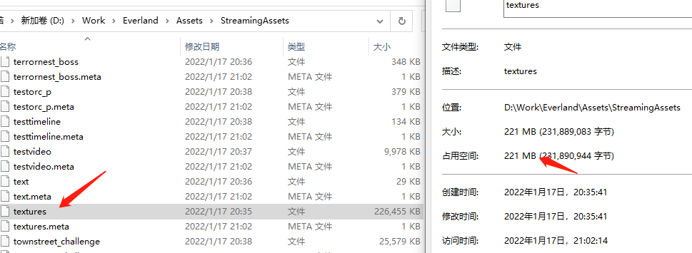

将所有图片打包成一个ab文件


打包ab包是散图，不是图集（后面放个正常图集的AB包的截图）


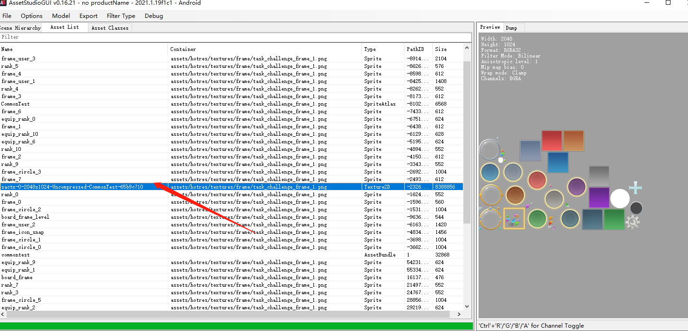


打包图集正常的


- Font字体划分依赖错误

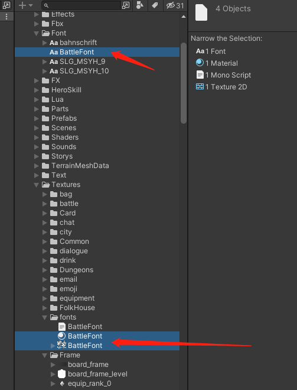


依赖的另外两个资源打包到textures文件中了


- prefab划分依赖过多
    角色的prefab和fbx是要打包到一个Bundle中的，现在是prefab一个文件，fbx一个文件，增加IO，颗粒度不够
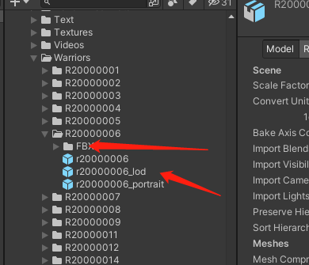

- 多语言文件划分错误
多语言文件应当每个文件一个AB包，玩家选择语言后重启加载对应语言文件的AB包即可
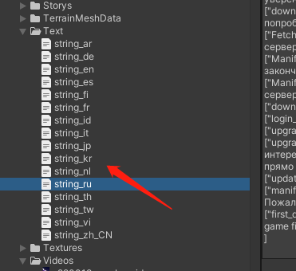

- 有的设置BundleName，有的没有
 第一个文件夹内容设置BundleName，下面三个文件夹内容没有设置
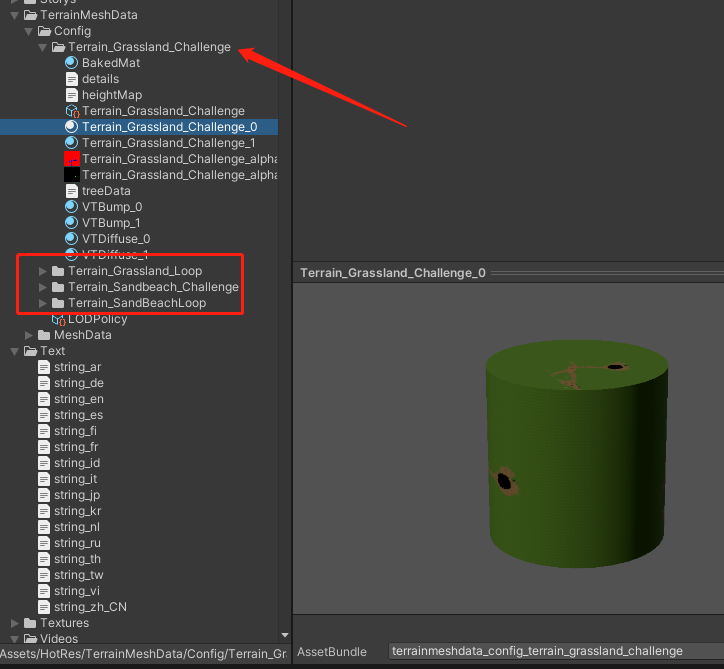

- Shader冗余严重

city AB包  


reet_challenge AB包  


> 解决方案  
> 1. 将所有Shader抽出打成一个独立bundle  
> 2. 配置到工程设置中(需要测试)  
> 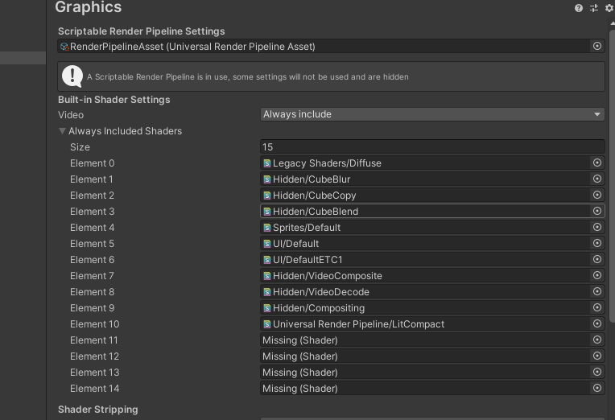  
> 3. 不建议使用URP自带shader 变体数量庞大，TA部门提供简化版本的Lit shader等等  
-->


### AssetBundle大小管理策略
主要问题：纹理，Shader，FBX动画
<!--
> 主要问题：纹理，Shader，Mesh，Terrain，FBX动画，
#### 打包避免冗余
- 每个角色的AB文件中都有 `Universal Render Pipeline/Lit`和`"Hidden/Universal Render Pipeline/FallbackError"`两个Shader，出现严重冗余，需要调整打包策略，建议所有Shader打包一个AB文件


- 基类公共状态机冗余
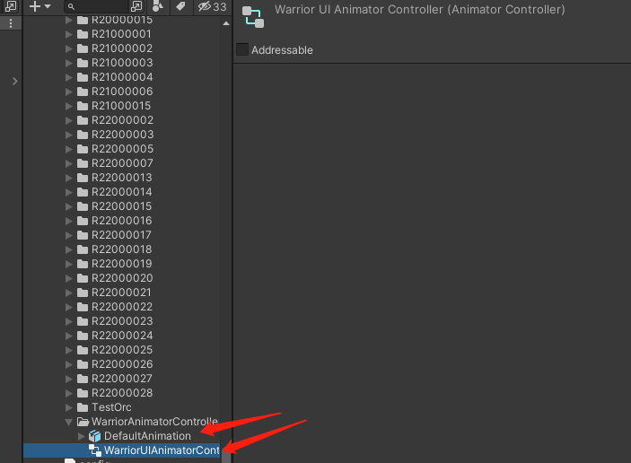  
*每个角色的包内都有该资源*，**需要验证**
-->
#### 图集、图片文件过大


使用第三方无损压缩，减小文件大小，这里文件大小是原来的1/3。

*使用图片无损压缩打包测试，图片属性：RGBA 2048\*2048,使用`RGBA Crunched ETC2`内存压缩*
| |压缩尺寸|压缩前|压缩后
|-|-|-|-|
|图片文件||1564kb|481kb|
|AB文件|2048|268kb|260kb|
|AB文件|1024|96kb|89kb|
*可以发现压缩后的图片打包AB文件比压缩前小大概7kb左右*


- 图片在内存中没有压缩
> 纹理的压缩格式影响AB包的大小   (Android平台测试)  
> 使用ETC2压缩生成AB包比使用 Crunched ETC生成AB包大3倍(这里只是说明压缩格式影响AB包文件大小，不说明压缩格式和包体的具体关系)。


Android平台

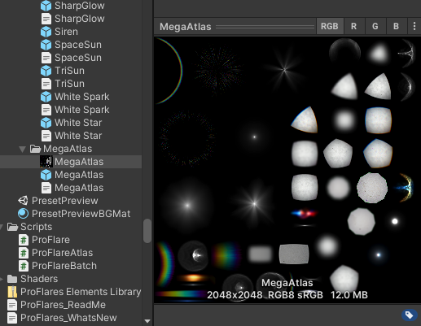

使用ETC 4Bit压缩后

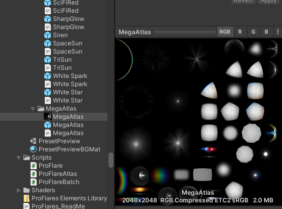

使用 Crunched ETC 压缩（需要真机测试性能及是否支持该压缩格式），这个格式消耗cpu，进入GPU处理阶段会解压成etc压缩，GPU本身不支持 Crunched ETC压缩  


>推荐 Android 和IOS都用ASTC;  
> 参考：[ASTC纹理压缩格式详解](https://zhuanlan.zhihu.com/p/158740249)
<!--
#### 无用资源进入AB文件中
需要分析及分解路径下的图片资源，使用策略去拆分剔除无用资源，最优方案是给美术和程序提供一套标准
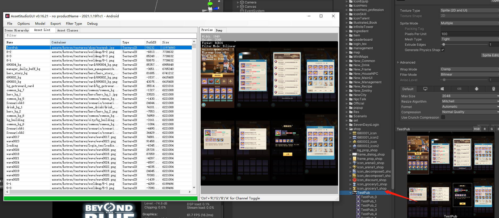

#### 图片素材尺寸合理性需要规划
这个图太大，需要调整策略  
  
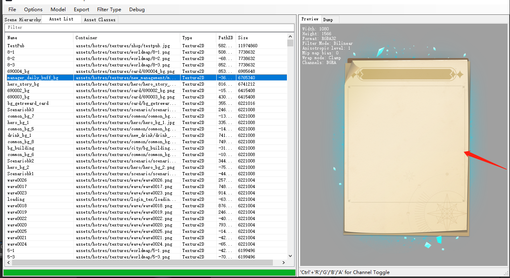  

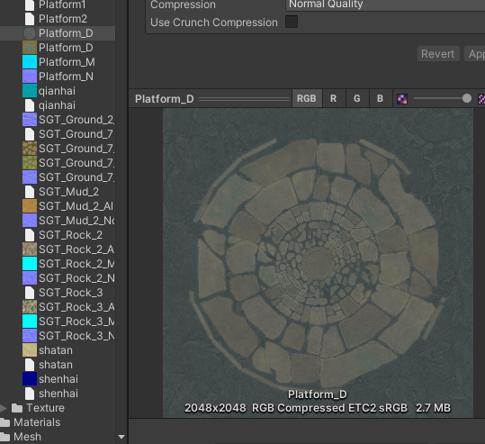  

-->
#### FBX文件过大
>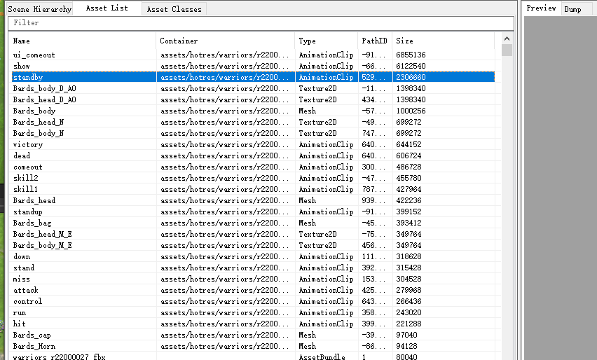  
>*主要是animation和纹理占用比较大,每个带动画的角色都是这样的情况*
> 

- [FBX模型通过draco算法压缩为gltf格式](https://blog.csdn.net/qq_34755472/article/details/105857330) 
 > 压缩大小比10倍，待测，不知道animation压缩怎么样

- 设置FBX Animation Compress格式

*使用`R220002@ui_comeout.fbx`动画文件测试*

现在的FBX配置  
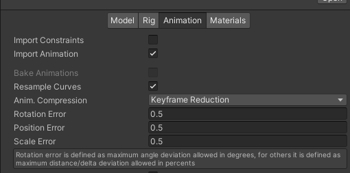
  
文件大小是4322kb，打包AB文件大小是1553kb  

修改FBX配置（没有勾选 Resample Curves）
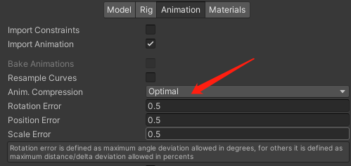  
   
文件大小是4322kb,打包AB文件大小是499kb  （这里fbx文件本身大小没变，untiy不修改源文件）  
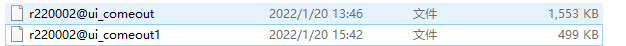  
修改后的内存大小是原来的1/4，Ab文件是原来的1/3  （动画表现一致）


使用脚本剔除无用scale数据及修改数据精度（没有勾选 Resample Curves） 
*这种方式每次animation导入修改后都不会保持，因为untiy默认重新导入animation并计算数据，需要在animation后处理中处理，每次变化都要执行一遍*  
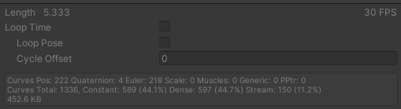  
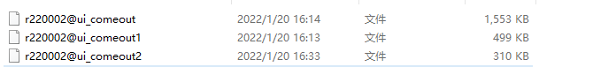  
文件大小是4322kb,打包AB文件大小是310kb  
修改后内存更低了和原始比是原来的不到1/4，AB文件是原来的1/5  （这里fbx文件本身大小没变，untiy不修改源文件） （动画表现一致）

**如果所有的角色动画都进行调整，包体可以明显减小**

*fbx导入到Unity之后是不会变化的，就是说Unity里面的所有编辑都不会保存在FBX文件里,可能在meta文件中，这里没有测试。*

**注意压缩后需要真机测试看看动画是否一致，这里是win editor测试的，没有真机测试**

> 参考：  
><https://blog.uwa4d.com/archives/Optimization_Animation.html>  
> <https://zhuanlan.zhihu.com/p/353402448>   
> <https://www.bzetu.com/344/.html>  
> <https://blog.uwa4d.com/archives/UWA_Pipeline22.html>  

>处理Animation时遇到的问题:  
>  
> 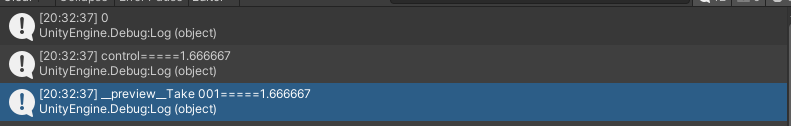  
> 一个fbx上出现两个animation 动画，`__preview_Take 001`应该是美术没有删除干净 
> 打包AB文件没有发现`__preview_Take 001`资源打包进去

<!--
#### Sound音频文件过大，不合理
> 可进行二次处理

  
*音频长度2分钟15秒*  
音频单个文件1M多，会影响加载速度，比较慢


需要降低下音频质量，或者无损压缩，这个应该是背景，一般几百kb就可以，200kb-500kb左右即可

> 优化参考：  
> <https://blog.csdn.net/qq_37672438/article/details/105071162>  
> <https://blog.csdn.net/Czhenya/article/details/102579237>  
> <https://www.icode9.com/content-4-980583.html>  
> <https://zhuanlan.zhihu.com/p/193012525>  


#### Terrain使用问题
有多个Terrain Data占用太大  
  
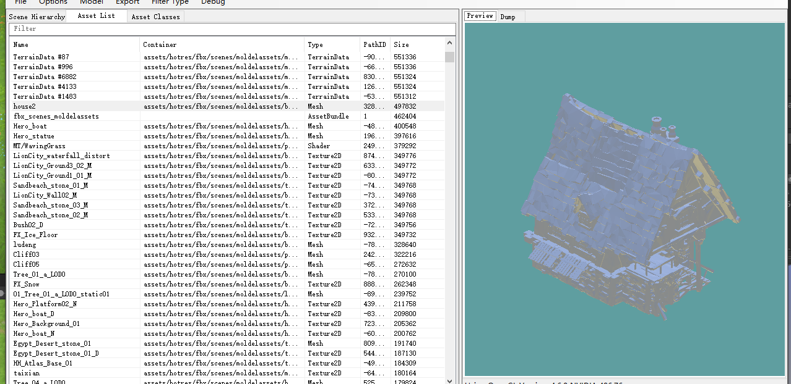  
如果确定不使用分块的方式处理场景，则需要Terrain导出Mesh，美术对Mesh直接减面去处理


**Terrain地形制作后最直接的问题是Mesh太大，没用的三角面太多**
#### Mesh问题
有多个mesh占用太大，根据具体情况减面，是否没用的三角面过多
  
  

  
静态批处理的Mesh占用比较大(new_scene)

#### 图集优化
> 使用图集可以影响包体大小，需要测试


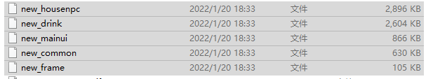
*蓝框中的new_common图集打包出错了，texture2D纹理没有打包进去，只是打包进去sprite数据，可能因为Library异常*

上面atlas前缀得AB文件是按照图集打包总共AB文件大小是`1.87M`，下面是散图打包的，总共AB文件大小是`6.93M`。对包体影响很大，需要细测，和图集利用率有关系

#### Shader过大

keywords组合不低于236种，造成Shader的AB文件太大，而且Sahder.Parse开销也会很大

所有Shader需要单独打包测试


#### 视频文件
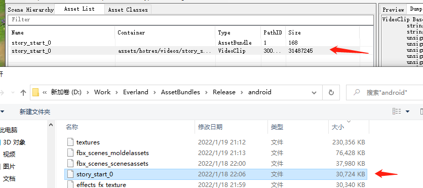  
单个音频AB文件30M，内存占用也是30M左右
最后需要检查是否有优化的可能

#### TextAsset检查
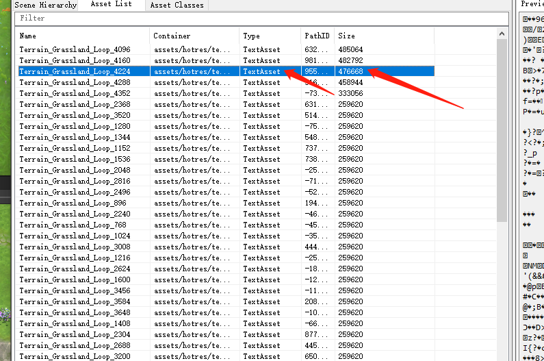
有几个场景Terrain分块后的数据AB包大概是9M左右（只是分块后的数据，没有素材和材质球等）  
这里是Terrain分块后的数据，量比较大，检查是否有优化可能性

#### Mesh Animator使用
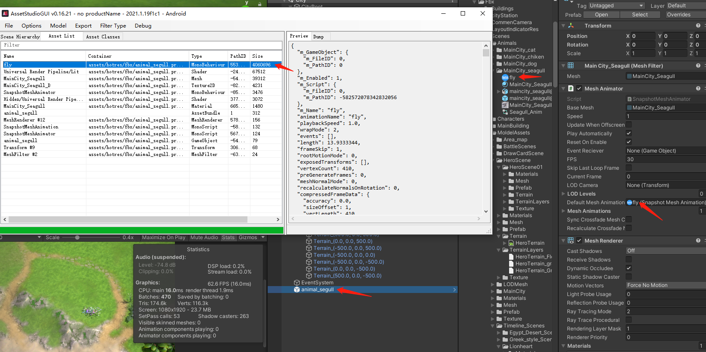  
这个fly.asset文件大小是15M左右，内存占用4M左右，打包AB文件比较大，这个AB文件3M左右  
**是否有其他方式去替代优化**   
**内存分析需要着重关注**  
-->

### AB加载和卸载策略
> 现有加载策略：
> 1. 根据manifest配置文件进行加载资源并且找到依赖进行加载
> 2. 只有同步加载没有异步加载
> 3. 加载的Bundle和LoadAsset资源都做了缓存，但是没有引用计数

> 现有资源卸载策略:  
> 1. lua Bundle加载资源后直接卸载bundle；
> 1. 场景加载后将bundle卸载,在切换场景时：
    - 执行LuaGC处理
    - 清理所有Asset的引用（将缓存的Dict清空）（资源泄露:bundle没有卸载，清空了asset引用，再次加载资源时会再次LoadAsset，会存在多份相同asset;加载效率利用率低，没有区分常驻内存资源和非常驻内存资源，bundle管理粗放）
    <!-- - SpriteManager好像没有用（这里没有细看） -->
> 1. 非场景资源加载后没有卸载流程,全部依靠场景卸载时清理
> 1. 除了上述bundle卸载之外，游戏运行中没有卸载bundle，内存占用过高容易崩溃
> 1. 业务层只管加载，不处理卸载
> 1. `Resources.UnloadUnusedAssets()`没有调用(场景加载时会自动调用，记不清了)

调整方案：
1. 同步和异步加载
2. 使用引用计数方案对Bundle和Asset管理
2. 增加图集管理(图集制作细分方案待定)
2. 使用加载和卸载成对管理，或者做内置管理和实例对象绑定


### URP Package 内置shader打包问题

- Universal Render Pipeline/Lit has too many Shader variants(150994944)
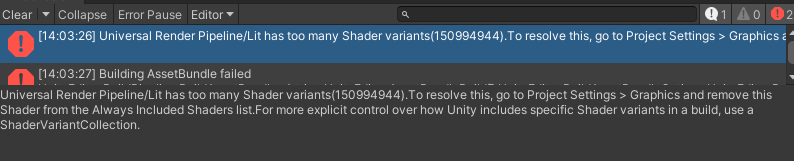  
URP 自带Lit Shader变体太多问题

- Assertion failed on expression:\`m_UserPathRemap.count(pathStr) == 0\`


可能因为在Project Setting-->Graphing设置All include 然后打包又打进去所以报错了


### 包体优化结果


*左侧蓝色是优化后的，右侧红色是优化前的*

#### DisableWriteTypeTree问题
关闭Bundle文件的`type information`数据写入，这是为了使用Unity版本不同做的兼容（标记数据，unity版本相同无用）

```csharp
//BuildAssetBundleOptions.DisableWriteTypeTree
BuildPipeline.BuildAssetBundles(dir,ls.ToArray(),BuildAssetBundleOptions.DeterministicAssetBundle | BuildAssetBundleOptions.ChunkBasedCompression|BuildAssetBundleOptions.DisableWriteTypeTree, BuildTarget.Android);
```

*红色是开启默认`type information`写入，asset classes就是写入的数据，左侧蓝色是关闭`type information`写入的大小*
bundle文件大小差5k多（每个bundle文件内容不一样，大小也不一样），还是很可观的

> 参考：<https://blog.csdn.net/kangluo1/article/details/119089200>


### Shader变体处理

- Graphics APIs 只保留`OpenGLEL3`就可以了,否则打包Shader时每个平台生成一套代码导致AB包过大
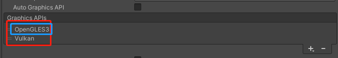

- Graphics -> Tier Settings默认三种配置，每个shader会生成对应三套代码，这里将Tier三种配置设置成相同的，则Shader只会生成一套代码，减小包体


- 单独打包Shader文件（没有材质球） 关于`#pragma multi_compile`和`#pragma shader_feature `测试
```glsl
            #pragma multi_compile  COM_M COM_N
            #pragma multi_compile  COM_X COM_Y COM_Z
            #pragma shader_feature _ A B
            #pragma shader_feature E F
```
打包的AB包中的Shader keywords数量  
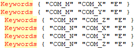
`multi_compile`两行的keywords组合相乘是最后的shader代码的数量，注意数量  
这里`#pragma shader_feature ` 如果第一项是`_`则认为没有keywords,如果不是`_`，则默认打包进第一个选项（这里是`E`）

- 单独打包材质球（将材质球和shader打包一起）
```glsl
            #pragma multi_compile  COM_M COM_N
            #pragma multi_compile  COM_X COM_Y COM_Z
            #pragma shader_feature _ A B
            #pragma shader_feature E F
```
打包的AB包中的Shader keywords数量  

材质球keywords默认：
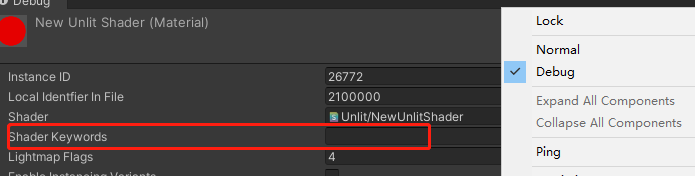  
  

材质球指定keywords后  
  
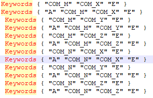  
*指定keywords后等于选择`shader_feature`的变体，`multi_compile`进行全部组合*

总结：**材质球指定`shader_feature` keywords后和shader打包到AB文件中，shader的keywords是受材质球的keywords配置影响的;加入了GraphicsSetting-> always included shader后，会将它所有的keywords变体打包到游戏中**

可以用`Shader Variant Collection`单独控制keywords，把collection和shader打包到一个AB文件中
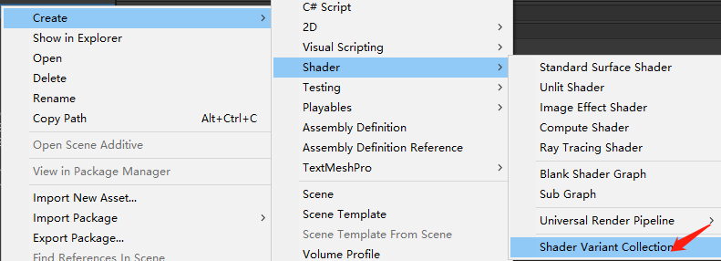


> 参考： 
> <https://zhuanlan.zhihu.com/p/68888831>  
> <https://blog.csdn.net/eevee_1/article/details/118632371>  
> <https://zhuanlan.zhihu.com/p/392004640> 
> <https://blog.csdn.net/danteshenqu/article/details/78170745> 
> <https://zhuanlan.zhihu.com/p/83780152>  

>关于 `GraphicsSetting-> always included shader`说明：   
>如果打AB时不想shader被打包进AB包，则用 `always included shader` 添加shader，单只能是unity buildin 内置shader（Packages内的shader不是内置的）。  
>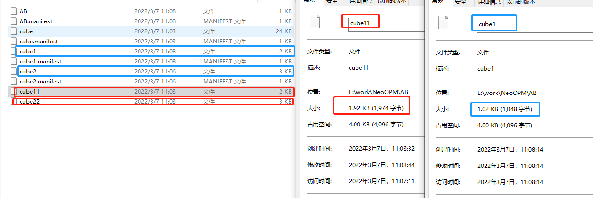  
>   
>*cube11和cube1使用的shader是`Unlit/Color`,Cube22和Cube2使用的shader是`custom/Cube2`；每个ab文件内只有一个cube物体的prefab，引用一个材质球和对应的shader*  
> *AB文件cube11和cube22是在`always included shader`添加前打包的，AB文件Cube1和Cube2是在`always included shader`添加后打包的*  
>根据上面打包测试分析出结果：  
> - Cube22和Cube2使用自定义shader `custom/Cube2` ，不管`always included shader`内是否添加该shader，打AB包都会把该shader打包进去  
> - Cube11和Cube1使用内置shader `Unlit/Color`,`always included shader`内添加该shader，打包AB包不会把该内置shader打包进去；否则会打包进AB包内
> - URP内Shader算是自定义shader，不管`always included shader`内是否添加，都会将使用的URP Shader打包到对应AB包中

### 关于URP Shader打包问题
> 由于`URP`内部的`Shader`在`Packages`中，不能使用`Inspector`面板设置`AssetBundleName`及脚本代码设置`AssetBundleName`。在`Graphics`面板中添加`URP shader`，但是打包还是会被打进去
解决方案：
    1. 使用`AssetBundleBuild`方式打包可以控制Packages内的资源
    2. 使用`Addressables`官方插件打包可以设置Packages内的资源
>
>材质球和shader打包到一起，会根据材质球引用的keywords变体打包，而加入了`GraphicsSetting-> always included shader`后，会将它所有的keywords变体打包到游戏中
>
> 关于shader变体说明：<https://blog.csdn.net/kuangben2000/article/details/105400835>
