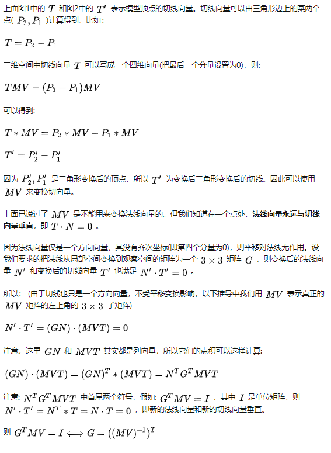

# 法线变换矩阵推导

> 在渲染管线中，模型的坐标会从局部空间(Local space)经Model matrix(简记为 `M` )变换到世界空间(World space)，从世界空间经View matrix(简记为 `V` )变换到观察空间(View space，也称为eye space)，然后再经Projection matrix(简记为 `P` )变换到裁剪空间(clip space) (vertex shader要计算出裁剪空间的坐标)，最后经视口变换(viewport transform)变换到屏幕空间。

## 法线为什么不能使用 MV 矩阵变换

在进行光照计算时，为了得到逼真的效果，一般要使用到模型的顶点的法线。可以在观察空间(View space)或世界空间(World space)中进行光照计算。中View space中进行光照计算的好处是观察者(即Camera)的坐标永远是(0, 0)。

假设在View space中进行光照计算。Local space到View space的变换矩阵为M乘以V，简记为 `MV` 。

Vertex Shader中输入数据有顶点位置 `aVertex` 及法线 `N`，它们都是在局部空间中的向量。则View space空间中的顶点位置可由公式计算: `MV*aVertex`

而View space中顶点的法线 `N` 一般不能由 `MV*N` 计算得到。比如，当模型发生non-uniform缩放时，经 `MV*N` 变换后的所谓“法线”已不与模型表面垂直了，根本不是法线了。如图1是未发生变换时三角形的法线，而图2是使用  `MV*N` 变换后的三角形“法线”。
  
  

那么用于法线变换的矩阵应该长什么样呢?答案是：

**把法线从local space变换到view space的变换矩阵为顶点位置变换矩阵 `MV` 的逆矩阵的转置矩阵，即 *(`(MV)`-1)T* 。**

*(如果在world space中进行光照计算，则 `normal matrix` 为 *(`(M)`-1)T* 。*

## 推导
  
  
  
  

>ref: [渲染管线中的法线变换矩阵](https://zhuanlan.zhihu.com/p/72734738)