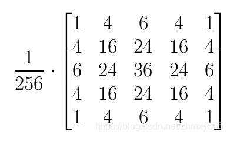
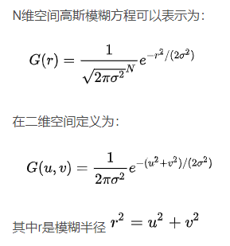
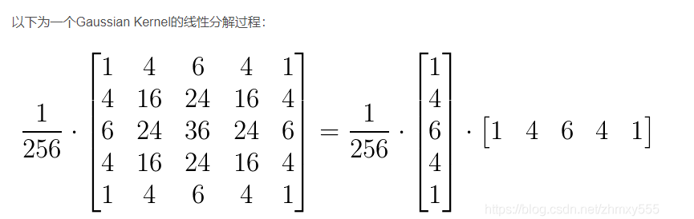

# 模糊实现

>参考：[https://blog.csdn.net/poem_qianmo/article/details/105350519](https://blog.csdn.net/poem_qianmo/article/details/105350519)  
  


## 方框模糊（Box Blur）
`BoxBlur.shader` *这两种模糊用同一个shader的不同 Pass*
```c
Shader "Hidden/BoxBlur"
{
    CGINCLUDE
    #include "UnityCG.cginc"
    sampler2D _MainTex;
    float4 _MainTex_TexelSize; // x= 1/width y=1/height z=width w=height
    float4 _BlurOffset;
    
    half4 frag_BoxFilter_4Tap (v2f_img i) : SV_Target
    {
        half4 d=_BlurOffset*half4(-1,-1,1,1);
        half4  s=0;
        s+= tex2D(_MainTex, i.uv+d.xy);
        s+= tex2D(_MainTex, i.uv+d.zw);
        s+= tex2D(_MainTex, i.uv+d.xw);
        s+= tex2D(_MainTex, i.uv+d.zy);
        s*=0.25;
        return s;
    }    
    
    half4 frag_BoxFilter_9Tap (v2f_img i) : SV_Target
    {
        half4 d=_BlurOffset*half4(-1,-1,1,1);
        half4  s=0;
        
        s+= tex2D(_MainTex, i.uv);
        
        s+= tex2D(_MainTex, i.uv+d.xy);
        s+= tex2D(_MainTex, i.uv+d.zw);
        s+= tex2D(_MainTex, i.uv+d.xw);
        s+= tex2D(_MainTex, i.uv+d.zy);
        
        s+= tex2D(_MainTex, i.uv+ half2(0.0,d.w));
        s+= tex2D(_MainTex, i.uv+ half2(0.0,d.y));
        s+= tex2D(_MainTex, i.uv+ half2(d.z,0.0));
        s+= tex2D(_MainTex, i.uv+ half2(d.x,0.0));
              
        s/=9.0;
        return s;
    }      
    
    ENDCG


    Properties
    {
        _MainTex ("Texture", 2D) = "white" {}
        _BlurOffset("BlurOffset",Vector)=(1,1,1,1)
    }
    SubShader
    {
        // No culling or depth
        Cull Off ZWrite Off ZTest Always
        // 0 双重模糊
        Pass
        {
            CGPROGRAM
            #pragma vertex vert_img
            #pragma fragment frag_BoxFilter_4Tap
            ENDCG
        }
        
        // 1 方框模糊
        Pass
        {
            CGPROGRAM
            #pragma vertex vert_img
            #pragma fragment frag_BoxFilter_9Tap
            ENDCG
        }        
    }
}

```

方框模糊：取该像素及周围8个点，一共9个点取平均值（9个点的权重相同，都为1/9）

 `BoxBlur.cs`:
```c
using System.Collections;
using System.Collections.Generic;
using UnityEngine;

[ExecuteInEditMode()]
public class BoxBlur : MonoBehaviour {
    public Material material;
    [Range(0, 10)]
    public int _Iteration = 4;
    [Range(0, 15)]
    public float _BlurRadius = 5.0f;
    [Range(1, 10)]
    public float _DownSample = 2.0f;

    void Start () {
        if (material == null || SystemInfo.supportsImageEffects == false
            || material.shader == null || material.shader.isSupported == false)
        {
            enabled = false;
            return;
        }
    }

    void OnRenderImage(RenderTexture source, RenderTexture destination)
    {
        int width = (int)(source.width / _DownSample);
        int height = (int)(source.height / _DownSample);
        RenderTexture RT1 = RenderTexture.GetTemporary(width,height);
        RenderTexture RT2 = RenderTexture.GetTemporary(width, height);

        Graphics.Blit(source, RT1);

        material.SetVector("_BlurOffset", new Vector4(_BlurRadius / source.width, _BlurRadius / source.height,_BlurRadius / source.width, _BlurRadius / source.height));
        for (int i = 0; i < _Iteration; i++)
        {
            Graphics.Blit(RT1, RT2, material, 1);
            Graphics.Blit(RT2, RT1, material, 1);
        }

        Graphics.Blit(RT1, destination);

        //release
        RenderTexture.ReleaseTemporary(RT1);
        RenderTexture.ReleaseTemporary(RT2);
    }
}

```


## 高斯模糊（Gaussian Blur）
> 高斯模糊（Gaussian Blur），也叫高斯平滑（Gaussian smoothing），作为最经典的模糊算法，一度成为模糊算法的代名词。

用于高斯模糊的高斯核（Gaussian Kernel）是一个正方形的像素阵列，其中像素值对应于2D高斯曲线的值。  
  
  
  
  
  

`GaussianBlur.shader`
```c
Shader "Hidden/GaussianBlur"
{
	CGINCLUDE
	#include "UnityCG.cginc"

	sampler2D _MainTex;
	float4 _BlurOffset;

	half4 frag_HorizontalBlur(v2f_img i) : SV_Target
	{
		half2 uv1 = i.uv + _BlurOffset.xy * half2(1, 0) * -2.0;
		half2 uv2 = i.uv + _BlurOffset.xy * half2(1, 0) * -1.0;
		half2 uv3 = i.uv;
		half2 uv4 = i.uv + _BlurOffset.xy * half2(1, 0) * 1.0;
		half2 uv5 = i.uv + _BlurOffset.xy * half2(1, 0) * 2.0;

		half4 s = 0;
		s += tex2D(_MainTex, uv1) * 0.05;
		s += tex2D(_MainTex, uv2) * 0.25;
		s += tex2D(_MainTex, uv3) * 0.40;
		s += tex2D(_MainTex, uv4) * 0.25;
		s += tex2D(_MainTex, uv5) * 0.05;
		return s;
	}

	half4 frag_VerticalBlur(v2f_img i) : SV_Target
	{
		half2 uv1 = i.uv + _BlurOffset.xy * half2(0, 1) * -2.0;
		half2 uv2 = i.uv + _BlurOffset.xy * half2(0, 1) * -1.0;
		half2 uv3 = i.uv;
		half2 uv4 = i.uv + _BlurOffset.xy * half2(0, 1) * 1.0;
		half2 uv5 = i.uv + _BlurOffset.xy * half2(0, 1) * 2.0;

		half4 s = 0;
		s += tex2D(_MainTex, uv1) * 0.05;
		s += tex2D(_MainTex, uv2) * 0.25;
		s += tex2D(_MainTex, uv3) * 0.40;
		s += tex2D(_MainTex, uv4) * 0.25;
		s += tex2D(_MainTex, uv5) * 0.05;
		return s;
	}

	ENDCG

	Properties
	{
		_MainTex ("Texture", 2D) = "white" {}
		_BlurOffset("BlurOffset",Float) = 1 
	}
	SubShader
	{
		// No culling or depth
		Cull Off ZWrite Off ZTest Always
		//0
		Pass
		{
			CGPROGRAM
			#pragma vertex vert_img
			#pragma fragment frag_HorizontalBlur
			ENDCG
		}
		//1
		Pass
		{
			CGPROGRAM
			#pragma vertex vert_img
			#pragma fragment frag_VerticalBlur
			ENDCG
		}
	}
}

```

`GaussianBlur.cs`
```csharp
using System.Collections;
using System.Collections.Generic;
using UnityEngine;

[ExecuteInEditMode()]
public class GaussianBlur : MonoBehaviour {
    public Material material;
    [Range(0, 10)]
    public int _Iteration = 4;
    [Range(0, 15)]
    public float _BlurRadius = 5.0f;
    [Range(1, 10)]
    public float _DownSample = 2.0f;

    void Start () {
        if (material == null || SystemInfo.supportsImageEffects == false
            || material.shader == null || material.shader.isSupported == false)
        {
            enabled = false;
            return;
        }
    }

    void OnRenderImage(RenderTexture source, RenderTexture destination)
    {
        int width = (int)(source.width / _DownSample);
        int height = (int)(source.height / _DownSample);
        RenderTexture RT1 = RenderTexture.GetTemporary(width,height);
        RenderTexture RT2 = RenderTexture.GetTemporary(width, height);

        Graphics.Blit(source, RT1);

        material.SetVector("_BlurOffset", new Vector4(_BlurRadius / source.width, _BlurRadius / source.height, 0,0));
        for (int i = 0; i < _Iteration; i++)
        {
            Graphics.Blit(RT1, RT2, material, 0); //水平方向
            Graphics.Blit(RT2, RT1, material, 1); //垂直方向
        }

        Graphics.Blit(RT1, destination);

        //release
        RenderTexture.ReleaseTemporary(RT1);
        RenderTexture.ReleaseTemporary(RT2);
    }
}

```