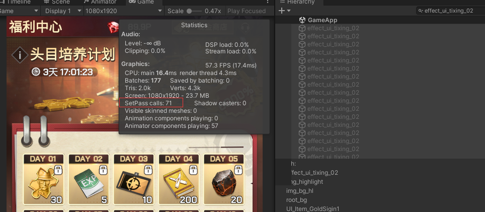
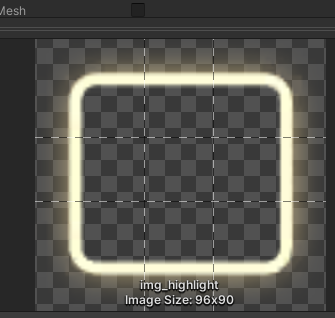
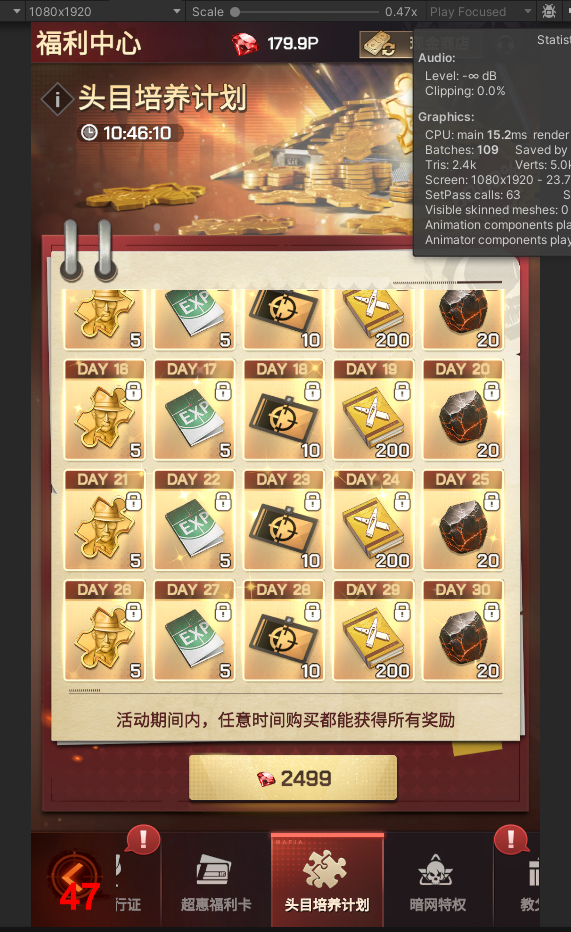
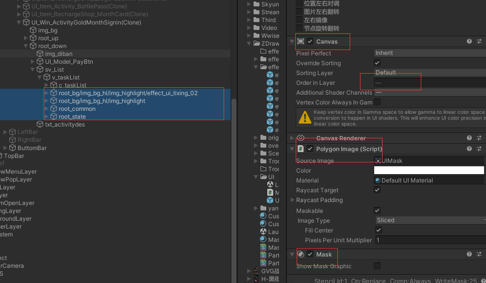
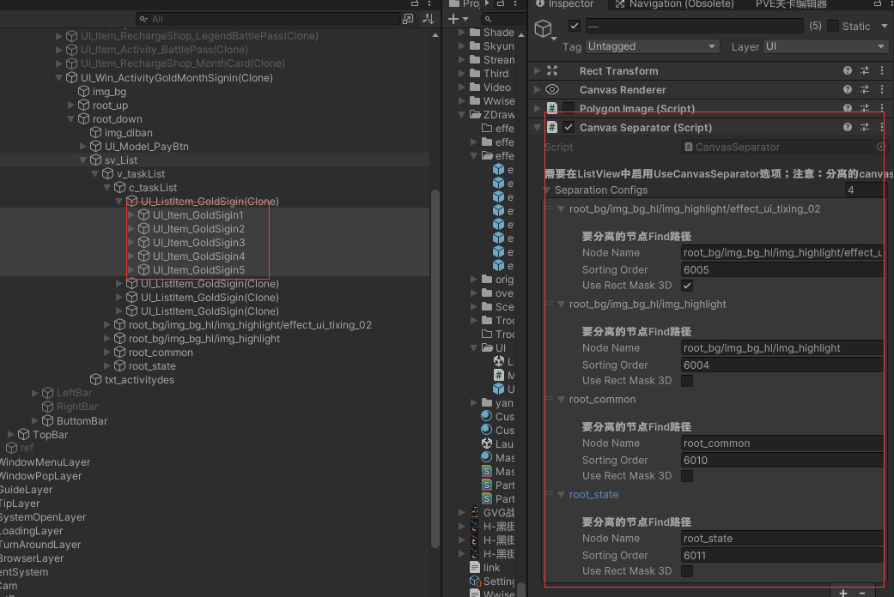
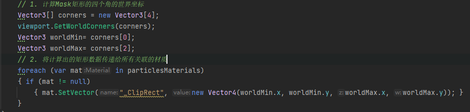

<!--more-->
# 世界地图合批的优化实战
## 基本概念
>参考：  
><https://zhuanlan.zhihu.com/p/356211912>  
><https://zhuanlan.zhihu.com/p/651364842>  
><https://zhuanlan.zhihu.com/p/432223843>  
><https://blog.csdn.net/qq_33726878/article/details/119863710>  
>
> - 什么是Draw Call？ 
>> 在Unity中，每次CPU准备数据并通知GPU的过程就称之为一个DrawCall。这个过程会指定一个Mesh被渲染，绘制材质。
>
>- 为什么 Draw Call多了会影响帧率
>>Draw Call是CPU告诉GPU需要绘制什么的命令。每一个Draw Call都包含了一些信息，如顶点数据、纹理数据、着色器等。每次发出一个Draw Call，CPU都需要做一些工作，如设置渲染状态、准备数据、调用图形API等。这些工作都需要消耗CPU的计算资源。  
>>当Draw Call的数量增加时，CPU需要处理的工作量也会增加,CPU就会把大量时间花费在提交Draw Call命令上，造成CPU的过载,如果CPU的处理能力不足，就可能导致渲染速度降低，从而影响到帧率。在实际的游戏开发中，过多的Draw Call是导致帧率下降的一个常见原因。  
>>此外，每个Draw Call都会引发一次图形管线的运行，包括顶点处理、光栅化、片元处理等步骤。如果Draw Call的数量过多，GPU的工作量也会增加，也可能导致帧率下降。  
>>因为 Unity 在发出 DrawCall 之前必须进行很多设置。实际的 CPU 成本便来自该设置，而不是来自 GPU DrawCall 本身（DrawCall 只是 Unity 需要推送到 GPU 命令缓冲区的少量字节）
>
> - 设置渲染状态具体指那些内容?  
>>(设置渲染状态通常发生在发起Draw Call之前，也就是在应用程序阶段。在这个阶段，CPU会将渲染指令和数据发送给图形驱动程序。) 
> >渲染状态是指在进行绘制操作之前，需要设置的一些参数。这些参数会影响到绘制操作的结果。以下是一些常见的渲染状态：  
>>着色器状态：指定用于渲染的顶点着色器和片元着色器。  
>>纹理状态：指定用于渲染的纹理。一个物体可能会使用多个纹理，例如漫反射纹理，法线贴图，光照贴图等。  
>>混合状态：指定如何将新生成的像素颜色和帧缓冲区中已有的像素颜色进行混合。  
>>深度和模板测试状态：指定如何进行深度测试和模板测试。深度测试用于解决物体的遮挡关系，模板测试可以用来实现一些特殊的渲染效果。  
>>光栅化状态：指定如何将几何形状转换成像素。例如，可以设置线框模式或者填充模式，可以设置剔除模式等。  
>
> - 渲染指令指什么?  
>>渲染指令是指在图形渲染过程中，由CPU发送给GPU的一系列命令。这些命令告诉GPU如何进行图形渲染，包括但不限于以下几种类型：  
>>Draw Call：这是最常见的渲染指令，告诉GPU绘制一定数量的顶点，形成三维模型。  
>>状态改变：这类指令用于改变渲染状态，例如切换使用的着色器，改变混合模式等。  
>>资源绑定：这类指令用于将资源（如纹理、缓冲区等）绑定到GPU，以便在渲染过程中使用。  
>>清除操作：这类指令用于清除帧缓冲区或深度缓冲区。  
>>计算着色器调度：这类指令用于在GPU上执行一些非图形渲染的计算任务。  
>>每个渲染指令都会影响到GPU的工作状态和行为，因此在编写图形程序时，需要仔细管理和调度这些渲染指令，以实现期望的渲染效果。  
>
>- 在opengl中渲染指令是那些?
>>在OpenGL中，渲染指令主要包括以下几类：  
>>Draw Calls：例如glDrawArrays，glDrawElements等函数，这些函数用于提交顶点数据并发起绘制操作。  
>>状态设置：例如glEnable，glDisable，glBlendFunc，glDepthFunc等函数，这些函数用于设置各种渲染状态。  
>>着色器操作：例如glCreateShader，glShaderSource，glCompileShader，glAttachShader等函数，这些函数用于创建和管理着色器。  
>>纹理操作：例如glGenTextures，glBindTexture，glTexImage2D等函数，这些函数用于创建和管理纹理。  
>>缓冲区操作：例如glGenBuffers，glBindBuffer，glBufferData等函数，这些函数用于创建和管理顶点缓冲区和索引缓冲区。  
>>帧缓冲操作：例如glGenFramebuffers，glBindFramebuffer，glFramebufferTexture2D等函数，这些函数用于创建和管理帧缓冲对象。  
>>变换和视口设置：例如glViewport，glMatrixMode，glLoadIdentity，glTranslate，glRotate，glScale等函数，这些函数用于设置视  口和模型视图投影矩阵。  
>>清除操作：例如glClear，glClearColor，glClearDepth等函数，这些函数用于清除颜色缓冲区，深度缓冲区和模板缓冲区。  
>>以上就是OpenGL中常见的一些渲染指令，实际上OpenGL的API还有很多，这里只是列举了一部分。  
>
>- 在opengl中设置渲染状态指哪些?
>>在OpenGL中，设置渲染状态主要涉及以下几个方面：  
>>启用或禁用特定功能：使用glEnable和glDisable函数，你可以启用或禁用一些特定的渲染功能，如深度测试（GL_DEPTH_TEST）、裁剪测试（GL_SCISSOR_TEST）、模板测试(蒙版测试)（GL_STENCIL_TEST）、透明度混合（GL_BLEND）等。  
>>设置混合模式：使用glBlendFunc和glBlendEquation函数，你可以设置源颜色和目标颜色的混合方式，以实现不同的透明效果。  
>>设置深度和模板测试模式：使用glDepthFunc和glStencilFunc函数，你可以设置深度测试和模板测试的比较方式。  
>>设置剔除模式：使用glCullFace和glFrontFace函数，你可以设置剔除模式，以决定哪些面（正面或背面）应该被剔除。  
>>设置视口和裁剪区域：使用glViewport和glScissor函数，你可以设置视口大小和裁剪区域。  
>>设置线宽和点大小：使用glLineWidth和glPointSize函数，你可以设置线宽和点大小。  
>>设置多边形模式：使用glPolygonMode函数，你可以设置多边形的渲染模式，如填充模式（GL_FILL）、线框模式（GL_LINE）或点模式（GL_POINT）。  
>>设置纹理参数：使用glTexParameter函数，你可以设置纹理的各种参数，如过滤模式、环绕模式等。  
>>以上就是OpenGL中设置渲染状态的一些常见操作，实际上OpenGL的API还有很多，这里只是列举了一部分。  
>
>- Draw Call为什么说cpu开销最大（调用Draw Call性能消耗原因是啥）?
>>Draw Call的CPU开销大主要有以下几个原因：  
>>我们的应用中每一次渲染，进行的API调用都会经过Application->Runtime->Driver(用户态图形驱动层和内核态驱动层)->硬件显卡(GPU)[1]，其中每一步都会有一定的耗时。
每调用一次渲染API并不是直接经过以上说的所有组件通知GPU执行我们的调用。
Runtime会将所有的API调用先转换为设备无关的“命令”（之所以是设备无关的，主要是因为这样我们写的程序就可以运行在任何特性兼容的硬件上了。运行时库使不同的硬件架构相对我们变的透明。）  
Draw Call性能消耗原因是命令**从Runtime到Driver的过程中，CPU要发生从用户模式到内核模式的切换**。  
模式切换对于CPU来说是一件非常耗时的工作，所以如果所有的API调用Runtime都直接发送渲染命令给Driver，那就会导致每次API调用都发生CPU模式切换，这个性能消耗是非常大的。  
Runtime中的Command Buffer可以将一些没有必要马上发送给Driver的命令缓冲起来，在适当的时机一起发送给Driver，进而在显卡执行。以这样的方式来寻求最少的CPU模式切换，提升效率。  
><video src="../images/drawcall_1.mp4" controls="controls" width="560" height="330"></video>
><video src="../images/drawcall_2.mp4" controls="controls" width="560" height="330"></video>
>  
>>
>>
>>状态设置：每次Draw Call之前，都需要设置一些渲染状态，如绑定纹理、设置着色器等。这些操作都需要CPU进行处理。  
>>数据传输：Draw Call通常涉及到将顶点数据、纹理数据等从CPU传输到GPU。这个过程需要CPU进行数据的准备和发送，尤其是当数据量大的时候，会占用较多的CPU资源。  
>>API调用：每次Draw Call都需要调用图形API，如OpenGL或DirectX。这些API调用本身就需要CPU时间。  
>>同步等待：在某些情况下，CPU需要等待GPU完成渲染操作，这会导致CPU空闲等待，浪费资源。  
>>因此，尽量减少Draw Call的数量是优化图形程序性能的一个重要手段。通过批处理（Batching）、实例化（Instancing）等技术，可以有效地减少Draw Call的数量，从而降低CPU的开销。  
>
>- 降低Drawcall次数的意义?
>>降低Draw Call次数的主要意义在于提高渲染效率和程序性能。以下是具体的几个方面：  
>>提高CPU效率：每个Draw Call都需要CPU进行一系列的设置和准备工作，包括设置渲染状态、准备数据、调用图形API等。如果Draw Call次数过多，CPU的负担就会增加，可能导致CPU成为性能瓶颈。降低Draw Call次数可以减轻CPU的负担，提高其效率。  
>>提高GPU效率：每个Draw Call都会引发一次图形管线的运行，包括顶点处理、光栅化、片元处理等步骤。如果Draw Call次数过多，GPU的工作量也会增加，可能导致GPU利用率不高。降低Draw Call次数可以使GPU更高效地处理渲染任务。  
>>提高帧率：由于降低了CPU和GPU的负担，因此可以提高渲染的帧率，使画面运行更加流畅，提高用户体验。  
>>节省电量：在移动设备上，降低Draw Call次数可以减少CPU和GPU的工作量，从而节省电量，延长设备的续航时间。  
>>因此，降低Draw Call次数是图形渲染优化的重要手段之一。  
>
>什么是 Batch
>>Batch翻译成中文一般我们称之为“批次”。我们经常用引擎每帧提交的批次数量来作为衡量渲染压力的指标。  
调用一次渲染API的绘制接口（如：Direct3D的DrawPrimitive/DrawIndexedPrimitive，OpenGL的glDrawArrays/glDrawElements/glDrawArraysInstanced/glDrawElementsInstanced）来向GPU提交使用相同渲染状态的一定数量的三角形的行为为一个渲染批次。从API调用的角度来看，Batch和Draw call是等价的，但是在游戏引擎中他们的实际意义是不一样的：Batch一般指代经过打包之后的Draw call。 
>
>OpenGL 发起Draw Call的API
>>在OpenGL中，发起一个Draw Call的API主要有以下几种：  
>>glDrawArrays(GLenum mode, GLint first, GLsizei count): 这个函数用于绘制顶点数组。参数mode指定了要绘制的图元类型（如GL_TRIANGLES表示绘制三角形），first指定了顶点数组中起始顶点的位置，count指定了要绘制的顶点数量。  
>>glDrawElements(GLenum mode, GLsizei count, GLenum type, const GLvoid * indices): 这个函数用于通过索引数组来绘制顶点数组。参数mode指定了要绘制的图元类型，count指定了索引数组中的元素数量，type指定了索引数组中元素的类型，indices指向索引数组。  
>>glDrawArraysInstanced(GLenum mode, GLint first, GLsizei count, GLsizei instancecount): 这个函数用于实例化渲染，可以一次性渲染多个相同的对象。  
>>glDrawElementsInstanced(GLenum mode, GLsizei count, GLenum type, const void *indices, GLsizei instancecount): 这个函数也用于实例化渲染，但是通过索引数组来绘制顶点数组。  
>>以上就是OpenGL中发起Draw Call的主要API。使用这些API时，需要确保已经正确设置了顶点数组和其他渲染状态。
>>

- `Draw Call`
Unity引擎前期，衡量CPU在渲染时的资源消耗大多都是是通过Draw Call的数量 因为CPU在渲染流水线中的处理阶段是应用程序阶段，主要是做一些数据的准备与提交工作，而Draw Call的数量代表了CPU向GPU提交的数据的次数，Draw Call本身只是一些数据流的字节，主要的性能消耗在于CPU的数据准备阶段

- `Batcher`
由于合批的出现，并不会每一个渲染对象都会产生一个Draw Call，所以这个时候就提出了一个新的衡量标准：Batcher

- `Set Pass Call`
前面也说过，CPU在渲染阶段，性能消耗的峰值一般不在于Draw Call，而往往存在于对其数据准备的阶段，因此单纯以数据的提交数量为衡量标准并不准确，同时在数据准备的过程中，假如前后两个材质发生了变化，会更大幅度的消耗性能，这也是整个CPU在渲染阶段最消耗性能的步骤，因此Unity通过Set Pass Call来作为性能消耗的标准


## 合批优化常见方法
- 合并网格和材质：建模时将多个网格合并成单个网格，将相邻的小物体合并成一个大物体，减少DrawCall数量。共享相同的材质，减少DrawCall。
- 使用共享材质，材质球相同时，如果参数不同使用`MaterialPropertyBlock`，保持材质的数目尽可能少，更大程度的批处理
- 利用网格的顶点数据（两个模型用了同一个材质为了不同但是之前用的两个材质多少有点不同，例如两棵树的颜色不同）    
-  Static Batching 静态批处理
    - 将多个静态物体合并为一个批次进行渲染，可以减少 Draw Call。可以在 Unity 中开启静态批处理来实现。  
    > 支持的Renderer
    > - `Mesh Renderer`  
    > - `Skinned Mesh Renderer`   蒙皮网格渲染器，通常用于渲染带有骨骼动画的角色，但如果角色不需要动画并且标记为静态，它们也可以被合批。  
    > - *`Sprite Renderer`、`Line Renderer`、`Trail Renderer`、`Particle System Renderer`等，通常不支持静态合批*。
    >
    > 要勾选StaticBatch，但是不能滥用。有color、uv3的，顶点超过4000个以上的，数量超多，但是同屏显示不多的模型。这些都不应该勾选StaticBatch。否则会导致包体积明显增大。因为StaticBatch会把模型都build到场景的ab包内。  
    >静态批次可以包含的顶点数量是有限制的。每个静态批次最多可包含 64000 个顶点。如果有更多，Unity 会创建另一个批次。  
    >不支持MaterialPropertyBlock。  
    >打包之后体积增大，应用运行时所占用的内存体积也会增大。  
    >需要额外的内存来存储合并的几何体。  
    >Unity将静态物体合并为一个(或多个)大网格，这个(或这些)大网格以vertex buffers和index buffers的形式存储在GPU上；
    >Unity按顺序绘制场景中的物体时，如果两个物体的数据属于同一块buffer，且在vertex buffer和index buffer上连续，那么这两个物体仅产生1次DrawCall；
    >如果它们不连续，那么将产生2次DrawCall(specify different regions of this buffer)；但是由于它们属于同一块buffer，因此这2次DrawCall之间的GPU状态不发生改变，它们构成1次StaticBatch；虽然没有降低DrawCall次数，但是避免了重复的"buffer binding"——我对"buffer binding"的理解是：在shader开始执行前告诉shader这个是vertex buffer、这个是index buffer……
    >**静态批处理不一定减少DrawCall，但是会让CPU在“设置渲染状态-提交Draw Call”上更高效**；
    > Unity2019有重复的Mesh在内存中存在多份的问题,冗余顶点数据及冗余索引数据

- Dynamic Batching 动态批处理：将多个动态物体合并为一个批次进行渲染，可以减少 Draw Call。可以在 Unity 中开启动态批处理来实现。 
    > 支持的Renderer:  `Mesh Renderer`,`Sprite Renderer`、`Line Renderer`、`Trail Renderer`、`Particle System Renderer`。  
    >特殊情况：不同材质的阴影会动态合批，只要绘制阴影的 pass是相同的，因为阴影跟其他贴图等数据无关。    
    >动态合批有限地支持MaterialPropertyBlock。动态合批可以在一定条件下合并多个动态物体的渲染调用，但是对于材质属性的差异有限制。如果使用MaterialPropertyBlock设置的属性会导致顶点数据的改变（例如颜色或者UV），那么这些物体可能无法被动态合批。但是，如果MaterialPropertyBlock用于修改不影响顶点数据的属性（例如材质的shader属性），那么这些物体仍然有可能被动态合批。  
    >动态批处理的约束：  
    >1. 批处理动态物体需要在每个顶点上进行一定的开销，所以动态批处理仅支持小于900顶点的网格物体。  
    >1. 如果你的着色器使用顶点位置，法线和UV值三种属性，那么你只能批处理300顶点以下的物体；如果你的着色器需要使用顶点位置，法线，UV0，UV1和切向量，那你只能批处理180顶点以下的物体。  
    >1. 不要使用缩放。分别拥有缩放大小(1,1,1) 和(2,2,2)的两个物体将不会进行批处理。  
    >1. 统一缩放的物体不会与非统一缩放的物体进行批处理。  
    >1. 使用缩放尺度(1,1,1) 和 (1,2,1)的两个物体将不会进行批处理，但是使用缩放尺度(1,2,1) 和(1,3,1)的两个物体将可以进行批处理。  
    >1. 使用不同材质的实例化物体（instance）将会导致批处理失败。  
    >1. 拥有lightmap的物体含有额外（隐藏）的材质属性，比如：lightmap的偏移和缩放系数等。所以，拥有lightmap的物体将不会进行批处理（除非他们指向lightmap的同一部分）。  
    >1. 多通道的shader会妨碍批处理操作。比如，几乎unity中所有的着色器在前向渲染中都支持多个光源，并为它们有效地开辟多个通道。  
    >1. 网格实例应引用相同的光照纹理文件——如果物体使用光照纹理，需要保证它们指向光照纹理中的同一位置，才可以被动态批处理
    >1. 材质的着色器不能依赖多个过程————多Pass的shader会中断批处理。
    >1. 预设体的实例会自动地使用相同的网格模型和材质。  
    >1. 动态合批有32k顶点的上限  
    >1. 如果是BRP项目，你也可以使用MaterialPropertyBlock语句修改材质，它不会破坏批处理，使用MaterialPropertyBlock要比使用多个材质球更快。但如果是URP/HDRP/SRP项目，不要使用MaterialPropertyBlock语句，因为它会阻止SRP Batcher
    >
    >**在ui中动态和静态物体不能一起批处理，否则会加重mesh重建开销。**    
    >**动态批处理在需要时非常有用，但过度使用它可能会适得其反。只在必要时使用动态批处理。**    
    >我们知道能够进行合批的前提是多个GameObject共享同一材质，但是对于Shadow casters的渲染是个例外。仅管Shadow casters使用不同的材质，但是只要它们的材质中给Shadow Caster Pass使用的参数是相同的，他们也能够进行Dynamic batching。例如，场景中我们摆放了许多的箱子，他们的材质中引用的Texture不同, 但是在做Shadow Caster Pass渲染的时候Texture会被忽略，这些箱子是可以合批渲染的。这是因为Shadow渲染如果使用ShadowMap或其他的衍生算法，场景中的物体要绘制两遍。第一遍绘制Shadow pass要做一次深度渲染，只提取场景中Shadow casters物体的深度值。  
    >Shadow Caster Pass在做Depth buffer渲染的时候我们不需要Fragment Shader关于颜色相关的结果，仅仅一个简单的能够输出深度值的Fragment Shader足以。而且对于几乎所有物体而言使用的Shadow Caster Pass又是相同的，所以这些Shadow caster物体就可以进行Dynamic batching了。  
    >在目前比较主流的游戏引擎中，进行其他绘制之前都会首先执行一次Depth buffer渲染，尤其是在采用Deferred Rendering的时候。这一步不仅仅是为Shadow的绘制，更是为了后续执行其他像素计算相关Shader的时候能够在Early-Z阶段剔除不必要执行的Fragment计算，降低填充率，提高效率。  
    >Dynamic batching在降低Draw call的同时会导致额外的CPU性能消耗，所以仅仅在合批操作的性能消耗小于不合批，Dynamic batching才会有意义。而新一代图形API（ Metal、Vulkan）在批次间的消耗降低了很多，所以在这种情况下使用Dynamic batching很可能不能获得性能提升。Dynamic batching相对于Static batching不需要预先复制模型顶点，所以在内存占用和发布的程序体积方面要优于Static batching。但是Dynamic batching会带来一些运行时CPU性能消耗，Static batching在这一点要比Dynamic batching更加高效。所以我们在实践中可以根据具体的场景灵活地平衡两种合批技术的使用。  
    >观察对比静态合批和动态合批Batches和DrawCall数量的不同，可以更加直观的区分两者原理上的差别，静态合批是在打包时将设置为静态的物体合并成一个Mesh下的多个SubMesh，一个Batches中会多次调用DrawCall渲染SubMesh，故Draw Call数远大于Batches数 ，而动态合批是把符合合批条件的模型的顶点信息变换到世界空间中，然后通过一次Draw call绘制多个模型，故Batches数和Draw Call数相同。

- GPU Instancing：启用GPU实例化，允许相同网格和材质的多个实例一次性渲染。
    GPU Instancing支持MaterialPropertyBlock。GPU Instancing是一种技术，它可以在GPU上高效地渲染大量相同网格和材质的物体，同时允许每个实例具有不同的材质属性。通过MaterialPropertyBlock，可以为每个实例设置不同的属性，如颜色、转换矩阵等，而不影响合批。
    ```
    第一个是无索引的顶点网格集多实例渲染，
    void glDrawArraysInstanced(GLenum mode, GLint first, GLsizei count, Glsizei primCount);
    第二个是索引网格的多实例渲染，
    void glDrawElementsInstanced(GLenum mode, GLsizei count, GLenum type, const void* indices, GLsizei primCount);
    第三个是索引基于偏移的网格多实例渲染。
    void glDrawElementsInstancedBaseVertex(GLenum mode, GLsizei count, GLenum type, const void* indices, GLsizei instanceCount, GLuint baseVertex);
    ```
- SRP Batcher:
    - 参考：<https://docs.unity3d.com/Manual/SRPBatcher.html>
    - 如果你使用MaterialPropertyBlock来改变材质属性，并且这些改变不会导致需要不同的shader变体，那么SRP Batcher通常可以合并这些渲染调用。这意味着，即使游戏对象使用了不同的颜色或纹理，只要它们使用相同的材质和shader，并且这些变化是通过MaterialPropertyBlock设置的，它们仍然有可能被合批。
    - 被渲染的物体不能使用MaterialPropertyBlock修改属性，MaterialPropertyBlock不支持SRP Batcher
    - 渲染的对象必须是网格或蒙皮网格。该对象不能是粒子。
    - 着色器必须与 SRP Batcher 兼容。HDRP 和 URP 中的所有光照和无光照着色器均符合此要求（这些着色器的“粒子”版本除外）。 为了使着色器与 SRP Batcher 兼容：
    - 必须在一个名为UnityPerDraw的 CBUFFER 中声明所有内置引擎属性。例如unity_ObjectToWorld 或 unity_SHAr
    - 必须在一个名为 UnityPerMaterial的 CBUFFER 中声明所有材质属性
    - 数据分析需要使用脚本：[SRPBatcherProfiler.cs](https://github.com/Unity-Technologies/SRPBatcherBenchmark/blob/master/Assets/Scripts/SRPBatcherProfiler.cs)
- 打包图集：将多个小贴图合并成一个大贴图，可以减少 Draw Call。可以使用 Unity 中的 SpritePacker 工具来实现贴图的合并。  
- 动态图集：动态图集可以减少Draw Call，但是频繁更新图集可能会导致性能问题，需要平衡图集的大小和更新频率，以避免内存浪费和性能损失。压缩纹理可能会影响图集的更新速度和质量。
    >参考：<https://blog.csdn.net/qq_33808037/article/details/130018125>
- 使用光照贴图(lightmap)而非实时灯光
- 使用LOD（层次细节）:使用Level of Detail技术，根据相机距离切换模型的细节级别。远离相机的物体使用低多边形模型，减少DrawCall；利用Unity的LOD群组，对一组相邻的角色使用相同的LOD，降低渲染负担，提高性能。
    >远景裁剪：根据相机距离裁剪掉远处不可见的物体，减少渲染压力

- 使用Culling技术：利用Unity的视锥体剔除（Frustum Culling）和遮挡剔除(Occlusion Culling)功能，确保只有当前相机可见的物体会被渲染。
    - 视锥体剔除（Frustum Culling）
        >Frustum Culling是Unity引擎的一部分，通常不需要手动设置，因为它默认就是开启的

        优化Frustum Culling的效果:
        1. 正确设置摄像机的视野（Field of View, FOV）和裁剪平面（Clipping Planes）.
        1. 使用层（Layers）配合Culling Mask 来控制渲染：
        1. 优化网格（Mesh）
            确保你的网格不是过于复杂，特别是对于那些经常被剔除的物体。复杂的网格需要更多的计算来确定是否在视锥体
        1. 使用遮挡剔除（Occlusion Culling
        1. 调整Quality Settings
            在Unity的Quality Settings中，你可以调整与剔除相关的设置，比如剔除距离和预设的层级剔除
        1. 编写自定义剔除逻辑
            如果你需要更精细的控制，你可以编写自定义剔除逻辑。通过实现自己的剔除系统，你可以根据特定的需求来决定哪些物体应该被渲染。

    - 遮挡剔除(Occlusion Culling)
        >遮挡剔除（Occlusion Culling）是一种性能优化技术，用于减少渲染不可见物体的开销。在Unity中，遮挡剔除可以自动处理，但是需要在场景中进行一些设置才能启用。
        在Unity中设置和使用遮挡剔除的步骤：
        1. 准备场景：
            确保场景中的物体正确设置了静态标记。在Inspector面板中，选择一个物体，然后勾选“Static”选项。对于那些不会移动的物体，如地形、建筑物等，应该标记为静态。这样，Unity才能知道哪些物体可以用于遮挡剔除的计算。
        1. 打开遮挡剔除窗口：
            在Unity编辑器中，选择“Window” > “Rendering” > “Occlusion Culling”来打开遮挡剔除窗口。
        1. 设置参数：
            在遮挡剔除窗口中，你可以设置一些参数，如视锥体大小、遮挡区域大小等。这些参数会影响遮挡剔除的精度和性能。
        1. 烘焙遮挡信息：
            在遮挡剔除窗口中，点击“Bake”按钮开始烘焙过程。Unity会计算哪些区域可能被其他静态物体遮挡，并存储这些信息。
        1. 测试遮挡剔除：
            烘焙完成后，你可以在场景视图中启用遮挡剔除的可视化来查看其效果。在遮挡剔除窗口中，勾选“Visualize”选项，然后在场景视图中移动摄像机，你会看到被遮挡的物体不会被渲染
        1. 启用或禁用遮挡剔除 `Camera.main.useOcclusionCulling`
            ```
            //开启关闭遮挡剔除测试
            using UnityEngine;
            public class OcclusionCullingToggle : MonoBehaviour
            {
                private void Update()
                {
                    if (Input.GetKeyDown(KeyCode.O)) // 按下'O'键切换遮挡剔除
                    {
                        Camera.main.useOcclusionCulling = !Camera.main.useOcclusionCulling;
                        Debug.Log("Occlusion Culling " + (Camera.main.useOcclusionCulling ? "enabled" : "disabled"));
                    }
                }
            }
            ```
- 减少实时光照和阴影效果(会使物体多Pass渲染)
    >尽量少的使用反射、阴影等之类的，会使物体多Pass渲染,避免过多的光照计算：使用合理数量的光源，避免过度复杂的光照设置。
- 动态合并Mesh(Static Batching In Runtime)
    ```
    // 模型开启Read/Write选项
    public void Mesh.CombineMeshes(CombineInstance[] combine)
    //合并staticBatchRoot 的子物体，合并后子物体无法改变Transform属性，但是staticBatchRoot 可以移动
    // StaticBatchingUtility.Combine prepares all children of the staticBatchRoot for static batching.
    // Once combined, children cannot change their Transform properties; however, staticBatchRoot can be moved.
    public static void StaticBatchingUtility.Combine(GameObject staticBatchRoot)
    ```
- Skinning Mesh:使用GPU Skinning,也叫Compute Skinning,大量角色使用了骨骼动画(Skinned Mesh Renderer)，考虑使用基于GPU的Skinning来加速动画渲染。
    >GPU Skinning是一种技术，通过在GPU上进行骨骼动画计算，从而实现更高效的动画渲染。  
    > 参考案例: <https://github.com/chengkehan/GPUSkinning> （支持OpenGL ES 2.0） unity内置的GPUSkinning最低是OpenGLES3.0  
    ><https://chengkehan.github.io/GPUSkinning.html>
    >- 提取骨骼动画数据:从Animation中提取每帧的骨骼数据
        将骨骼动画数据序列化到自定义的数据结构中。这么做是因为这样能完全摆脱 Animation 的束缚，并且可以做到 Optimize Game Objects（Unity 中一个功能，将骨骼的层级结构 GameObjects 完全去掉，减少开销），同时不丢失绑点。
    >- 在 CPU 中进行骨骼变换:根据播放动画的当前帧，读取之前提取的骨骼数据对应帧的矩阵信息，然后和骨骼动画的默认姿态数据计算，得到当前帧骨骼变换的结果，将所有骨骼的变换结果作为矩阵数组传递到shader中。
    >- 在shader中根据进行蒙皮，根据提供的顶点、骨骼权重和骨骼矩阵运算计算出当前帧顶点的位置等数据即蒙皮的结果。
- Bone Matrix Palette Batching
    我们可以模仿“Hardware Skinning”的渲染方式，但是让每个物体仅受一根骨骼影响，创建一个Transform matrix palette，其中存放的是我们打包的变换矩阵
- 控制渲染顺序：
    >减少状态改变：渲染顺序的优化可以减少GPU状态改变的次数。例如，按照材质或着色器排序可以减少切换材质或着色器的次数，因为相同的材质和着色器可以被合并到一个批次中。
    >
    >动态和静态合批：Unity中有动态合批和静态合批两种方式。静态合批适用于不会移动的对象，可以在编辑器中将这些对象标记为静态，Unity会在构建时自动合并这些对象的网格和材质。动态合批则适用于运动的对象，但要求这些对象使用相同的材质。通过控制渲染顺序，可以确保动态对象尽可能地被合批。
    >
    >透明物体的排序：透明物体需要按照从后向前的顺序渲染，以确保透明效果正确。如果透明物体的渲染顺序不正确，可能会导致合批失败或渲染效果错误。
    >
    >避免过度绘制：通过合理的渲染顺序，可以减少不必要的过度绘制。例如，先渲染遮挡关系中的前面物体，可以避免渲染被遮挡的后面物体，从而节省GPU资源。
    >
    >Shader的Pass顺序：有些Shader包含多个Pass，控制这些Pass的执行顺序可以影响合批的效率。例如，先渲染所有对象的第一个Pass，再渲染所有对象的第二个Pass，可以提高合批的可能性
- 分块加载：将世界地图划分成小块，在需要时动态加载，减少一次性加载的DrawCall。

- 减少遮罩（Mask）：在UI中遮罩会增加DrawCall的数量，因此只在必要的情况下使用，并在可能的情况下使用Rect Mask 2D替代
- Layout Group、ContentSizeFitter等组件可能引起额外的计算和布局，增加渲染的负担。

- 低多边形模型：使用简化的低多边形模型代替高细节模型，降低渲染成本。

- 降低纹理分辨率：对于简化模式，可以使用较低分辨率的纹理，减少内存和渲染负担。

- 基于屏幕距离的细节调整：根据物体与相机的距离，动态调整细节层次，优化性能。
- 使用工具，如Unity的Draw Call Minimizer，自动合并和优化角色的渲染调用。
- 采用融合技术：使用融合技术将相似的角色合并成一个，减少渲染调用。这对于大量相似的敌人或NPC非常有用。
- 减少动态物体的数量：动态物体需要每帧重新绘制，因此数量过多会导致 Draw Call Different Combined Meshes 增加。可以通过使用静态物体、使用 LOD 等方式来减少动态物体的数量。  
- 减少透明物体的数量：透明物体需要额外的渲染步骤，因此数量过多会导致 Draw Call 增加。可以通过使用不透明物体、使用 Alpha Test 等方式来减少透明物体的数量。  

>  
>  
>  
### 合批优化选择
  

|合批方式|	原理|	代价|	适用场景|
|-|-|-|-|
|Static Batching|	多个Mesh转换为一个Mesh下的多个SubMesh|	包体大小增加，内存大小增加（重复的Mesh）|	静止的物体，Mesh的重复率低，材质数量少的场景|
|Static Batching（运行时）|	同 Static Batching|	运行时一次较大的CPU开销，CPU上多占用一份内存|	相对静止的场景|
|Dynamic Batching|	把符合合批条件的模型的顶点信息变换到世界空间中，然后通过一次Draw call绘制多个模型|	动态合批每帧会产生一定的CPU开销|	常用于UI/粒子特效的合批|
|GPU Instancing|	提交一次Mesh在多个地方绘制，要求材质球相同但材质的属性可以不同|	Shader需要支持、要求相对较高图形API版本（Android OpenGL ES 3.0+ / IOS Metal）|	大量相同网格的物体渲染、GPU Skinning|


**合批执行优先级顺序：SRP Batcher｜Static Batching > GPU Instancing > Dynamic Batching**

## 世界地图合批优化实战分享
### 优化结果
 世界地图优化前的数据  
   

 优化后的数据：  


1. 在展示层（不计算UI） 优化前drawcall为452,优化后为71 
1. 在lod第一层时 优化前drawcall为107，优化后为87
1. 在lod最高层时 所有建筑单位（重点是关卡圣地）的drwacall为54，优化后为17
1. 战斗部队200支头像 优化前drawcall为1400，优化后为22
1. 驻扎部队23支的名字 优化前drawcall为46，优化后为13


### 怪物合批和部队合批
> 怪物的动态合批方案：  游戏视野内的怪物根据图集指定固定的sortingorder值，始终和其他物体分离
> 部队的动态合批方案： 游戏视野内部队的数量大于10支时，根据图集指定固定的sortingorder值，当小于10支时，如果画质设置为高，则还原为sortingorder初始值，如果画质设置为中或者底时，则不还原。
>
地图 建筑单位可以合并图集处理


分析场景 `map-analyse.unity `

分析前的`drawcall`是 `478`


只显示怪的数据`drawcall`是 `274`


怪是3转3的图片，带阴影，有8个方向，每个动作都有8个方向，所有动作：攻击，待机，行走，跑步，攻击，休闲 

1. 调整图集方案
现在图集的方案是每只怪的所有动作作为一个图集  
调整图集：  
**所有怪的相同动作作为一个图集，因为图集太大，这里将所有士兵怪按照相同动作生成为一个图集的方案去处理**

2. 使用精灵切块工具[SpriteDicing
](https://github.com/Elringus/SpriteDicing)尝试将序列帧中每帧相同部分进行公用。 

3. 一个动作需要为8方向生成序列帧，这里考虑下是否能接受 左右镜像来减少序列帧素材，
    > 提供左上，左，左下的序列帧，通过镜像方式作为右上，右，右下的序列帧使用，这样就能减少3方向的素材，减小包体
    >需要考虑阴影单独拆分
    
4. 动态合并图集
5. shader实现一个材质球代表一个怪物的展示(shader实现几*几的方格子，同时渲染多个图集的数据)
    >
    >弊端：怪物和别的怪或者部队有交叉重叠时，不能交叉渲染，前后遮挡关系会有细节问题

6. 怪物里面的每个士兵和英雄 根据图集设置固定的order，分离渲染顺序
    >会丢失阵型前后遮挡关系，也会丢失重叠怪的遮挡关系
    
    >测试调整后的怪，drawcall只有`7`
    >
    
7. 角色和角色阴影分离
    > 减小角色图集 ,阴影可以使用更低的分辨率，使角色图集能容纳更多角色的图
    > 降低overdraw，角色和阴影在一个图中，形成大面积的透明区域，overdraw严重
    > 可以根据角色生成对应的mesh，降低overdraw，带阴影的情况下mesh不能复用
    > 阴影可以再中低平台设备上关闭，或者中端使用一个阴影图片来代替，降低阴影的性能开销，更可控
8. 使用 [SortingGroup](https://docs.unity3d.com/cn/2021.2/Manual/class-SortingGroup.html) 进行分组 
    >Unity 按 Sorting Layer 和 Order in Layer 渲染器属性对同一排序组中的所有渲染器进行排序。在此排序过程中，Unity 不会考虑每个渲染器的 **Distance to Camera** 属性。实际上，Unity 会根据包含 Sorting Group 组件的根游戏对象的位置，为整个排序组（包括其所有子渲染器）设置 Distance to Camera 值。  
    >配置在怪物上，表现一般，大量重叠的对象上效果应该更好一些  
    >

#### 结论
**使用第6条方案，每个士兵和英雄 根据图集设置固定的order，分离渲染顺序**
    
>数据比对 测试场景 `mapbatches.unity`
>优化前的怪和部队drawcall `426`  
> 
>
>优化后的怪和部队drawcall `36`  
>


### 场景内lod高层静态特效及物体


>优化后的数据 （lod 对象这里没有进行图集整合，需要时可以支持）
>优化前drawcall是 54，优化后是17，效果非常可观，但需要注意动态合批的CPU及内存开销
>

#### 静态特效


优化后特效后的结果: 


**结论**
1. 给特效物体不同的材质球指定不同的`sortingorder`
>如果不同材质球的物体使用相同的`sortingorder`，unity内部


#### 静态物体


drawcall 序号1和3是相同图集相同材质球,序号2和4也是相同图集相同材质球，1,2,3,4使用的相同shader，且，1,2,3,4动态合批的物体互相没有遮挡，


**结论**

1. 动态合批时，渲染顺序穿插会造成消耗更多的drawcall，最好指定固定的`sortingorder`,手动控制顺序，这样能提高动态合批的成功率.
>调整后的drawcall从4个变成2个

2. 所有圣地的图片需要调整到一个图集里面
>调整后的drawcall从4个变成1个

3. 占领后需要调整颜色，则使用`MaterialPropertyBlock`进行处理，不会打断合批(前提是支持`GPU Instancing`)

4. 这里使用顶点颜色进行颜色调整

5. `SpriteRenderer`针对不同sprite生成不同的mesh，mesh不同，所以不支持`GPU Instancing`合批，

#### 在lod层时 会有展示层内容占用drawcall
 相机从展示层到lod1层时，策划的需求是可点击业务单位及可以自由行军到业务单位，所以展示层的节点保留了，会把展示层的sprite节点`localScale`设置为`0`，但scale为0还是会占用drawcall。

 **处理方案：** 将scale为0时的sprite位置设置到相机外的位置

 

处理后的`drawcall`


### 常驻特效
>联盟标记，城堡护盾，冒烟特效，着火特效， 部队移动烟尘，lod高层圣地常驻特效，普攻子弹特效，

1. 城堡护盾、冒烟，着火特效
护盾特效（`effect_map_huzhao`）本身占用10个drawcall，有两个模型组成，每个模型5个材质球，且模型不能动态合批合批（因为不同材质球的渲染顺序相同）


*7个护盾特效，占用60个drawcall，视野内随着护盾数量的增长，drawcall也急速增长*

**结论**
- 建议优化护盾特效，降低材质球数量
    > 这里半球护盾特效是有两个mesh组成（1/2的半球mesh）,这两个mesh是相同的，（思考下是否可以使用1/4的半球mesh？） 
    > `eff_banyuan_007_1`和`eff_banyuan_007_2` mesh是一样的，资源冗余问题
    >
- 将材质球的`RenderQueue`进行调整，不同的材质球使用不同的值，可以进行动态合批
    >测试后的drawcall `11` 
    >
    >将 `Sorting Group`组件移除后drawcall 是`6` （`Sorting Group`这里打断动态合批了） 
    >

2. 普通子弹特效

**爆炸特效**
`effect_map_tongyong_touzhiwu_baozha` 炮弹爆炸特效 有7个材质球，每个爆炸特效 占用7个drawcall。
24个爆炸特效，同时播放会有 71 drawcall，特效有动态合批，但drawcall还是随着特效数量增长而增长

**处理方案**：将爆炸特效的sortingorder分别设置不同的值，24个爆炸特效，同时播放会有9个drawcall（一个clear的drawcall，一个天空盒的drawcall），特效完美动态合批，且drawcall不会随着特效数量增加而增加

> 着火和冒烟特效 也是这样的处理方案

**炮弹特效**


`effect_map_tongyong_touzhiwu` 炮弹的顶点数量过多不能动态合批，
**处理方案：**调整模型的顶点数，不高于300个顶点


**处理方案：**分离SortingOrder

## 世界地图UI合批优化实战分享
### UI及UI特效

1. `UI_Pop_TroopNameState` 部队名字及状态图标


23支部队，只显示`UI_Pop_TroopNameState` 占用drawcall就达到46 
`UI_Pop_TroopNameState`节点上添加有`Canvas`组件,所以打断合批了


**处理方案：**
    - 将`Canvas`组件移除，给状态图标添加`SortingGroup`组件，将名字和图标层级分离，这样保证`Text`组件和`Image`组件分别独立合批，不会被打断
    - 图标显示分底图和图标，将底图和图标放到同一个图集中。 

>优化后：
>


2. `UI_Pop_TroopSelectHUD` 部队选中后的信息显示

5支部队，占用20个drawcall 
`UI_Pop_TroopSelectHUD`节点上添加有`Canvas`组件,所以打断合批了


>关于合批 UGUI的一个缺陷  
>  
> *头像框合批失败，所以是3个drawcall*  
>  
> *白色图片不能合批，一共占用3个drawcall*
> 
>根据上图占用3个drawcall，推断出，Hierachy内的上下关系不能保证临近位置合批，受到前后遮挡关系影响。 
>这里有个问题是 第1个drawcall先绘制的左侧的白图，根据Hierachy的顺序，应该先绘制蓝色图片才对?
>UGUI是根据Depth进行相邻的Depth合批，不相邻的不能合批，这里可以调整节点关系

3. `UI_Pop_TroopFightInfoHUD` 战斗头像

10支部队，占用50个drawcall，200支部队占用drawcall为1000  ,200支部队副将头像也显示 drawcall为 1400
  
200支部队  
  
问题：  
- 每个头像上添加有Canvas组件  
> 去除Canvas组件后 drawcall 是19,200支部队占用drawcall为375  
- 每个头像上的指向线添加有Canvas组件  
>这个Canvas组件是保证指向线的层级在头像后面，不能去除。  
>这里去除Canvas后使用固定的材质球调整Render Queue来替代处理层级关系，替换材质球后drawcall为16，200支部队占用drawcall为412   
>  
- 如果不显示指向线，且把Canvas组件去除，头像的drawcall为9，  200支部队占用drawcall为175   
>  
- 指向线通过`MultiImage`组件合并成一个mesh进行处理   
> 这时候指向线和头像同时显示的drawcall为10，  200支部队占用drawcall为176   
>


**处理方案**
- 指向线通过`MultiImage`组件合并成一个mesh进行处理   

- 战斗头像超过一定数量限制后,处理办法:   
    1. 进行位置更新频率调整，
    1. 缩放效果停止播放，
        > 别人不会播放，只有自己的部队及和自己对战的会播放
    1. 战斗头像的技能特效停止播放，战斗抖动效果停止播放
        > 别人不会播放，只有自己的部队及和自己对战的会播放
    1. 分离成名字组和头像组，遮挡关系舍弃
    1. 数量级很大时，再次分组，canvas Rebuild更新Mesh会非常耗时

- 图集调整，将英雄战斗头像这一个尺寸类型单独打包一个图集为`duilietouxiang`图集
    1. 将战斗头像框，血条，技能充能条放到该图集中
    1. 部队的状态图标，状态图标底图，别动队图标放到该图集中（战斗头像和行军列表使用相同的头像） 
        >
    >英雄头像的图集放有多种尺寸类型的，这个图集不合理  
    >  


 优化前 200支部队，不显示指向线时 drawcall为1200  
 优化后 200支部队，不显示指向线时 drawcall为  21 (去掉canvs，所有头像相关图片调整到一个图集中)    
   

## UGUI合批
>合批过程是指Canvas合并UI元素的网格，并且生成发送给Unity渲染管线的命令。Canvas使用的网格都是从绑定在Canvas上的CanvasRenderer获得，但是不包含子Canvas的网格。UGUI的层叠顺序是按照Hierarchy中的顺序从上往下进行的，也就是越靠上的组件，就会被绘制在越底部。所有相邻层的可合批的UI元素（具有相同材质和纹理），就会在一个DrawCall中完成。


### 测试
> Win10,`Unity 2019.4.17f1c1`


  
*8个drawcall，左右的白色图片合批了，其他都没有合批;再次打开场景显示7个drawcall，左右白色图片、绿色图片合批了，其他都没有合批。*

 

 


 
 

 
 
*白色图片不能合批，一共占用3个drawcall。* 
>根据上图占用3个drawcall，推断出，Hierachy内的上下关系不能保证临近位置合批，受到前后遮挡关系影响。 
>这里有个问题是 第1个drawcall先绘制的左侧的白图，根据Hierachy的顺序，应该先绘制蓝色图片才对?

- 设置Image的alpha=0，坐标移到画布视野外，还是会继续占用drawcall，**设置localScale=0则不会占用drawcall**。

### Depth计算算法：

- 遍历所有UI元素（已深度优先排序），对当前每一个UI元素CurrentUI，如果不渲染，CurrentUI.depth = -1，如果渲染该UI且底下没有其他UI元素与其相交（rect Intersects），其CurrentUI.depth = 0;
- 如果CurrentUI下面只有一个的需要渲染的UI元素LowerUI与其相交，且可以Batch（material instance id 和 texture instance id 相同，即与CurrentUI具有相同的Material和Texture），CurrentUI.depth = LowerUI.depth；否则，CurrentUI.depth= LowerUI.depth + 1;
- 如果CurrentUI下面叠了多个元素，这些元素的最大层是MaxLowerDepth，如果有多个元素的层都是MaxLowerDepth，那么CurrentUI和下面的元素是无法合批的；如果只有一个元素的层是MaxLowerDepth，并且这个元素和CurrentUI的材质、纹理相同，那么它们就能合批。


### DrawCall合批(Batch)：

- Depth计算完后，依次根据Depth、material ID、texture ID、RendererOrder（即UI层级队列顺序，HierarchyOrder）排序（条件的优先级依次递减），剔除depth == -1的UI元素，得到Batch前的UI元素队列VisiableList。
- 对VisiableList中相邻且可以Batch（相同material和texture）的UI元素合并批次，然后再生成相应mesh数据进行绘制。

### UGUI合批策略

- 设置窗口父节点Z 值为 0，否则下面的元素都无法合批了。子UI元素Z值不为0时，会被视为3D UI，不参与合批。如果有Z改变了，尽量通过Group来规整在一起
- 设置Canvas.overrideSorting为true
- 设置Canvas.sortingOrder为窗口在Hierarchy下的排列顺序，即每当打开一个新的窗口，都会+1，根据数值由小到大依次渲染。
- 设置Canvas.sortingLayerID为0，表示默认为Default
- 设置Canvas.sortingLayerName为SortingLayer.IDToName(0)
- 根据功能适用性，合理使用Atlas图集。
- Mask和RectMask2D组件,
    >1. 不同mask之间是可以合批的
    >1. 被mask的物体只是不被绘制，依旧会影响合批计算
    >1. RectMask2D之间无法进行合批
    >1. 被RectMask2D隐藏的物体不会参与合批计算
    >1. RectMask2D组件上挂载的Image可以参与外部的合批
    >1. 自定义形状MeshMask, 参考<https://www.cnblogs.com/leoin2012/p/6822859.html>
- 不要使用Unity内置的素材，不能合批
- GameObject.activeSelf  获取本地激活状态，需要注意的是当父对象是没有激活的时候，也会返回True
- GameObject.activeInHierarchy  获取游戏对象在场景中的激活状态，当父对象是没有激活的时候，就会返回False

> 参考：
> <https://zhuanlan.zhihu.com/p/339387759>  
> <https://www.cnblogs.com/moran-amos/p/13878493.html> 
> <https://www.cnblogs.com/moran-amos/p/13883818.html> 

### UGUI优化指南
1. 优化填充率，裁减掉无用的区域，镂空等，镂空可以勾掉`FillCenter`。

1. Mask和RectMask2D的优劣，根据具体需求取舍。
1. 少用unity自带的outline和shadow。
    >会大量增加顶点和面数，比如outline，他实现原理是复制了四份文本然后做不同角度的便宜，模拟描边，要不就用自己实现的（挖坑待填）；
1.  全屏UI界面打开时建议将场景3D相机移走或者关闭。
1.  如果非特殊需求没必要使用CanvasPixedPerfect，因为比如在scrollView时，滑动视图时一直会导致不断重绘产生性能损耗；
1. 不需要接受点击时间的物件将RayCastTarget关掉减少事件响应，从底层看是因为UGUI的RayCastTarget的响应是从数组中遍历检测是否和用户的点击区域响应，所以能够缩减数组大小自然能够缩减遍历次数；
1. UI动静分离
1. 对于UI上常用的改变颜色的操作，不要使用Image组件上的Color属性改变颜色，这样会导致整个Canvas的重建，可以新建个材质，设置材质给Image的Material通过修改材质的颜色来达到同样效果
1. 对于界面上常用的组件隐藏，别使用SetActive来控制显隐，有两种方式，一种是通过设置物体上`CanvasRenderer`的`CullTransparentMesh`并且控制物体透明度进行剔除，这个一般用于单个ui，如果是多个UI要不显示的话通过设置`CanvasGroups`的`Alpha`控制显隐。
1. Text的组件的BestFit非必要别开，因为这样开启这个会不断生成各种尺寸的字号字体图集，增加不必要开销。
1. 生成图集
1. Image组件不要选择None，也会使用一个默认图片且无法与图集合批，选用一张图片来统一使用并打入到图集中。
1. 不要使用透明为0的图片当作按钮，改用NoOverdrawImage来代替
```
//不渲染但可以相应点击
public class NoOverdrawImage : Graphic{    public override void Rebuild(CanvasUpdate update){}   }   

public class Empty4Raycast : MaskableGraphic    {
        protected Empty4Raycast(){useLegacyMeshGeneration = false;}
        protected override void OnPopulateMesh(VertexHelper toFill){ toFill.Clear();        }    }
```
1. UI相机看不到的物体也会被渲染，占用DC，可以先禁用它们

>参考: 
> <https://www.jianshu.com/p/4aa2b8641875> 

## UI问题分析

>ui常见的问题:
>1. GPU 片段着色器使用过多（即填充率过度使用）
>1. 重建 Canvas 批处理所花费的 CPU 时间过多
>1. Canvas 批次的重建数量过多（过度污染）
>1. 用于生成顶点的 CPU 时间过多（通常来自文本）
>
>
sprite 被意外引用，造成多加载一个图集


### UGUI 优化记录
#### 主界面优化


优化前批次 84


> 红点图标的图集和主面板的icon图集不是一个，所以所有红点图标不能合批

- 位置1
>所有按钮使用的图集 `uileitubiao_1`

mask使用 用来处理动画


mask（没用的），没用用的节点动画


底图

这个底图独自占一个批次，没有使用sprite，不能合批


**指定一个上层sprite所在图集的一个背景纹理即可减少一个批次，背景图会和上层的icon按钮合批。**  
*内层mask没有影响合批，后面再测试*

- 位置2 
邮件图标和位置1的图标时同一个图集

**位置1 的内层mask和外层mask都移除后，会和邮件按钮进行合批**

- 位置3 
活动图标的图集和位置1位置2的图集不同

**活动图标的图集改为位置1用的图集**

- 位置4，5，10

位置4 的icon使用的图集 `common_banzi`,`feitongyong_01`,`uileitubiao_1`
位置5 的icon使用的图集 `common_banzi` 和 `uileitubiao_1`
位置10 的icon使用的图集 `common_banzi`,`uileitubiao_3`,`feitongyong_03`


- 位置6
> 单独测试占用12批次

icon使用的图集 `common_banzi` 和 `uileitubiao_4` 
特效节点 `effect_task_huang`  
特效没有合批
有粒子特效（`Particle System`），需要使用替代方案

红点有canvas，造成红点文字合批失败，需要调整
红点文字的字体和其他文字字体不一致，打断合批

无用的空Image节点占用一个批次，且打断合批 (这里Image透明度为0)


>优化后独立测试占用5批次，特效应该还有优化空间

- 位置7
> 批次 6  

icon使用的图集 `uileitubiao_1`


不能合批是因为左侧红点的mesh比较大（红点图标透明区域很大），被右侧图标遮挡了，就会插入到左侧图标和右侧图标中间
>优化后3


- 位置8
icon使用的图集 `uileitubiao_1`

- 位置9
icon使用的图集 `uileitubiao_1`

- 位置20 
icon使用的图集 `common_banzi` 和 `uileitubiao_4` 
还有空Image 但是alpha不是0，不能合批


- 位置11
>批次 6

icon使用的图集 `common_banzi` 和 `daojutubiao_1` 


- 位置19
icon使用的图集 `common_banzi` 

- 位置 14，15，16，17，18 （活动集合）
icon使用的图集 `uileitubiao_1` ,`uileitubiao_4`,`feitongyong_11`,   
有粒子特效（`Particle System`），需要使用替代方案
还有其他特效

这里特效有两部分，一部分在ui底下，一部分在ui上面，美术同学做特效时给所在的prefab所有ui节点挂载`Canvas`组件,直接导致合批失败 且形成大量的drawcall

- 位置12

icon使用的图集 `common_banzi`   
有循环动画  

- 位置13
icon使用的图集 `feitongyong_12`


- 位置23,24

icon使用的图集 `uileitubiao_3`,`uileitubiao_4`,`uileitubiao_6`
有循环动画

- 位置21
icon使用的图集 `uileitubiao_1`

- 位置22
icon使用的图集 `feitongyong_04`,`feitongyong_03`

- 位置 搜索坐标， 收藏按钮
icon使用的图集 `feitongyong_05`,`feitongyong_01`，`feitongyong_03`

#####  优化后的结果：


#### 全屏透明图片优化
原始的Overdraw


优化后的Overdraw


#### 活动界面头目培养计划优化


 这个界面drawcall数量太高，有这几方面问题
 - 这是全屏界面，界面打开时 3D场景相机没有关闭或者移动到空的位置
    >隐藏3D场景相机前drawcall是439，隐藏后是334，减少105个drawcall
    >
    >
 - 这个全屏界面使用了`grabpass`来做模糊处理，但是这个界面背景不是半透的，所以没用
 - 这个界面核心问题是道具Item上有特效`effect_ui_tixing_02`，这个特效使用了第三方插件`UIParticle`，打断了合批，造成这些道具Item加上Item上的特效总共占用接近200个drawcall
    >隐藏特效前drawcall是334个，隐藏后是177个，减少了157个
    >
    >
 - 道具Item的外光圈图片所在图集分配不合理，没有和道具Item在一个图集里，造成更多的drawcall占用
    >隐藏`img_highlight`前是drawcall是177个，隐藏后是113个，减少了64个
    >
    >
    >
    >
-  这个界面其他非通用的图片也可以考虑放到同一个图集中,将道具的所有相关图片放到同一个图集中，这个界面非通用的图片放到一个独立图集中
    >这里将`mg_highlight`也分离了
    


最终优化结果drawcall是109。





**处理方案**
- 全屏界面隐藏场景3D相机
- 将`ScrollRect`的Item分离成多层使用`CanvasSeparator`组件（且同步滑动坐标），每层都挂载`Canvas`强制分层
- 特效上面使用了`Coffee.UIExtensions.UIParticle`组件，这个不能合批（因为每个Item都有）,将这个组件移除，使用粒子系统的`sortingOrder`进行渲染顺序控制；粒子系统支持遮罩：修改Shader支持`_ClipRect`（用脚本设置该参数）；粒子系统支持UI适配（粒子系统设置`ScalingMode`为`Hierarchy`）
  >
- 将不再同一个图集的Image使用`CanvasSeparator`组件进行配置分层，防止打断同图集合批(例如`mg_highlight`)

## 简化模式处理
1. 核心思想：随着部队数量的增加，部队相关的drawcall尽可能的合批
1. 简化模式触发: 当前帧率低于30帧时自动开启
2. 简化模式优化内容		
	1. 特效	
		- 根据部队归属类型，进行技能特效简化模式处理：
		    1. 玩家本人的部队以及玩家本人参与的战斗单位（包含发起和参与的集结部队、增援盟友、驻防联盟建筑和世界建筑），技能特效正常播放；
		    1. 与玩家本人部队或玩家参与的战斗单位交战且触发战斗的敌方单位（包含个人部队、集结部队、别墅、联盟建筑和世界建筑、野怪等），技能特效正常播放；
		    1. 除上述情况外，其他单位的技能特效全部隐藏
        - 部队的烟尘等特效不显示（显示会打断合批）
        - 部队的HUD头像的特效不显示（显示会打断ui合批）
	1. 飘字	
		A. 技能飘字包含伤害飘字、buff&debuff效果飘字、夹击飘字、击溃战败飘字；
		B. 玩家本人的部队以及玩家本人参与的战斗单位（包含发起和参与的集结部队、增援盟友、驻防联盟建筑和世界建筑），技能飘字正常播放；
		C. 与玩家本人部队或玩家参与的战斗单位交战且触发战斗的敌方单位（包含个人部队、集结部队、别墅、联盟建筑和世界建筑、野怪等），技能飘字正常播放；
		D. 由于AOE效果对玩家本人的部队或玩家参与的战斗单位造成伤害或属性影响时，技能飘字正常播放；
		E. 除上述情况外，其他单位的技能飘字全部隐藏
	1. 部队阵型序列帧优化	
		A. 玩家开启简化模式后，地图上所有玩家的个人部队全部简化成只显示主将英雄，其他副将英雄和士兵的序列帧动画全部隐藏；
            - 大量部队战斗时士兵的数量变化不需要计算部队的阵型，会明显节省cpu资源，特别是视野内部队数量很多的情况下，
		B. 野怪、艾萨克、情报怪等中立单位不受影响，依然显示正常阵型；
		C. 地图上所有的集结部队不受影响，正常显示阵型；
		D. 开启简化模式后，部队只有显示上进行简化，部队的实际尺寸以及碰撞依然按照当前兵力计算出的尺寸处理；
		E. 开启简化模式后，主将英雄的站位需要居中显示；

[-]:    简化模式
[-]:	A.玩家开启简化模式后，地图上所有玩家的个人部队全部简化成只显示主将英雄，其他副将英雄和士兵的序列帧动画全部隐藏；
[-]:	B.野怪、艾萨克、情报怪等中立单位不受影响，依然显示正常阵型；
[-]:	C.地图上所有的集结部队不受影响，正常显示阵型；
[-]:	D.开启简化模式后，部队只有显示上进行简化，部队的实际尺寸以及碰撞依然按照当前兵力计算出的尺寸处理；
[^999]:   E.开启简化模式后，主将英雄的站位需要居中显示；

## 内城优化

*每个hud上添加有Canvas组件*  
**移除后的效果：**


##静态合批


