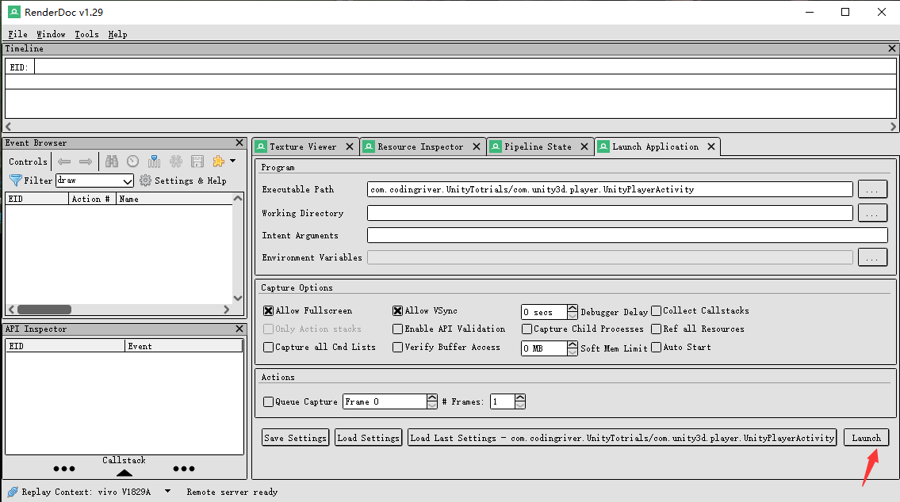
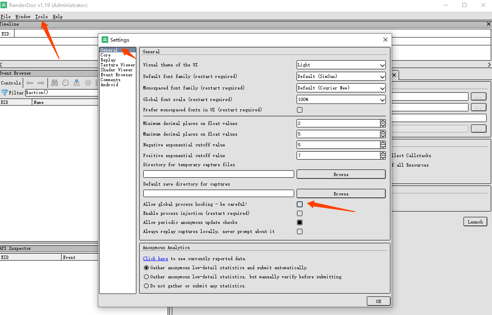
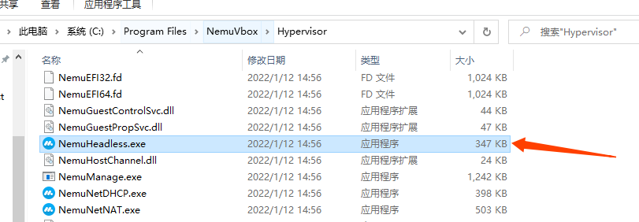
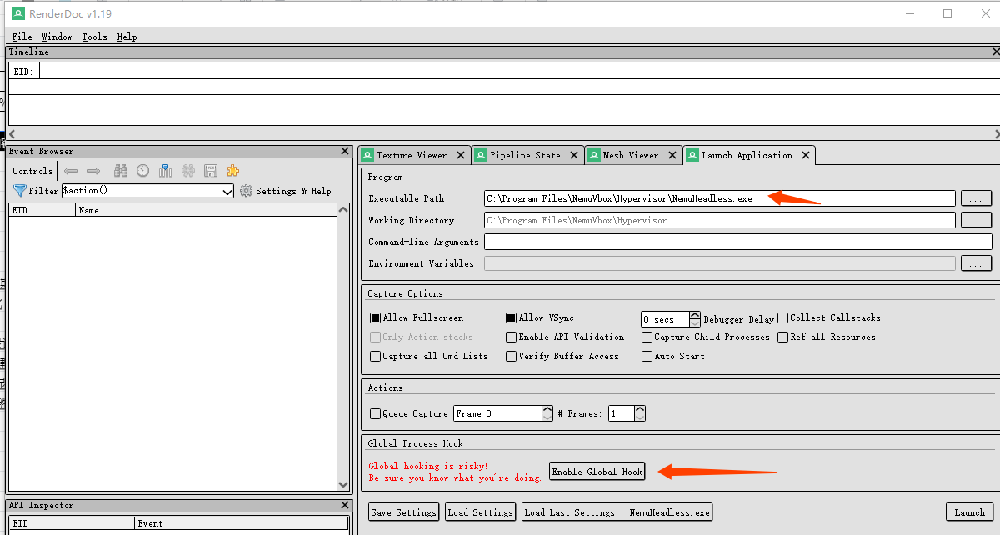
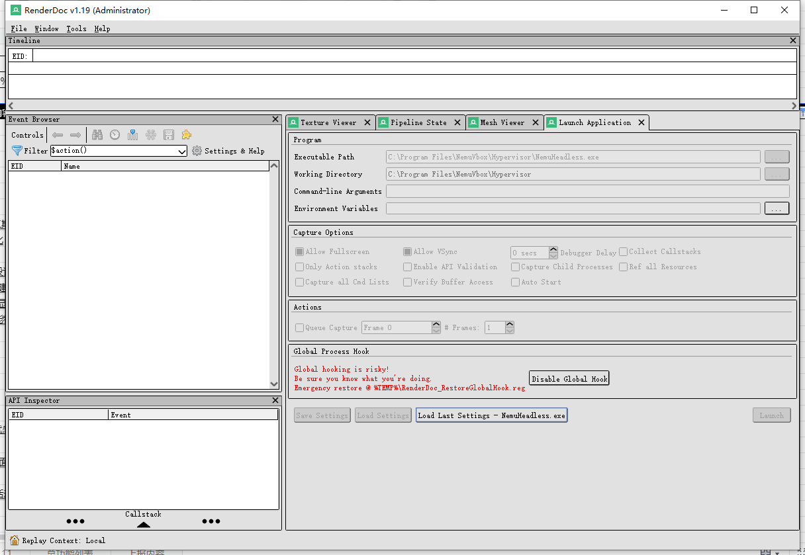
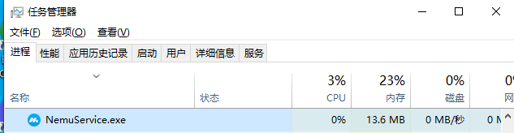
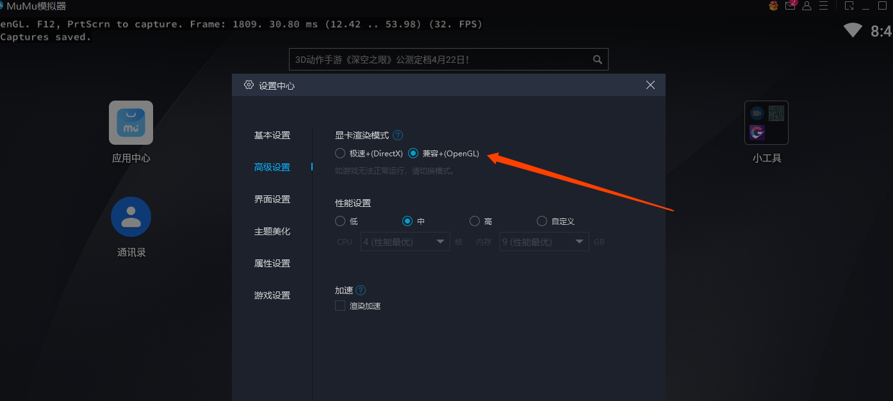
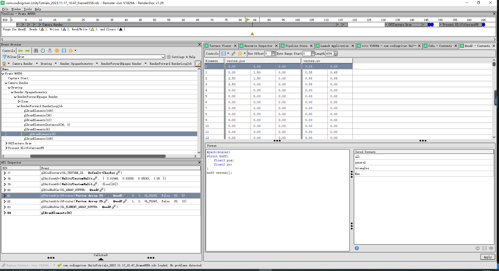
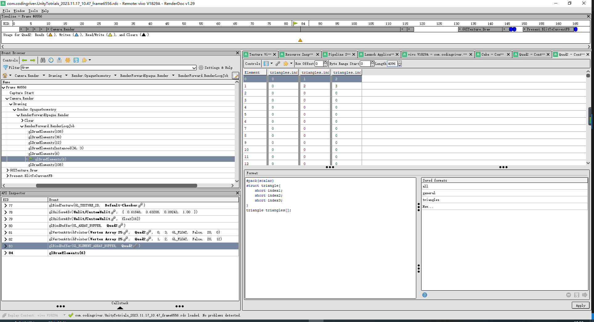

# RenderDoc-调试

> [插件大全](https://gamedevplugins.com/)
> [Editor Console Pro](https://assetstore.unity.com/packages/tools/utilities/editor-console-pro-11889?aid=1101l4bPZ&utm_source=aff)
> 

# RenderDoc 调试
## RenderDoc Android真机调试
> 连接手机时需要在手机上安装apk，然后开启所有请求的权限

- `开发者选项`--> `USB安装` 开启
- `开发者选项`--> `USB调试(安全设置)` 开启
- `开发者选项`--> `通过USB验证应用` 关闭
- `开发者选项`--> `启动GPU调试层` 开启
  
*使用小米手机测试 ( `RedMi K30 Ultra` )*  

  
  

  
  




## RenderDoc 调试MuMU模拟器

> 参考 [用RenderDoc和安卓模拟器抓帧手游](https://blog.kangkang.org/index.php/archives/504/comment-page-1)

- Windows 环境变量 `RENDERDOC_HOOK_EGL = 0` 。 (这个是为了防止 RenderDoc 把模拟器里面实现的 GLES API 给 Hook 了的同时还 Hook 了 DirectX 造成冲突)
- 在 `RenderDoc Tools->Settings->General` 里面找到 `Allow global process hooking` 并勾选

- 找到模拟器的核心文件，一般是一个叫 `XXXHeadLess.exe` 的文件(也可能是其他的。找到的方法很简单，模拟器里面随便运行一个手游，然后任务管理器里面按照 CPU 使用排序，排在最前面的就是，右键点击之，选择打开文件所在位置。就可以找到核心文件的位置)。  
*我的路径`C:\Program Files\NemuVbox\Hypervisor`*

- 在 RenderDoc 的 Launch Application 页面里面。Executable Path 选择刚才找到的模拟器核心。然后在下面 `Global Process Hook` 里面点 `Enable Global Hook`，如果提示需要 Administrator 启动就确定以后再点 `Enable Global Hook` 按钮。
    
操作完后：  
  

- 退掉所有模拟器，（注意一定要退干净，有时候模拟器界面关掉了，核心还在后台运行。可以在任务管理器里面查看模拟器的核心是否还在运行，还在运行的话用任务管理器杀掉）然后重新启动模拟器，这时候应该能看到模拟器画面左上角已经显示 RenderDoc 的信息了，如果没有，请检查前面操作是否正确，没有RenderDoc的显示信息说明完全没有加载成功。
  
*上面操作后打不开模拟器则关闭hook启动模拟器修改设置，然后关闭模拟器，打开hook再重新打开模拟器试试*
  
  
- RenderDoc File 菜单 Attach to Running Instance , 在 localhost 下面可以看到模拟器核心程序，选中并点击 Connect to app ，之后就正常抓帧即可。


[^1]:# IOS 调试
[^1]:> [iOS调试和性能优化技巧](https://hello-david.github.io/archives/4569df37.html)

[^1]:## unity Timer插件
[^1]:[github工程](https://github.com/codingriver/UnityProjectTest/tree/master/Timer)


## RenderDoc 查看buffer的数据
>#pack(scalar) 这个标记是struct在内存的对齐方式，这个是松散的结构，不使用对齐；
>如果不使用pack进行对齐说明，RenderDoc默认会用严谨的内存对齐方式，查看数据会有错误
>pack(push, 1) 告诉编译器使用1字节对齐，这意味着结构体中的字段将会紧密排列，没有填充。你可能会使用`#pragma pack(push, 1)`和`#pragma pack(pop)`来确保结构体中的数据紧密排列，没有任何填充。


- 查看Cube的Vertex Buffer数据

```
#pack(scalar)
struct buff{
	float3 pos;
	float3 normal;
	float4 tangent;
	float2 uv;
	float2 uv1;
}
buff vertex[];
```


**这里实际使用的只有pos和uv，其他数据是冗余的，没用使用**

- 查看Quad2的Vertex Buffer数据

```
#pack(scalar)
struct buff{
	float3 pos;
	float2 uv;
}
buff vertex[];
```
```
#pack(scalar) // vertex buffers can be tightly packed

[[size(16)]]
struct vbuffer {
  float3 in_POSITION0;
}

vbuffer vertex[];
```



- 查看Quad2的Index Buffer数据

*点击右上角的View Contents*
```
#pack(scalar)
struct triangle{
	short index1;
	short index2;
	short index3;
}
triangle triangles[];
```
