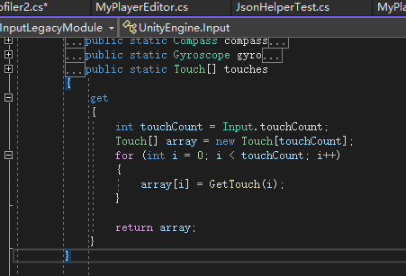
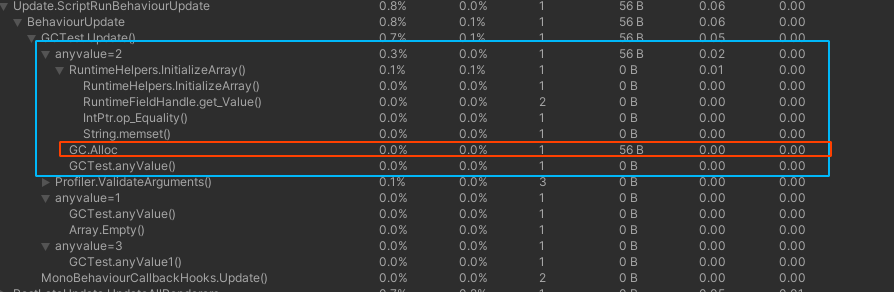

# unity性能优化总结

- [ ]  接口interface 继承测试，使用struct或者class继承interface，struct是否会出现装箱问题

### 基本优化

- 控制帧率，在非操作和没有特效播放时可以降低帧率（有效控制部分发热）
- 降低分辨率
- 缓存池的应用（资源缓存和class对象缓存），使用引用计数，定期调用 UnloadUnusedAssets
- 原生层和热更层互相调用应该减少在update中每一帧调用


### 一、内存的优化：
>Unity中的内存种类
>实际上Unity游戏使用的内存一共有三种：程序代码、托管堆（Managed Heap）以及本机堆（Native Heap）。 

#### 优化程序代码的内存占用
- API兼容性级别选择.net2.0子集（不需要Unity将全部.NET的Api包含进去）
- 剥离级别选择剥离字符集（示从build的库中剥离的力度，每一个剥离选项都将从打包好的库中去掉一部分）
 
#### 托管堆优化
> 参照程序代码优化
 
#### 本机堆的优化

**纹理**
- 使用png格式
- 关闭纹理资源的read/write功能（增加1倍） ui不适用mipmap（增加1/3）
- 非二次幂的纹理（不压缩 ，ui图集，可以是非正方形）
- Ui的背景可以适当选用1024
- Android平台贴图压缩用etc2 8bit，占用原来的1/4内存（etc 8bit注意下）
- Ios平台贴图压缩用astc 4x4 block(也可用astc6x6) 占用原来的1/4内存（不要求正方形也不要求2的幂次方，建议2的幂次方）（全部opengl es 3.1支持astc ios和android）（ 如果是pvrtc 则还得必须是正方形 1/8）,法线需要更高的精度，要避免压缩纹理导致的失真。
- 压缩贴图的话贴图本身必须是二次幂的
- 光照贴图和shadowmask图的压缩纹理选项。ios下可以统一使用astc6x6。android下shadowmask图使用rgb16，否则阴影会有明显的模糊或者锯齿。lightmap图倒是没有太大限制，尽量使用压缩纹理即可。

**音频**
- 背景音乐使用压缩的ogg或者mp3，像攻击音效等使用wav
- 背景音乐等长的音频使用在内存中压缩(Compressed in memory，Streaming)的加载类型
- 攻击音效等短的音频使用加载时解压(Decompress on load)的加载类型
- 加载时解压是在内存中压缩的10倍内存  

**网格**
- 模型资源不要开启read/write  使用 Mesh Compression 压缩网格（在个别特殊情况，mesh压缩和动画压缩后可能出现动画抖动的情况，这个时候不能压缩了）
- 不要使用自带的球体网格，面数太多

**动画（animator）**
-  动画压缩
-  一个角色有多个动画的情况下，单独导出一份角色的骨骼，角色导出的多个动画不用带骨骼


**其他**
- 导出的配置的格式是数组结构，不是key value结构。通过给每个条目设置metatable，业务层同样可以用key来访问对应的数据。这样可以节省一半以上的内存。
- 将配置存为二进制文件，文本文件占用空间大
- 注意Shader变体的数量，Shader Lab内存；
- 游戏中大量的数据导出配置尽量使用untiy内置的Asset管理，效率很高
### 二、CPU的方面的优化： 
>Drawcall：  
>Drawcall是啥？其实就是对底层图形程序（比如：OpenGL ES)接口的调用，以在屏幕上画出东西。

#### DrawCall如何优化：
- 使用Draw Call Batching，也就是描绘调用批处理。Unity在运行时可以将一些物体进行合并，从而用一个描绘调用来渲染他们。
  - 静态批处理Static Batching，只要是静态不动的物体且具有相同材质的话就可以使用静态批处理来降低描绘调用（注：shader不同则会增加纹理的拼合降低渲染效率）
    > 要勾选StaticBatch，但是不能滥用。有color、uv3的，顶点超过4000个以上的，数量超多，但是同屏显示不多的模型。这些都不应该勾选StaticBatch。否则会导致包体积明显增大。因为StaticBatch会把模型都build到场景的ab包内。
  - 动态批处理Dynamic Batching：动态批处理是引擎自动进行，无需设置，当物体共享相同的材质，则引擎就会自动对Drawcall进行优化，也就是动态批处理（如实例化预制件）。动态批处理存在约束，稍有不慎就会增加Drawcall
    >动态批处理的约束：  
    >1、批处理动态物体需要在每个顶点上进行一定的开销，所以动态批处理仅支持小于900顶点的网格物体。  
    >2、如果你的着色器使用顶点位置，法线和UV值三种属性，那么你只能批处理300顶点以下的物体；如果你的着色器需要使用顶点位置，法线，UV0，UV1和切向量，那你只能批处理180顶点以下的物体。  
    >3、不要使用缩放。分别拥有缩放大小(1,1,1) 和(2,2,2)的两个物体将不会进行批处理。  
    >4、统一缩放的物体不会与非统一缩放的物体进行批处理。  
    >5、使用缩放尺度(1,1,1) 和 (1,2,1)的两个物体将不会进行批处理，但是使用缩放尺度(1,2,1) 和(1,3,1)的两个物体将可以进行批处理。  
    >6、使用不同材质的实例化物体（instance）将会导致批处理失败。  
    >7、拥有lightmap的物体含有额外（隐藏）的材质属性，比如：lightmap的偏移和缩放系数等。所以，拥有lightmap的物体将不会进行批处理（除非他们指向lightmap的同一部分）。  
    >8、多通道的shader会妨碍批处理操作。比如，几乎unity中所有的着色器在前向渲染中都支持多个光源，并为它们有效地开辟多个通道。  
    >9、预设体的实例会自动地使用相同的网格模型和材质。  
    >所以尽量使用静态批处理。


- 打包图集
- 使用共享材质
- 保持材质的数目尽可能少，更大程度的批处理
- 使用光照贴图(lightmap)而非实时灯光
- 使用LOD，好处就是对那些离得远，看不清的物体的细节可以忽略。
- 遮挡剔除（Occlusion culling）
- 利用网格的顶点数据（两个模型用了同一个材质为了不同但是之前用的两个材质多少有点不同，例如两棵树的颜色不同）
- 尽量少的使用反光啦，阴影啦之类的，因为那会使物体多次渲染
- 脚本动态合并mesh
- 尽量使用GPU Instanc
- URP使用SRPBatcher
#### 物理组件：
- 1）设置较大的Fixed timestep，减少物理计算次数，提高游戏性能。
- 2）设置fps在60帧左右（Application.targetFrameRate = 60;），关闭垂直同步 ，设置帧率及使用相关帧率优化方案，在玩家不操作时降低帧率，操作时恢复帧率
- 优点：1.省电，减少手机发热的情况；2.能都稳定游戏FPS，减少出现卡顿的情况。
- 3）尽量不用MeshCollider
- 4）粒子组件，屏幕上最大粒子数量建议小于200个，粒子应尽可能的小，关闭粒子的碰撞功能。
- 5）真实物理（刚体）很消耗，不要轻易使用，尽量使用自己的代码模拟
- 6）对于投射物不要使用真实物理碰撞和刚体，自己模拟

### 三、GPU的优化
#### 顶点优化（减少顶点数量）
1. 优化几何体
2. 使用模型lod（Level of Detail）技术（unity中使用LOD Group组件）
3. 使用遮挡剔除（Occlusion Culling）技术
4. 使用mesh压缩

#### 片元优化（减少片元数量）（减少overdraw，overdraw指的就是一个像素被绘制了多次。透明物体）
1. overdraw的视图
2. 控制绘制顺序
    >2.1 在Unity中，那些Shader中被设置为“Geometry” 队列的对象总是从前往后绘制的，而其他固定队列（如“Transparent”“Overla”等）的物体，则都是从后往前绘制的。这意味这，我们可以尽量把物体的队列设置为“Geometry” 。而且，我们还可以充分利用Unity的队列来控制绘制顺序。例如，对于天空盒子来说，它几乎覆盖了所有的像素，而且我们知道它永远会在所有物体的后面，因此它的队列可以设置为“Geometry+1”。这样，就可以保证不会因为它而造成overdraws。
3. 时刻警惕透明物体
    >3.1 因此，如果场景中大面积的透明对象，或者有很多层覆盖的多层透明对象（即便它们每个的面积可以都不大），或者是透明的粒子效果，在移动设备上也会造成大量的overdraws。这是应该尽量避免的
4. 减少实时光照和阴影
    > 4.1 实时光照对于移动平台是个非常昂贵的操作。如果只有一个平行光还好，但如果场景中包含了太多光源并且使用了很多多Passes的shader，那么很有可能会造成性能下降。而且在有些机器上，还要面临shader失效的风险。例如，一个场景里如果包含了三个逐像素的点光源，而且使用了逐像素的shader，那么很有可能将Draw Calls提高了三倍，同时也会增加overdraws。这是因为，对于逐像素的光源来说，被这些光源照亮的物体要被再渲染一次。更糟糕的是，无论是动态批处理还是动态批处理（其实文档中只提到了对动态批处理的影响，但不知道为什么实验结果对静态批处理也没有用），对于这种逐像素的pass都无法进行批处理，也就是说，它们会中断批处理。
    > 4.2 使用Lightmaps和light probe（光照探针）
5. 减少使用法线贴图（或者在角色身上使用），静态物体尽量不要用，而是将法线渲染到贴图上
6. 尽量不使用fog雾效，或者使用简单的后处理雾效或者渐变的面片（参考shadow gun）    
7. 尽量减少alpha test的使用
#### 减少计算复杂度
1. 使用Shader的LOD技术
   1. 设置Shader.maximumLDO或者Shader.globalMaximumLOD来允许最大的LOD
2. Shader代码优化
   1. 把高斯模糊和边缘计算计算放到顶点shader中
   2. float存储顶点坐标等变量，half存储一些标量和纹理坐标等信息，fixed适用于大多数颜色变量和归一化的方向矢量
   3. 减少pow，sin，cos等函数使用
   4. 后处理时，降低分辨率采样
#### 其他优化

- 使用Mobile版本的shader。比如Particle/Additive中有ColorMask，这个在移动平台比较耗。
- 避免使用昂贵的数学函数。比如 pow exp log cos sin tan 等
- 尽可能减少纹理采样数目。 比如roughness和metal贴图合并成一张贴图
- 如果有一些计算比较复杂，可以使用查找纹理（lut）
- 优先使用低精度的数字格式。优先使用half。在现代gpu上fixed等同于half。 部分对精度有特殊需求的情况下才使用float。个别情况下，尤其是与法线相关的时候，使用half容易因为精度不足导致渲染结果错误，这个时候还是应该使用float。


### 优化内存带宽：
- 1	减少纹理大小（压缩纹理，使用mipmap，mipmap图片渲染的质量比压缩要好））
- 2	使用mipmap。
    >Mipmap中每一个层级的小图都是主图的一个特定比例的缩小细节的复制品。因为存了主图和它的那些缩小的复制品，所以内存占用会比之前大。但是为何又优化了显存带宽呢？因为可以根据实际情况，选择适合的小图来渲染。所以，虽然会消耗一些内存，但是为了图片渲染的质量（比压缩要好），这种方式也是推荐的。
- 3 纹理压缩（ETC2 8bit，ASTC 4x4 block，PVRTC）
- 4 降低分辨率尤其是在android平台上，有效缓解GPU压力（实际分辨率*0.85左右）,`Screen.SetResolution`
- 5 关闭图片ReadWrite
- 6 尽量提高GPU缓存命中率

### UI优化
> 主要思想：**动静分离；降低drawcall**

- fillcenter
- 动静网格分离（通过增加canvas）
- 修改image的color会造成canvas.rebuildbatch  如果是颜色动画可以但是单独创建一个material 直接修改color，不会rebuild（动静网格分离）
- EventSystem.Update（）消耗大  ，raycasttarget 关掉，分离canvas，需要的挂上GraphicRaycaster
- 图片如果是左右对称和上下对称可以使用mirrorImage类似的自定义Image组件，使用原始Sprite图片的四分之或者二分之一即可
- 图集尽量根据业务去划分
- 玩家头顶血条的HUD要使用3D的，而不是UGUI。否则同屏玩家数量很多的时候Mesh合并开销很大（大概率没帧刷新）。

- UI上使用TextMeshPro。可以很大程度上缓解UI打开卡顿的问题。描边、阴影开销很低（如果是多语言支持的话可能比较麻烦，需要提前将字体库制作成TextMeshPro内置的库，不便通用）。
- 使用TextMeshPro。减少GC，减少字体生成的开销。字体放大缩小依然保持锐利清晰。
- 写一个UICollider而不是透明的Image，可以减少overdraw
- 小地图用shader实现指定位置的图片渲染，而不是RectMask2D，可以减少overdraw。因为RectMask2D是使用alpha=0来实现裁剪的。
- 血条的减少动画之前是Image和DOTween来实现的。后面修改为shader实现。(坐标计算)
- 战斗飘字，原先是DOTween来实现的，后面修改为直接在Update里面计算坐标。目的是减少DOTween动画初始化的GC开销。自己实现简化版的动画，性能也更好一些；终极优化是在shader中实现且飘字使用GPU Instance（自动计算mesh且调用`DrawMesh`接口绘制）。
- 使用SimpleAnimationComponent 来做UI动画，而不直接使用Animator。因为Animator在动画播放完毕之后，依然会Update。这会导致两个问题，一个是性能隐患，另外一个是被动画控制的控件无法再通过代码设置位置。在动画播放完毕之后再禁用动画组件，实现起来比较复杂。相比而言，直接使用SimpleAnimationComponent就要简单干净很多，也更加高效。
- 禁用不必要的raycastTarget。
- 实现一个UICircleImage来替代用Mask实现的圆形遮罩裁剪。一般64个点就可以形成圆形。外部再罩一个边框图，就可以消除边缘锯齿。


### 程序代码优化
- 删除空的脚本和不需要的默认方法（例如Update，Start）
- 避免使用OnGUI
- 同一脚本中频繁使用的变量建议声明全局变量
- 数组，集合类元素优先使用Array，其次是Queue/Stack,再次是List
- 合理的设置容器的初始化Capacity
- 应尽量为类或函数声明为sealed，变虚函数为直接函数调用
- 尽量减少闭包的使用
- 减少装箱和拆箱操作
- 减少Dictionary冗余操作
- 脚本在不使用时禁用，使用时启用
- 应减少不必要的Transform.position/rotation等访问
- 减少除法运算，例如a/5f,可以写成a*0.2f；
- 尽量直接声明脚本变量，而不是用Getcomponent来获取脚本组件
- 使用各种类的对象池和物体实例化池
- 减少使用sin，cos，pow等三角函数，如果使用量大则建议使用查表法来优化三角函数的计算量
- 尽量不要在Update中做复杂的计算，如果有需要在隔几帧计算一次
- 不要动态的生产字符串，例如使用Debug.Log（“a”+“b”），尽量预先创建好字符串资源，还有一个打印变量时不要用+号去链接也不要用$符去格式化，而是用Debug.logFormat去输出，这样关闭Debug时就能关闭和Debug输出相关的动态字符串
- 应使用支持[Conditional("DEBUG")]的日志输出机制，支持log关闭
- 不要直接访问gameobject的tag属性(可以用if (go.CompareTag (“human”))， 因为访问物体的tag属性会在堆上额外的分配空间)
- String拼接时尽量使用System.Text.StringBuilder代替
- 避免频繁调用GameObject.SetActive
- 减少material频繁的set参数，如果量大，则使用字符串key获取唯一id
- 使用同一的CoroutineManager而不是直接用MonoBehaviour的StartCoroutine，可以提高性能。
- 在每帧执行的代码中，尽可能避免闭包。减少匿名方法。这些可能会产生GCAlloc
- 避免使用枚举作为字典的key。会有装箱操作。原因是enum为值类型，Dictionary实现会调用Object.getHashCode获取key的哈希代码，这里期望的是引用类型。（可以考虑强制转换为int即可。或者实现一个 IEqualityComparer。）
- 慎用 mesh.vertices 等接口。它每次调用都会生成一个新的内存副本。同理 Input.touches类似。
- foreach与for相比还是有性能差距。所以在调用不频繁的地方，可以使用foreach以提高可读性。频繁调用的地方还是推荐直接用for进行遍历。
- C#的string是不可变的，任何SubSting等操作都会产生新的副本。
- 按ID寻址属性。比如 Animator、Shader都有对应的接口。Animator.StringToHash。Shader.PropertyToID。
- 使用非分配物理API。替换Physics.RaycastAll为Physics.RaycastNonAlloc等,当然能不用Raycast最好（例如地面时平的想知道点击屏幕位置对应的地面位置，则可以通过线与面相交计算出位置）。
- 尽可能减少 Camera.,main 的调用。它内部会调用 Object.FindObjectWithTag。在Start中进行缓存。
- 不要用 type[x, y] 这样的多维数组。性能很低。
- 合理使用C#的委托。每次添加或者删除回调的时候，C#的委托都会执行回调列表的完整拷贝。所以不要在Update中进行委托的添加或者删除回调的操作。如果有频繁添加的需求，可以考虑使用List维护回调数组而不是委托。
- 手工编码的 String.StartsWithFast 会比内置方法快 10~100倍。
- Vector3.zero 会返回一个新的Vector3对象。虽然因为其是值类型，远比引用类型性能要高。但是频繁调用的地方还是应该维护一个const的对象用来进行比对或者赋值。
- 更新材质属性的时候，使用MaterialPropertyBlock。性能更好。且可以避免实例化一份新的材质对象。而且GPU Instance支持使用MaterialPropertyBlock
- AlphaBlend会比AlphaTest性能要好一些。因为移动平台的GPU会有EarlyZ的优化，而AlphaTest会使EarlyZ无效。
- 使用SimpleAnimationComponent来替代Unity的Animator来做UI动画。主要是Animator会一直更新，即便动画已经播放完毕了。这个一方面会有性能问题，另外一方面被动画驱动的控件无法再通过脚本移动。

### 资源规范：

- 建筑升级的资源是拼接的（节省内存）
- 模型角色高模 6000+面，低模 3000面。顶点数不定，因为顶点存在共用的情况，所以顶点数量可能是面数的两倍，也可能比面数低。纹理使用1024大小的贴图。低模纹理大小减半。主角因为有高低模，所以不开mipmap。个别精度比较高的npc（有UI显示需求）需要开mipmap，否则场景中会有明显的闪烁。
- 不使用大的prefab 增加io的负担（多棵草做一个prefab）
- 每个模型只使用一个skinned mesh renderer
- 每个mesh不要超过2个material
- 骨骼数量不要超过30
- 场景的面数在100k~300k之间都是合理的数值（手游一般是100k同屏）。
### 打包和资源加载


```
    BuildPipeline.BuildPlayer(BuildConfig.scenes, outputPath, target, buildOptions);
    BuildPipeline.BuildAssetBundles(rABPath, rOptions, (BuildTarget)CurBuildPlatform);  (BuildAssetBundleOptions.DeterministicAssetBundle | BuildAssetBundleOptions. ChunkBasedCompression)
    UnityEditor.U2D.SpriteAtlasUtility.PackAllAtlases(EditorUserBuildSettings.  activeBuildTarget); 
```
- 打包使用LZ4格式压缩，压缩比1:3;LZMA 压缩比1:4。

### 模型方面
01. 合并使用同贴图的材质球，合并使用相同材质球的Mesh； 　　
02. 角色的贴图和材质球只要一个，若必须多个则将模型离分离为多个部分； 　　
02. 骨骼系统不要使用太多，骨骼数量不要超过30； 　　
03. 当使用多角色时，将动画单独分离出来；如果角色有多个动画，则将骨骼分离出来，导出动画不要带骨骼； 　　
04. 使用层距离来控制模型的显示距离； 　　
05. 阴影其实包含两方面阴暗和影子，建议使用实时影子时把阴暗效果烘焙出来，不要使用灯光来调节光线阴暗。 　　
06. 少用像素灯和使用像素灯的Shader； 　　
08. 如果硬阴影可以解决问题就不要用软阴影，并且使用不影响效果的低分辨率阴影； 　　
08. 实时阴影很耗性能，尽量减小产生阴影的距离； 　　
09. 允许的话在大场景中使用线性雾，这样可以使远距离对象或阴影不易察觉，因此可以通过减小相机和阴影距离来提高性能； 　　
10. 使用圆滑组来尽量减少模型的面数； 　　
11. 项目中如果没有灯光或对象在移动那么就不要使用实时灯光； 　　
12. 水面、镜子等实时反射/折射的效果单独放在Water图层中，并且根据其实时反射/折射的范围来调整； 　　
13. 碰撞对效率的影响很小，但碰撞还是建议使用Box、Sphere碰撞体； 　　
14. 建材质球时尽量考虑使用Substance； 　　
15. 尽量将所有的实时反射/折射（如水面、镜子、地板等等）都集合成一个面； 　　
16. 假反射/折射没有必要使用过大分辨率，一般64*64就可以，不建议超过256*256； 　　
17. 需要更改的材质球，建议实例化一个，而不是使用公共的材质球； 　　
18. 将不须射线或碰撞事件的对象置于IgnoreRaycast图层； 　　
19. 将水面或类似效果置于Water图层 　　
20. 将透明通道的对象置于TransparentFX图层； 　　
21. 养成良好的标签（Tags）、层次（Hieratchy）和图层（Layer）的条理化习惯，将不同的对象置于不同的标签或图层，三者有效的结合将很方便的按名称、类别和属性来查找； 　　
22. 通过Stats和Profile查看对效率影响最大的方面或对象，或者使用禁用部分模型的方式查看问题到底在哪儿； 　　
23. 使用遮挡剔除（Occlusion Culling）处理大场景，一种较原生的类LOD技术，并且能够“分割”作为整体的一个模型。

### Unity优化工具
- MAT（Memory Analyzer Tool） 需要导入HPROF文件再分析 只能查看java层的内存情况，看不到native堆的详情
- Xcode Instrument工具 只能用于Mac,iOS 只能查看C++ 或 object C 的情况，看不到mono堆的详情
- Unity自带Profiler 需要单独编译develop版本 在PC上执行，没法捕获真机数据 内存数据跟实际真机的数据差异很大、多的时候有几十M差距 只能看到最近一段时间的数据，看不到总体的详情（Unity的Profiler不会跟踪主线程之外的GCAlloc分配。如果在子线程需要进行分析，可以考虑把子线程切换的主线程进行调试，或者使用功能BeginThreadProfiling API）。
- 官方开源Memory Profiler （使用IL2CPP，构建时开启Development Build）
- UWA
- WeTest PerfDog 性能狗
- RenderDoc
- Snapdragon Profiler  骁龙分析工具
> [Snapdragon Profiler工具简介](https://blog.csdn.net/weixin_38498942/article/details/89333185)  
> [Download Snapdragon Profiler](https://developer.qualcomm.com/software/snapdragon-profiler)  
> [snapdragon和renderdoc](https://zhuanlan.zhihu.com/p/452220699)
- Intel GPA
> [Download Intel GPA](https://www.intel.cn/content/www/cn/zh/developer/tools/graphics-performance-analyzers/overview.html)  
> [使用Intel GPA在PC上分析Android游戏的渲染流程](https://zhuanlan.zhihu.com/p/68741433)
- Miku-LuaProfiler

> 端游游戏，考虑使用的工具有NSight，Intel GPA，RenderDoc
>
>手机真机分析可以根据不同厂商的GPU SDK选择对应的软件。比如高通骁龙手机可以选用SnapDragon Debugger，Mali手机可以选用Mali.Graphic Debugger，NVIDA Tegra的手机可以选用Tegra Debugger等等。如果都没有，那么RenderDoc.


> - 加载类型(Load Type)： 运行时Unity加载音频的方法。
>    - 加载时解压缩(Decompress on load): 加载后解压缩声音。使用于较小的压缩声音，以避免运行时解压缩的性能开销。(将使用比在它们在内存中压缩的多10倍或更多内存，因此大文件不要使用这个。)
>    - 在内存中压缩(Compressed in memory): 保持声音在内存中（压缩的）在播放时解压缩。这有轻微的性能开销（尤其是OGG / Vorbis格式的压缩文件），因此大文件使用这个。
>    - 从磁盘流(Stream from disc): 直接从磁盘流读取音频数据。这只使用了原始声音占内存大小的很小一部分。使用这个用于很长的音乐。取决于硬件，一般建议1-2线程同时流。
> - Audio Source 优化
>   - Short Clips – Native
>   - Longer (or looping) clips – compressed in memory
>   - Music – Stream from disc
>   - Files which consistently cause CPU spikes – Decompress on load
> - Ui动画：帧动画、Animation、脚本动画


> 参考：  
> <https://zhuanlan.zhihu.com/p/157877557>  
> <https://docs.unity3d.com/Manual/OptimizingGraphicsPerformance.html>   
> <https://docs.unity3d.com/353/Documentation/Manual/iphone-Optimizing-Scripts.html>  


## 具体性能优化
<https://docs.unity3d.com/cn/2021.1/Manual/BestPracticeUnderstandingPerformanceInUnity.html>

*Unity版本：Unity2021.2.16f1c1*
### 默认新建对象操作的`Unity API`

使用`public static Touch GetTouch(int index)`


**这些属性在get的时候 Unity API会返回一个新的对象，每次调用都会返回新的对象，造成GC** 

### enum枚举作为Dictionary的键时，产生装箱
<https://docs.unity3d.com/cn/2021.1/Manual/BestPracticeUnderstandingPerformanceInUnity4-1.html>

### 闭包和匿名方法


### 集合和数组重用
使用 C# 的集合类或数组时，尽可能考虑重用或汇集已分配的集合或数组。集合类开放了一个 Clear 方法，该方法会消除集合内的值，但不会释放分配给集合的内存。

### 方便可变参数（params）
**可变参数的数组会有GC开销**
测试代码 
`GCTest.cs`

```csharp
    const string str1 = "anyvalue=1";
    const string str2 = "anyvalue=2";
    const string str3 = "anyvalue=3";
    // Update is called once per frame
    void Update()
    {
        UnityEngine.Profiling.Profiler.BeginSample(str1);
        anyValue();
        UnityEngine.Profiling.Profiler.EndSample();
        UnityEngine.Profiling.Profiler.BeginSample(str2);
        anyValue(1,1,2,3,4,5);
        UnityEngine.Profiling.Profiler.EndSample();

        UnityEngine.Profiling.Profiler.BeginSample(str3);
        anyValue1(1, 1, 2, 3, 4, 5);
        UnityEngine.Profiling.Profiler.EndSample();
    }
    void anyValue(params int[] arr){}
    void anyValue1(int a,int b,int c,int d,int e,int f){}    
```




