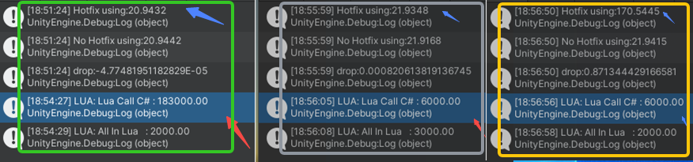

# xlua性能测试

> lua中`os.clock()`:  
> 解释：返回一个程序使用CPU时间的一个近似值。  
>引用：<https://www.jianshu.com/p/46e0d70746cc>

### xlua 常用说明
> 详细说明：<https://github.com/Tencent/xLua/blob/master/Assets/XLua/Doc/configure.md>

#### `XLua.LuaCallCSharp`
一个C#类型加了这个配置，xLua会生成这个类型的适配代码（包括构造该类型实例，访问其成员属性、方法，静态属性、方法），否则将会尝试用性能较低的反射方式来访问。

一个类型的扩展方法（Extension Methods）加了这配置，也会生成适配代码并追加到被扩展类型的成员方法上。

xLua只会生成加了该配置的类型，不会自动生成其父类的适配代码，当访问子类对象的父类方法，如果该父类加了LuaCallCSharp配置，则执行父类的适配代码，否则会尝试用反射来访问。

反射访问除了性能不佳之外，在il2cpp下还有可能因为代码剪裁而导致无法访问，后者可以通过下面介绍的ReflectionUse标签来避免。

#### `XLua.CSharpCallLua`
如果希望把一个lua函数适配到一个C# delegate（一类是C#侧各种回调：UI事件，delegate参数，比如List<T>:ForEach；另外一类场景是通过LuaTable的Get函数指明一个lua函数绑定到一个delegate）。或者把一个lua table适配到一个C# interface，该delegate或者interface需要加上该配置。


#### `XLua.DoNotGen`

指明一个类里头的部分函数、字段、属性不生成代码，通过反射访问。

只能标准Dictionary<Type, List>的field或者property。key指明的是生效的类，value是一个列表，配置的是不生成代码的函数、字段、属性的名字。

和ReflectionUse的区别是：1、ReflectionUse指明的是整个类；2、当第一次访问一个函数（字段、属性）时，ReflectionUse会把整个类都wrap，而DoNotGen只wrap该函数（字段、属性），换句话DoNotGen更lazy一些；

和BlackList的区别是：1、BlackList配了就不能用；2、BlackList能指明某重载函数，DoNotGen不能；
    



### xlua 性能测试
> 环境 `win` 平台的 `unity2020.3.21f1c1`,xlua版本`2.2.16`

性能测试结果（1+2加法运算执行1亿次的耗时，毫秒单位）
|案例|结果|
|-|-|
|CSharp 内调用|20.5071|
| lua 内调用 | 3000.00 |
| Hotfix 模式`Hotfix Inject In Editor`后 | 170.0945 |
| `xlua.hotfix()`修复后调用 | 9175.6273 |
|LuaCallCSharp 标记前调用| 184000.00 |
| LuaCallCSharp 标记后调用 |  6000.00 |

*Hotfix 模式下执行`Hotfix Inject In Editor`后 执行lua的`xlua.hotfix()`修复后调用*


性能测试代码
```csharp
using UnityEngine;
using XLua;
namespace LuaAnalysis
{
#region Calc Class
    

    
    /// <summary>
    /// 纯CSharp调用
    /// LuaCallCSharp 标记前调用
    /// </summary>
    public class Calc1
    {
        public static int Add(int a,int b)
        {
            return a+b;
        }
    }

    /// <summary>
    /// LuaCallCSharp 标记后调用
    /// </summary>
    [LuaCallCSharp]
    public class Calc
    {
        public static int Add(int a,int b)
        {
            return a+b;
        }
    }

    [Hotfix]
    public class HotfixCalc
    {
        public int Add(int a, int b)
        {
            return a - b;
        }
        /// <summary>
        /// Hotfix 标记后
        /// </summary>
        /// <param name="a"></param>
        /// <param name="b"></param>
        /// <returns></returns>
        public static int Add1(int a, int b)
        {
            return a - b;
        }        
        /// <summary>
        /// Hotfix 标记后,注入后且xlua.hotfix修复后执行lua代码
        /// </summary>
        /// <param name="a"></param>
        /// <param name="b"></param>
        /// <returns></returns>        
        public static int Add2(int a, int b)
        {
            return a - b;
        }                         
    }

    public class NoHotfixCalc
    {
        public int Add(int a, int b)
        {
            return a + b;
        }
    }
#endregion


    public class Analysis : MonoBehaviour
    {
    static string lua=@"
            
            local Add= function(a, b)
                return a + b
            end
            local count=100 * 1000 * 1000
            
            starttime = os.time()
            for i=1,count,1 do
                Add(2,1)
            end
            endtime=os.time()
            print(string.format('Lua内调用   : %.2f', (endtime - starttime)*1000))

            starttime = os.time()
            for i=1,count,1 do
                CS.LuaAnalysis.Calc1.Add(2,1)
            end
            endtime=os.time()
            print(string.format('LuaCallCSharp 标记前调用（反射访问） : %.2f', (endtime - starttime)*1000))            

            starttime = os.time()
            for i=1,count,1 do
                CS.LuaAnalysis.Calc.Add(2,1)
            end
            endtime=os.time()
            print(string.format('LuaCallCSharp 标记后调用（绑定访问） : %.2f', (endtime - starttime)*1000))                        

            xlua.hotfix(CS.LuaAnalysis.HotfixCalc, 'Add2', function(a,b)
                return a+b
            end)     
            
        ";

        // Start is called before the first frame update
        void Start()
        {
            LuaEnv luaenv = new LuaEnv();   
            HotfixCalc calc = new HotfixCalc();
            int CALL_TIME = 100 * 1000 * 1000;
            System.DateTime start;
            double d=0;

            luaenv.DoString(lua); 

            start = System.DateTime.Now;
            for (int i = 0; i < CALL_TIME; i++)
            {
                Calc1.Add(2, 1);
            }
            d = (System.DateTime.Now - start).TotalMilliseconds;
            Debug.Log("CSharp 内调用(静态方法):" + d);  

            start= System.DateTime.Now;
            for (int i = 0; i < CALL_TIME; i++)
            {
                calc.Add(2, 1);
            }
            d = (System.DateTime.Now - start).TotalMilliseconds;
            Debug.Log("Hotfix 标记后(成员方法):" + d); 

            start= System.DateTime.Now;
            for (int i = 0; i < CALL_TIME; i++)
            {
                HotfixCalc.Add1(2, 1);
            }
            d = (System.DateTime.Now - start).TotalMilliseconds;
            Debug.Log("Hotfix 标记后(静态方法):" + d); 

                       

            start= System.DateTime.Now;
            for (int i = 0; i < CALL_TIME; i++)
            {
                HotfixCalc.Add2(2, 1);
            }
            d = (System.DateTime.Now - start).TotalMilliseconds;
            Debug.Log("Hotfix 标记后(静态方法) lua.hotfix修复后:" + d);    

            // start= System.DateTime.Now;
            // for (int i = 0; i < CALL_TIME; i++)
            // {
            //     HotfixCalc.Add3(2, 1);
            // }
            // d = (System.DateTime.Now - start).TotalMilliseconds;
            // Debug.Log("Hotfix 标记后(静态方法,CSharpCallLua) lua.hotfix修复后:" + d);                         


                
            
             
            luaenv.Dispose();
        }

    }
}

```

打印结果
```
LUA: Lua内调用   : 3000.00

LUA: LuaCallCSharp 标记前调用（反射访问） : 184000.00

LUA: LuaCallCSharp 标记后调用（绑定访问） : 6000.00

CSharp 内调用(静态方法):20.5071

Hotfix 标记后(成员方法):170.0945

Hotfix 标记后(静态方法):171.2534

Hotfix 标记后(静态方法) lua.hotfix修复后:9175.6273
```
