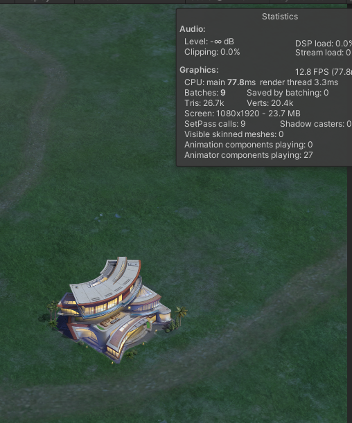
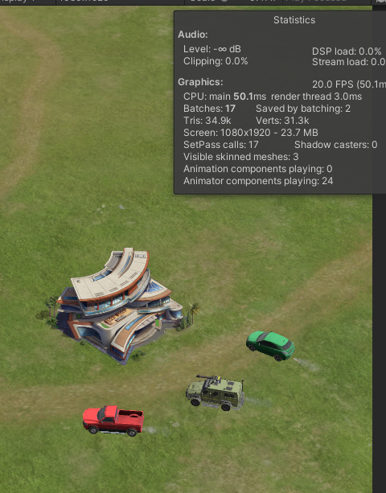
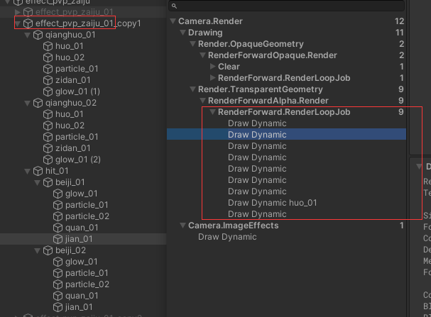
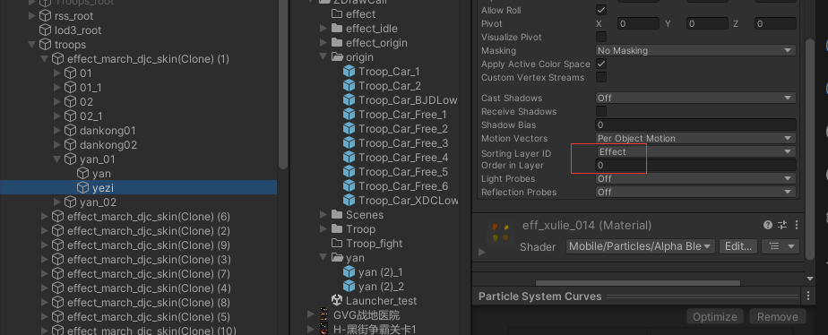
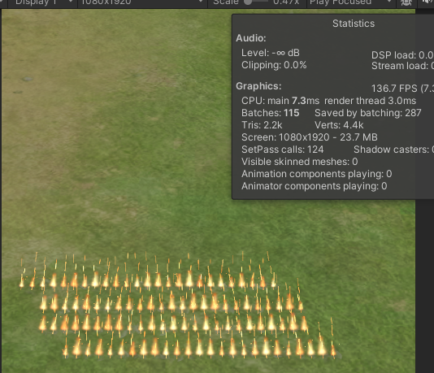
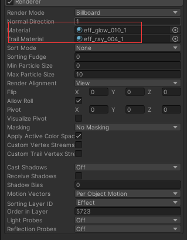

<!--more-->

## 世界部队普通攻击DrawCall分析

### 部队待机状态

*车本身占用一个drawcall；车的尾气特效`effect_march_car_yan_1.prefab`占用2个drawcall。*

> 
> 数据:
>* 空屏对照组 8 dw
>* 5只部队时 峰值是23 dw
>* 2只部队时 峰值是14 dw
>* 1只部队时 峰值是11 dw
>

*统计drawcall数据:*
- *5只部队时 峰值是15 dw （相同的车皮肤）*
- *4只部队时 峰值是6 dw （相同的车皮肤）*
- *3只部队时 峰值是3 dw （相同的车皮肤）*

根据上面数据分析得出多个尾气特效不能合批,**原因**: `Objects have different MaterialPropertyBlock set`。
>是因为下面的脚本设置了`MaterialPropertyBlock`参数，所以上面的测试是手动复制的，合批会有问题,游戏内的合批是其他原因
>
>
>优化后: 100个车外加100个特效，一共占用102个drawcall，特效合批后一共占用2
>
>

*不同车的特效`effect_march_djc_hao`和`effect_march_car_yan_1`，prefab内引用的材质球等信息都是相同的，唯一不同的是粒子组件`renderer`的`OrderInLyaer`的值，造成**渲染顺序不同，所以不能合批**。*

特效`effect_march_BJD_run_Bone_DP`使用了4个材质球都是粒子特效但是两个不同材质球的`sortingOrder`和`sortingLayer`的值相同，造成合批失败，需要分别设置根据渲染表现

**优化结论：**
- **虽然prefab不同，但是必须保证可以合批对象的sortingLayer和sortingOrder的值相同且唯一(不能合批的对象不能占用该值，否则会被打断)**
- **修改尾气特效，更简化，建议简化为一个drawcall**
- **普通车的尾气特效也不要显示，大量的车的尾气占用cpu开销**
- **普通车使用脚本`PlanarShadow`，但是普通车没有Shadow，需要去掉**

### 部队（车）战斗状态

>* 空屏对照组 19 dw
>* 5只部队时 峰值是44 dw 
>* 4只部队时 峰值是43 dw 
>* 3只部队时 峰值是42 dw 
>* 3只部队时 峰值是60 dw （三个不相同的车皮肤）

*ui全部隐藏的情况下，屏蔽技能特效*
- 5只部队时 峰值是25 dw （相同的车皮肤）
- 4只部队时 峰值是24 dw （相同的车皮肤）
- 3只部队时 峰值是23 dw （相同的车皮肤）
- 3只部队时 峰值是41 dw （三个不相同的车皮肤）

**结论：**
- **战斗中车的尾气特效不显示，战斗表现优先，节省这部分开销**

*红车和绿车的尾气drawcall合并了，军绿车占用两个drawcall（多了Pass_PlanarShadow）*

### 部队战斗特效独立分析
#### 普通车攻击特效
* `effect_pvp_zaiju_01` 占用drawcall 9个；100个时drawcall数量：9，400个时drawcall数量：9
*这个是通用攻击特效，所有免费车用的都是这个攻击特效*

#### 冲锋战神攻击特效
* `effect_march_djc_skin` 占用drawcall 13个；100个时drawcall数量：520

* `effect_march_djc_skin2` 占用drawcall 3个；100个时drawcall数量：115

#### 怪兽卡车攻击特效

`effect_march_djc_skin`,`effect_march_djc_skin`,`effect_march_djc_hao`分别一个一共3个占用drawcall 27，分别10个一共30个占用drawcall 102，随着数量增加drawcall会增长

#### 死亡公爵攻击特效 
`effect_march_BJD_idle_Bone_DP`,`effect_march_BJD_attack_ROOT`,`effect_march_BJD_attack_Bone_FYP_ROOT`分别一个一共3个占用drawcall 32，分别10个一共30个占用drawcall 190，随着数量增加drawcall会增长

`effect_march_BJD_attack_Bone_FYP_ROOT`带有拖尾特效需要注意

#### 地狱猎犬攻击特效(地狱猎犬皮肤车占用drawcall为2)
`effect_march_XDC_att`,`effect_march_XDC_yan_TAG_Spine_2`,`effect_march_XDC_yan_TAG_Spine_1`分别一个一共3个占用drawcall 25，分别10个一共30个占用drawcall 120，随着数量增加drawcall会增长

`effect_march_XDC_att`是三个里占用最严重的

#### 优化结果
- 普通车攻击特效：1个时drawcall数量：9，20个时drawcall数量：9
- 冲锋战神攻击特效：1个时drawcall数量：13，20个时drawcall数量：13
- 怪兽卡车攻击特效：1个时drawcall数量：19，20个时drawcall数量：19
- 死亡公爵攻击特效：1个时drawcall数量：31，20个时drawcall数量：31
    > `effect_march_BJD_attack_Bone_FYP_ROOT`这个特效美术改完后合批还是异常，随着数量增加drawcall明显增加，因为一个粒子上有两个材质球且RenderQueue都是3000（多了一个Trail Material），造成渲染排序混乱,解决方案是将这两个材质球的RenderQueue设置为不同值就可以了
    >
    >
    >
    > `effect_march_BJD_attack_ROOT`这个特效有两个在相同位置，可能是特效冗余了
- 地狱猎犬攻击特效：1个时drawcall数量：26，20个时drawcall数量：26
#### 总结

1. 移除车上无用的shadow组件PlanarShadow，CitySceneShadow，将冲锋战神Troop_Car_2的shader从IGG/Standard3改为IGG/Standard4（*Standard3会多一个阴影shadow的pass，世界上没有必要；PlanarShadow，CitySceneShadow两个组件是处理阴影的，浪费cpu开销，移除掉*），并且设置RenderQueue为2995

2. **相同材质的多个`Renderer`合批需保证`sortingOrder`相同且唯一（被其他`Renderer`占用会打断合批）。**
    >不同材质特效需分离sortingOrder（均用Effect层），每个材质独占唯一值（禁止复用，跨Prefab亦不可重复）。
3. 同一`Renderer`上的多个材质必须使用不同的`RenderQueue`，否则无法合批。
    >
4. 普通车的尾气特效也不要显示，大量的车的尾气占用cpu开销,且修改尾气特效，更简化，建议简化为一个drawcall

#### 面数说明

`Troop_Car_BJDLow` 死亡公爵的车占用5.9k面，加上攻击特效占用面数峰值为15.7k面数，太严重