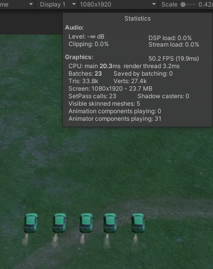
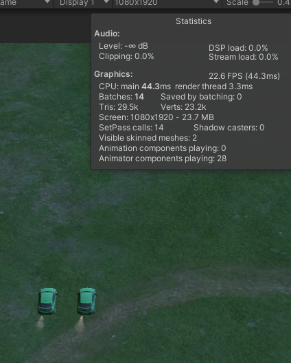
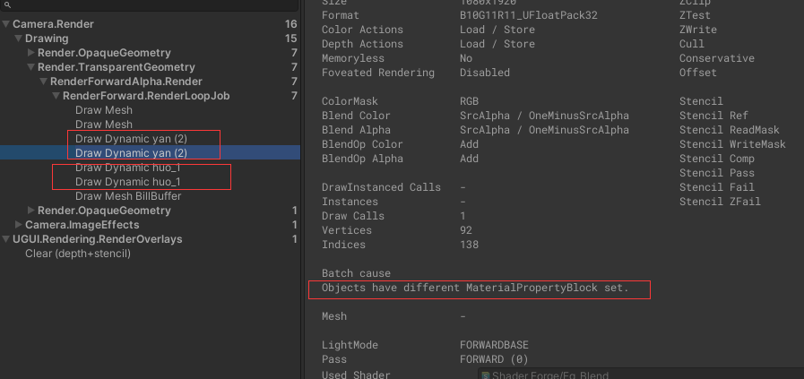
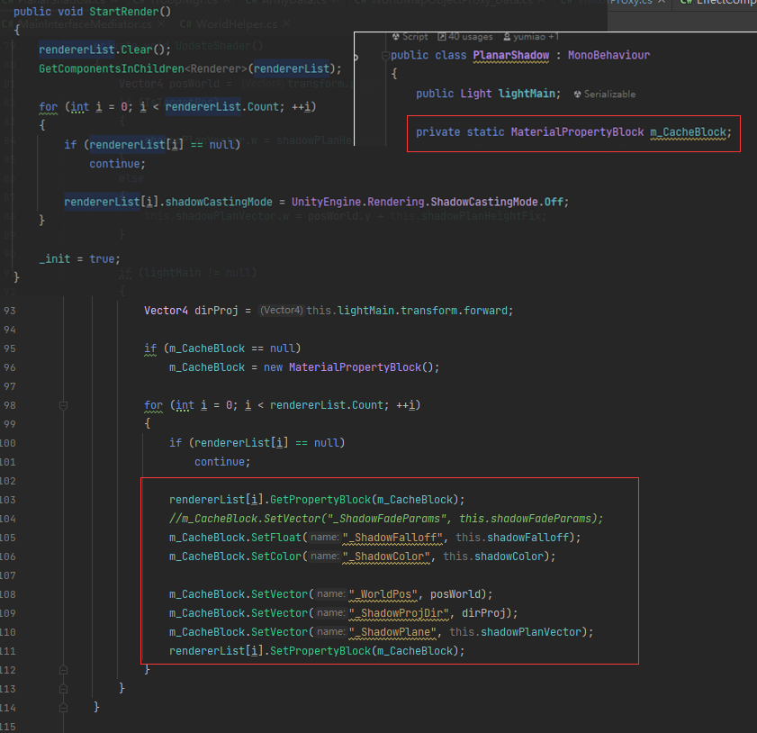
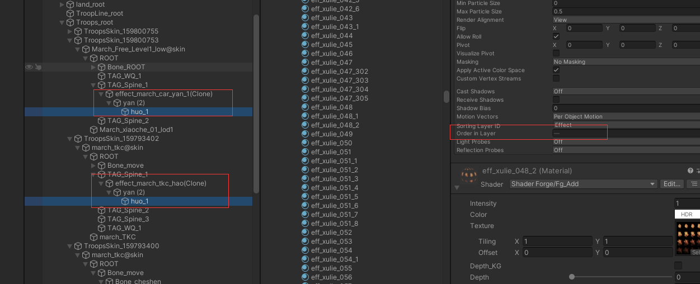
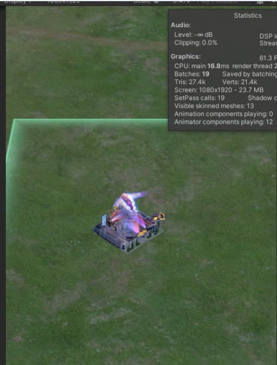
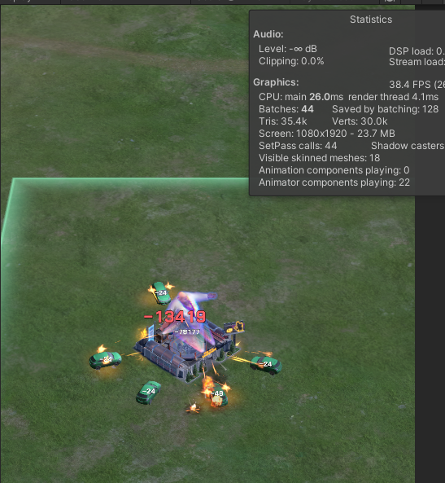
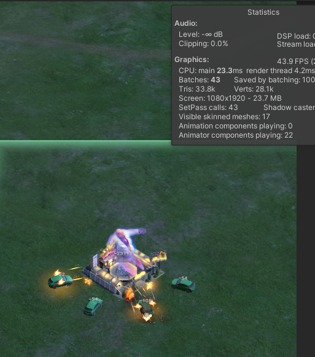
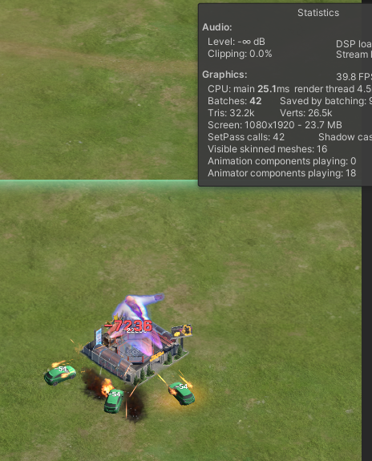
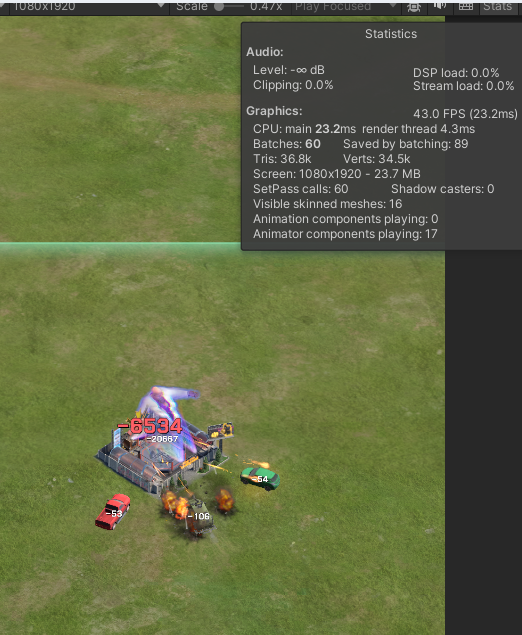

# 世界部队DrawCall分析和优化

## 世界部队普通攻击 DrawCall 分析

### 部队待机状态

车本身占用一个 drawcall；车的尾气特效 `effect_march_car_yan_1.prefab` 占用 2 个 drawcall。

> 数据：
> - 空屏对照组 8 dw
> - 5 只部队时峰值是 23 dw
> - 2 只部队时峰值是 14 dw
> - 1 只部队时峰值是 11 dw

统计 drawcall 数据：

- 5 只部队时峰值是 15 dw（相同的车皮肤）
- 4 只部队时峰值是 6 dw（相同的车皮肤）
- 3 只部队时峰值是 3 dw（相同的车皮肤）

根据上面数据分析得出多个尾气特效不能合批，**原因**：`Objects have different MaterialPropertyBlock set`。

> 是因为下面的脚本设置了 `MaterialPropertyBlock` 参数，所以上面的测试是手动复制的，合批会有问题，游戏内的合批是其他原因。
>
> 
>
> 优化后：100 个车外加 100 个特效，一共占用 102 个 drawcall，特效合批后一共占用 2。
>
> 

不同车的特效 `effect_march_djc_hao` 和 `effect_march_car_yan_1`，prefab 内引用的材质球等信息都是相同的，唯一不同的是粒子组件 `renderer` 的 `OrderInLyaer` 的值，造成渲染顺序不同，所以不能合批。

### 优化结论

- 虽然 prefab 不同，但是必须保证可以合批对象的 `sortingLayer` 和 `sortingOrder` 的值相同且唯一
- 修改尾气特效，更简化，建议简化为一个 drawcall
- 普通车的尾气特效也不要显示，大量的车的尾气占用 cpu 开销
- 普通车使用脚本 `PlanarShadow`，但是普通车没有 Shadow，需要去掉

### 部队（车）战斗状态

> - 空屏对照组 19 dw
> - 5 只部队时峰值是 44 dw
> - 4 只部队时峰值是 43 dw
> - 3 只部队时峰值是 42 dw
> - 3 只部队时峰值是 60 dw（三个不相同的车皮肤）

### 总结

1. 移除车上无用的 shadow 组件 `PlanarShadow`、`CitySceneShadow`。
2. 相同材质的多个 `Renderer` 合批需保证 `sortingOrder` 相同且唯一。
3. 同一 `Renderer` 上的多个材质必须使用不同的 `RenderQueue`，否则无法合批。
4. 普通车的尾气特效不要显示，且建议进一步简化为一个 drawcall。
